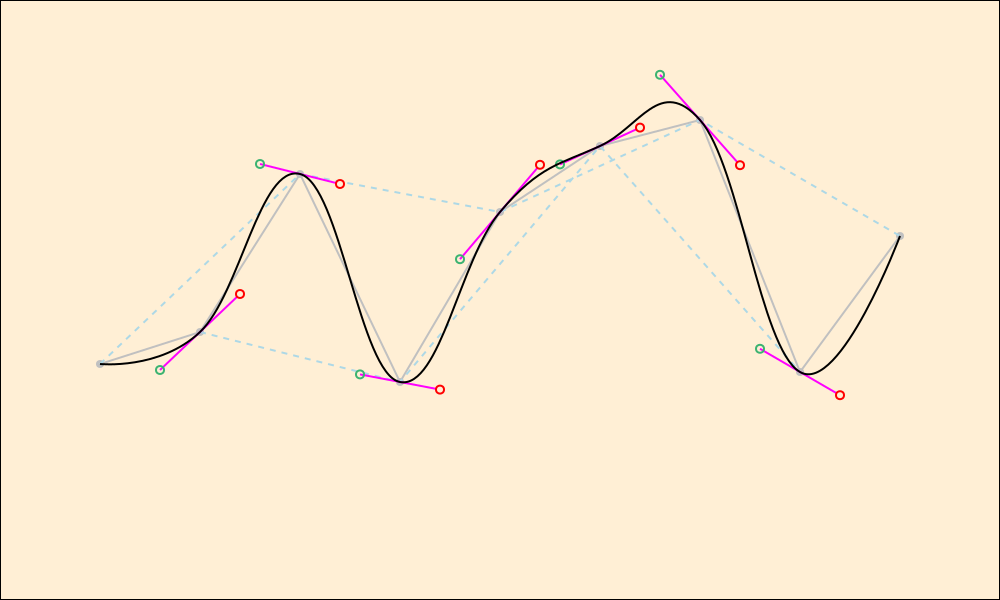
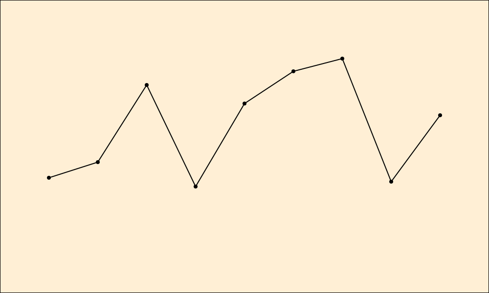
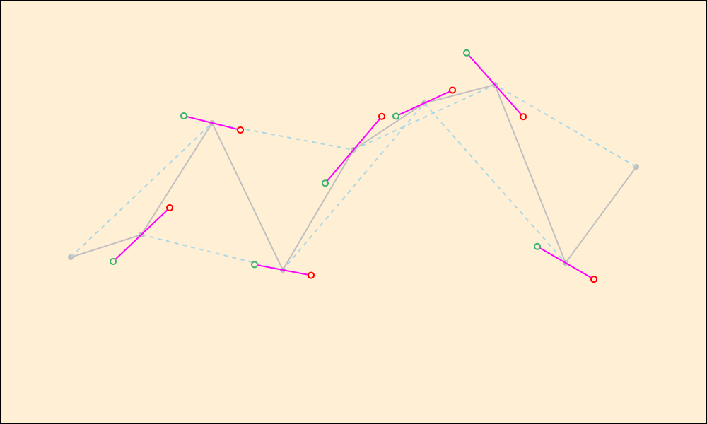
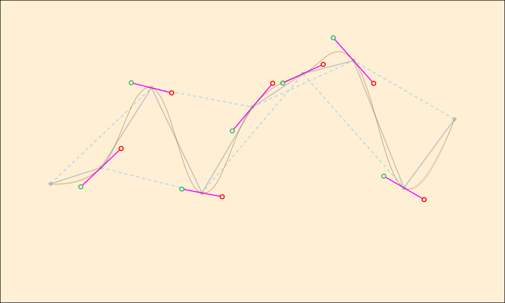
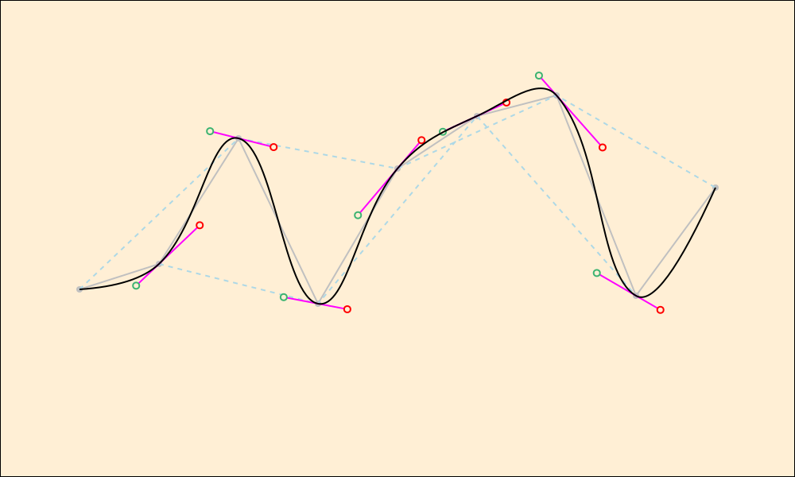

# Bézier curves in SVG using XSLT

## Synopsis

Inspired by Giel Berkers’s [Drawing a smooth bezier line through several points](https://gielberkers.com/drawing-a-smooth-bezier-line-through-several-points/) and Coty Embry’s [Spline interpolation with cubic Bezier curves using SVG and path (make lines curvy](<https://www.youtube.com/watch?v=o9tY9eQ0DgU), this tutorial describes how we developed an XSLT library function that smooths a line graph by using Bézier curves to round off the meeting points. To use the function, import it and then pass it an SVG `<polyline>`, which defines a sequence of connected line segments (e.g., as seen in a line chart). The function returns an SVG `<path>` element that describes a smoothly curved line through the same points.

## Signature

```xpath
djb:bezier($input as element(svg:polyline), $scaling as xs:double) as element(svg:path)
```

## Terminology

* **Bézier curve.** A smooth curve between two endpoints, with the shape of the curve determined by additional control points.
* **Spline** or **polybézier.** A smoothly connected sequence of individual Bézier curves. Our function returns a spline, implemented as an SVG `<path>` element. We refer to the Bézier curves that make up a spline as **curve segments**, much as **line segments** make up a **polyline**.
* **Knot.** A point on the spline. The first knot is the starting point of the first curve segment, the last knot is the ending point of the last curve segment, and each other knot is simultaneously the ending point of the incoming curve segment and the starting point of the outgoing one.
* **Control point**, **anchor point**, or **handle**. A point not on the curve (except accidentally) that determines the shape of the curve between two knots (endpoints of a curve segment).
* **Quadratic Bézier curve.** A Bézier curve with a single control point. We use quadratic Bézier curves as the first and last curve segments of our spline.
* **Cubic Bézier curve.** A Bézier curve with two control points, one anchored at the starting knot and one at the ending knot. We use cubic Bézier curves for all curve segments of our spline except the first and last.

## The mathematics of Bézier curves

**Cubic Bézier curves** are defined by four **points**. Two, located on the **spline**, are the **starting point** and **ending point** of the **curve segment**. The other two, called **control points** (also **anchor points** or **handles**), are typically not located on the curve (if they are, it is accidental), but nonetheless control its shape. Complex continuous shapes with multiple curves in different directions, called **splines**, can be created by joining individual Bézier curve segements at **knots**, that is, points on the spline where two curve segments meet. In order to ensure that these segments meet smoothly, without a visible **cusp** (angle), the individual cubic Bézier curves that make up a spline must have the following properties:

1. Alternating points on the curve (e.g., the first and third, second and fourth, third and fifth, etc.) are connected by an imaginary **joining line**, which, with the point on the curve between the two endpoints of the joining line, form a triangle, where the intermediate point is opposite the joining line.
2. An imaginary **control line** is drawn through the point opposite the imaginary joining line, and *parallel to it*; all points on the curve except the first and last have such a control line. The control line extends a certain distance to either side of that point and terminates in a **control point**. The distance of each control point from the point on the curve through which the control line passes affects the shape of the curve; we set that distance initially at a uniform 20% of the length of the joining line and fine-tune it later.
3. When a cubic Bézier curve is drawn, then, it is defined by two adjacent points on the curve (the starting and ending points), the outgoing control point of the starting point, and the incoming control point of the ending point. The shape of a quadratic Bézier is determined by a single control point.
4. The first and last points on the spline do not have control points, which means that their shape is determined only by the control point at the other end of the curve segment. The first curve has a control point associated only with its ending point, which is the second point on the spline; the last curve has a control point associated only with its starting point, which is the penultimate point on the spline. We draw the first and last curve segments initially as cubic Bézier curves with an approximate additional control point; we then refine our implementation by replacing them with quadratic Bézier curves, as is more appropriate where there is only a single control point. 

The following image (from <https://en.wikipedia.org/wiki/B%C3%A9zier_curve>) illustrates how the endpoints (P<sub>0</sub> and P<sub>3</sub>) define the endpoints of a cubic Bézier curve and the control points (P<sub>1</sub> and P<sub>2</sub>) control the shape of the curve:


The following sample output was created by our XSLT transformation:



The components of the image are as follows:

* Bézier spline: black
* Polyline: solid and silver, with silver dots at the knots
* Joining lines: dotted and pale blue
* Control lines: magenta
* Incoming control point: green circle
* Outgoing control point: red circle

## Bézier curves and SVG

The SVG `<path>` element describes the shape of the spline by recording the four control points for each cubic Bézier curve segment (and the three for each quadratic Bézier curve segment) that make up the spline. The challenge, then, is to place the control points, that is, to determine their location, angle, and length. 

## Berkers’s method and Embry’s adjustments

### Berkers’s method

Berkers’s method for plotting Bézier curves, which is that starting point for our implementation in XSLT below, is as follows:

1. Plot a line graph the connects the points with line segments.
3. Superimpose secondary line graphs that connect alternating points, e.g., connecting *X<sub>1</sub>Y<sub>1</sub>* to *X<sub>3</sub>Y<sub>3</sub>*, *X<sub>2</sub>Y<sub>2</sub>* to *X<sub>4</sub>Y<sub>4</sub>* etc. (we use one-based counting, as is appropriate for XPath). These are the joining lines described above.
4. Get the lengths of the joining lines. (Use the Pythagorean theorem, where the distances between the two X values and the two Y values of the endpoints are the lengths of the legs, that is, the sides adjacent to the right angle, and the line between the points is the hypotenuse.)
5. Divide the original distances between the X points and the Y points by the length of the hypotenuse to get the unit vectors. Call these `$unitX` and `$unitY`.
6. The two normals (endpoints of a perpendicular unit vector) are `-$unitY, $unitX` and `$unitY, -$unitX`, which rotates the unit vector around its center by 90º. See <https://stackoverflow.com/questions/1243614/how-do-i-calculate-the-normal-vector-of-a-line-segment> for how this works. (As one of the comments there explains, no division is involved, which removes the risk of division by zero.)
7. Determine the angles of the two anchor points.
8. Set the lengths of the handles (by default) to 20% of the length of the joining line.
9. Use the control points in an SVG `<path>` element, employing the `C` (*curve to*) command to create a spline.

### Embry’s adjustments

We then make three modifications to Berkers’s method, taken from Embry’s video tutorial:

1. Berkers uses the `C` command to create a sequence of cubic Bézier curves from the first knot to the last. Because the first and last curves on the spline have only a single control point, Embry uses the `Q` command to create them as quadratic Bézier curves, using cubic curves for all of the other spline segments.
1. Berkers sets the lengths of the anchors arbitrarily at 20% of the length of the imaginary joining line, so that both anchors coming out of a single knot are the same length. Embry explains how to set them at different lengths in a way that provides a smoother curve. 
2. Embry uses a *scaling factor* to control the curviness of the spline; this is added as an additional user-supplied parameter.

Berkers’s visualizations are created in PHP and Embry’s in JavaScript. The implementation below is in XSLT 3.0.

## Step by step using XSLT

### 1. Plot a line graph that connects the points with line segments

X values are evenly spaced; Y values are random.

#### Output



#### XSLT

```xslt
<?xml version="1.0" encoding="UTF-8"?>
<xsl:stylesheet xmlns:xsl="http://www.w3.org/1999/XSL/Transform"
    xmlns:xs="http://www.w3.org/2001/XMLSchema"
    xmlns:math="http://www.w3.org/2005/xpath-functions/math" exclude-result-prefixes="#all"
    xmlns="http://www.w3.org/2000/svg" version="3.0">
    <xsl:output method="xml" indent="yes"/>
    <!--
        9 points, X values evenly spaced, Y values random
    -->
    <xsl:variable name="xPoints" as="xs:integer+"
        select="50, 100, 150, 200, 250, 300, 350, 400, 450"/>
    <xsl:variable name="yPoints" as="xs:integer+" select="182, 166, 87, 191, 106, 73, 60, 186, 118"/>
    <xsl:variable name="points" as="element(Q{}point)+">
        <xsl:for-each select="1 to count($xPoints)">
            <xsl:element name="point" xmlns="">
                <xsl:value-of select="string-join(($xPoints[current()], $yPoints[current()]), ',')"
                />
            </xsl:element>
        </xsl:for-each>
    </xsl:variable>
    <xsl:variable name="cRadius" as="xs:integer" select="2"/>

    <xsl:template name="xsl:initial-template">
        <svg width="1000" height="600" viewBox="0 0 500 300">
            <style type="text/css"><![CDATA[
                .mainLine {
                    fill: none;
                    stroke: black;
                    stroke-width: 1;
                }
                .mainCircle {
                    fill: black;
                }
                .alternatingLine {
                    fill: none;
                    stroke: blue;
                    stroke-width: 1;
                    stroke-dasharray: 3 3;
                }]]></style>
            <g>
                <!-- background-->
                <rect x="0" y="0" width="500" height="300" stroke="black" stroke-width="1"
                    fill="papayawhip"/>
                <!-- main circles and connecting lines -->
                <xsl:for-each select="1 to count($xPoints)">
                    <circle class="mainCircle" cx="{$xPoints[current()]}" cy="{$yPoints[current()]}"
                        r="{$cRadius}"/>
                </xsl:for-each>
                <polyline class="mainLine" points="{string-join($points, ' ')}"/>
            </g>
        </svg>

    </xsl:template>
</xsl:stylesheet>
```

### 2. Draw connecting lines between alternating points

#### Output


#### XSLT

```xslt
<?xml version="1.0" encoding="UTF-8"?>
<xsl:stylesheet xmlns:xsl="http://www.w3.org/1999/XSL/Transform"
    xmlns:xs="http://www.w3.org/2001/XMLSchema"
    xmlns:math="http://www.w3.org/2005/xpath-functions/math" exclude-result-prefixes="#all"
    xmlns="http://www.w3.org/2000/svg" version="3.0">
    <xsl:output method="xml" indent="yes"/>
    <!--
        9 points, X values evenly spaced, Y values random
    -->
    <xsl:variable name="xPoints" as="xs:integer+"
        select="50, 100, 150, 200, 250, 300, 350, 400, 450"/>
    <xsl:variable name="yPoints" as="xs:integer+" select="182, 166, 87, 191, 106, 73, 60, 186, 118"/>
    <xsl:variable name="points" as="element(Q{}point)+">
        <xsl:for-each select="1 to count($xPoints)">
            <xsl:element name="point" xmlns="">
                <xsl:value-of select="string-join(($xPoints[current()], $yPoints[current()]), ',')"
                />
            </xsl:element>
        </xsl:for-each>
    </xsl:variable>
    <xsl:variable name="cRadius" as="xs:integer" select="2"/>

    <xsl:template name="xsl:initial-template">
        <svg width="1000" height="600" viewBox="0 0 500 300">
            <style type="text/css"><![CDATA[
                .mainLine {
                    fill: none;
                    stroke: black;
                    stroke-width: 1;
                }
                .mainCircle {
                    fill: black;
                }
                .alternatingLine {
                    fill: none;
                    stroke: blue;
                    stroke-width: 1;
                    stroke-dasharray: 3 3;
                }]]></style>
            <g>
                <!-- background-->
                <rect x="0" y="0" width="500" height="300" stroke="black" stroke-width="1"
                    fill="papayawhip"/>
                <!-- main circles and connecting lines -->
                <xsl:for-each select="1 to count($xPoints)">
                    <circle class="mainCircle" cx="{$xPoints[current()]}" cy="{$yPoints[current()]}"
                        r="{$cRadius}"/>
                </xsl:for-each>
                <polyline class="mainLine" points="{string-join($points, ' ')}"/>
                <!-- alternatingLines -->
                <polyline class="alternatingLine" points="{$points[position() mod 2 eq 0]}"/>
                <polyline class="alternatingLine" points="{$points[position() mod 2 eq 1]}"/>
            </g>
        </svg>

    </xsl:template>
</xsl:stylesheet>
```

### 3. Get the lengths of the connecting lines

We create some additional variables here and output them, for diagnostic purposes, using `<xsl:message>`.

#### Output


#### Diagnostics

```text
bezierLength 1: 137.93
bezierLength 2: 103.08
bezierLength 3: 101.79
bezierLength 4: 154.67
bezierLength 5: 110.07
bezierLength 6: 150.89
bezierLength 7: 115.60
```

#### XSLT

```xslt
<?xml version="1.0" encoding="UTF-8"?>
<xsl:stylesheet xmlns:xsl="http://www.w3.org/1999/XSL/Transform"
    xmlns:xs="http://www.w3.org/2001/XMLSchema"
    xmlns:math="http://www.w3.org/2005/xpath-functions/math" exclude-result-prefixes="#all"
    xmlns="http://www.w3.org/2000/svg" xmlns:svg="http://www.w3.org/2000/svg" version="3.0">
    <xsl:output method="xml" indent="yes"/>

    <!-- ================================================================= -->
    <!-- Stylesheet variables                                              -->
    <!-- ================================================================= -->
    <!-- Line points: X values evenly spaced, Y values random              -->
    <!-- ================================================================= -->
    <xsl:variable name="xPoints" as="xs:integer+"
        select="50, 100, 150, 200, 250, 300, 350, 400, 450"/>
    <xsl:variable name="yPoints" as="xs:integer+" select="182, 166, 87, 191, 106, 73, 60, 186, 118"/>
    <xsl:variable name="points" as="element(point)+">
        <xsl:for-each select="1 to count($xPoints)">
            <xsl:element name="point" xmlns="">
                <xsl:value-of select="string-join(($xPoints[current()], $yPoints[current()]), ',')"
                />
            </xsl:element>
        </xsl:for-each>
    </xsl:variable>
    <xsl:variable name="connectingLineLenghts" as="xs:double+">
        <xsl:for-each select="1 to count($points) - 2">
            <xsl:variable name="x1" as="xs:integer" select="$xPoints[position() eq current()]"/>
            <xsl:variable name="x2" as="xs:integer" select="$xPoints[position() eq current() + 2]"/>
            <xsl:variable name="y1" as="xs:integer" select="$yPoints[position() eq current()]"/>
            <xsl:variable name="y2" as="xs:integer" select="$yPoints[position() eq current() + 2]"/>
            <xsl:variable name="xDistance" as="xs:integer" select="$x2 - $x1"/>
            <xsl:variable name="yDistance" as="xs:integer" select="$y2 - $y1"/>
            <xsl:sequence
                select="(math:pow($xDistance, 2) + math:pow($yDistance, 2)) => math:sqrt()"/>
        </xsl:for-each>
    </xsl:variable>
    <!-- ================================================================= -->
    <!-- SVG constants                                                     -->
    <!--                                                                   -->
    <!-- $svgWidth as xs:integer : width of viewport                       -->
    <!-- $svgHeight as xs:integer : height of viewport                     -->
    <!--   Note: halve these values in viewBox to scale up to 200%         -->
    <!-- $cRadius as xs:integer : radius of main and anchor points         -->
    <!-- $css as element(svg:style) : convenience variable                 -->
    <!-- ================================================================= -->
    <xsl:variable name="svgWidth" as="xs:integer" select="1000"/>
    <xsl:variable name="svgHeight" as="xs:integer" select="600"/>
    <xsl:variable name="cRadius" as="xs:integer" select="2"/>
    <xsl:variable name="css" as="element(svg:style)">
        <style type="text/css"><![CDATA[
            .mainLine {
                fill: none;
                stroke: black;
                stroke-width: 1;
            }
            .mainCircle {
                fill: black;
            }
            .alternatingLine {
                fill: none;
                stroke: blue;
                stroke-width: 1;
                stroke-dasharray: 3 3;
            }]]></style>
    </xsl:variable>
    <!-- ================================================================= -->

    <!-- ================================================================= -->
    <!-- Main                                                              -->
    <!-- ================================================================= -->
    <xsl:template name="xsl:initial-template">
        <!-- ============================================================= -->
        <!-- Diagnostics                                                   -->
        <!--                                                               -->
        <!-- $connectingLineLengths                                        -->
        <!-- ============================================================= -->
        <xsl:message
            select="
                '$connectingLineLenghts&#x0a;' ||
                string-join($connectingLineLenghts ! round(., 2), ' ')"/>
        <!-- ============================================================= -->
        <svg width="{$svgWidth}" height="{$svgHeight}"
            viewBox="0 0 {$svgWidth div 2} {$svgHeight div 2}">
            <xsl:sequence select="$css"/>
            <g>
                <!-- background-->
                <rect x="0" y="0" width="500" height="300" stroke="black" stroke-width="1"
                    fill="papayawhip"/>
                <!-- main circles and connecting lines -->
                <xsl:for-each select="1 to count($xPoints)">
                    <circle class="mainCircle" cx="{$xPoints[current()]}" cy="{$yPoints[current()]}"
                        r="{$cRadius}"/>
                </xsl:for-each>
                <polyline class="mainLine" points="{string-join($points, ' ')}"/>
                <!-- alternatingLines -->
                <polyline class="alternatingLine" points="{$points[position() mod 2 eq 0]}"/>
                <polyline class="alternatingLine" points="{$points[position() mod 2 eq 1]}"/>
            </g>
        </svg>
    </xsl:template>
</xsl:stylesheet>
```

### 4. Get the unit vectors of the lines

We revise the system of variables and output them as an HTML `<table>` element (instead of as an `<xsl:message>`, for insertion into this tutorial. 

*Note:* We will raise a division-by-zero error if the length of the hypotenuse is 0, which can happen only if two adjacent points have the same X and Y coordinates. Because we do not anticipate needing to process a graph of this shape, we do not trap this error.

#### Output


#### Diagnostics

<table style="text-align: right;">
   <tr style="text-align: center;">
      <th>#</th>
      <th>dirX</th>
      <th>dirY</th>
      <th>length</th>
      <th>unitX</th>
      <th>$unitY</th>
   </tr>
   <tr>
      <td>1</td>
      <td>100</td>
      <td>-95</td>
      <td>137.93</td>
      <td>0.72</td>
      <td>-0.69</td>
   </tr>
   <tr>
      <td>2</td>
      <td>100</td>
      <td>25</td>
      <td>103.08</td>
      <td>0.97</td>
      <td>0.24</td>
   </tr>
   <tr>
      <td>3</td>
      <td>100</td>
      <td>19</td>
      <td>101.79</td>
      <td>0.98</td>
      <td>0.19</td>
   </tr>
   <tr>
      <td>4</td>
      <td>100</td>
      <td>-118</td>
      <td>154.67</td>
      <td>0.65</td>
      <td>-0.76</td>
   </tr>
   <tr>
      <td>5</td>
      <td>100</td>
      <td>-46</td>
      <td>110.07</td>
      <td>0.91</td>
      <td>-0.42</td>
   </tr>
   <tr>
      <td>6</td>
      <td>100</td>
      <td>113</td>
      <td>150.89</td>
      <td>0.66</td>
      <td>0.75</td>
   </tr>
   <tr>
      <td>7</td>
      <td>100</td>
      <td>58</td>
      <td>115.60</td>
      <td>0.87</td>
      <td>0.50</td>
   </tr>
</table>

#### XSLT

```xslt
<?xml version="1.0" encoding="UTF-8"?>
<xsl:stylesheet xmlns:xsl="http://www.w3.org/1999/XSL/Transform"
    xmlns:xs="http://www.w3.org/2001/XMLSchema"
    xmlns:math="http://www.w3.org/2005/xpath-functions/math" exclude-result-prefixes="#all"
    xmlns="http://www.w3.org/2000/svg" xmlns:svg="http://www.w3.org/2000/svg" version="3.0">
    <xsl:output method="xml" indent="yes"/>

    <!-- ================================================================= -->
    <!-- Stylesheet variables                                              -->
    <!-- ================================================================= -->
    <!-- Line points: X values evenly spaced, Y values random              -->
    <!-- $xPoints as xs:integer+ : X coordinates of points                 -->
    <!-- $yPoints as xs:integer+ : Y coordinates of points                 -->
    <!-- $points as element(point)+ : comma separated X,Y values of points -->
    <!-- ================================================================= -->
    <xsl:variable name="xPoints" as="xs:integer+"
        select="50, 100, 150, 200, 250, 300, 350, 400, 450"/>
    <xsl:variable name="yPoints" as="xs:integer+" select="182, 166, 87, 191, 106, 73, 60, 186, 118"/>
    <xsl:variable name="points" as="element(point)+">
        <xsl:for-each select="1 to count($xPoints)">
            <xsl:element name="point" xmlns="">
                <xsl:value-of select="string-join(($xPoints[current()], $yPoints[current()]), ',')"
                />
            </xsl:element>
        </xsl:for-each>
    </xsl:variable>
    <!-- ================================================================= -->


    <!-- ================================================================= -->
    <!-- Computed values                                                   -->
    <!--                                                                   -->
    <!-- $dirXs as xs:double+ : X coordinates of hypotenuses               -->
    <!-- $dirYs as xs:double+ : Y coordinates of hypotenuses               -->
    <!-- $connectingLineLengths as xs:double+ : formed by                  -->
    <!--   connecting alternate points                                     -->
    <!-- $unitXs as xs:double+ : X coordinates of unit vectors             -->
    <!-- $unitYs as xs:double+ " Y coordinates of unit vectors             -->
    <!-- ================================================================= -->

    <xsl:variable name="dirXs" as="xs:integer+">
        <xsl:for-each select="1 to count($points) - 2">
            <xsl:variable name="x1" as="xs:integer" select="$xPoints[position() eq current()]"/>
            <xsl:variable name="x2" as="xs:integer" select="$xPoints[position() eq current() + 2]"/>
            <xsl:sequence select="$x2 - $x1"/>
        </xsl:for-each>
    </xsl:variable>
    <xsl:variable name="dirYs" as="xs:integer+">
        <xsl:for-each select="1 to count($points) - 2">
            <xsl:variable name="y1" as="xs:integer" select="$yPoints[position() eq current()]"/>
            <xsl:variable name="y2" as="xs:integer" select="$yPoints[position() eq current() + 2]"/>
            <xsl:sequence select="$y2 - $y1"/>
        </xsl:for-each>
    </xsl:variable>
    <xsl:variable name="lengths" as="xs:double+">
        <xsl:for-each select="1 to count($points) - 2">
            <xsl:variable name="xDistance" as="xs:integer" select="$dirXs[current()]"/>
            <xsl:variable name="yDistance" as="xs:integer" select="$dirYs[current()]"/>
            <xsl:sequence
                select="(math:pow($xDistance, 2) + math:pow($yDistance, 2)) => math:sqrt()"/>
        </xsl:for-each>
    </xsl:variable>
    <xsl:variable name="unitXs" as="xs:double+">
        <xsl:for-each select="1 to count($points) - 2">
            <xsl:sequence select="$dirXs[current()] div $lengths[current()]"/>
        </xsl:for-each>
    </xsl:variable>
    <xsl:variable name="unitYs" as="xs:double+">
        <xsl:for-each select="1 to count($points) - 2">
            <xsl:sequence select="$dirYs[current()] div $lengths[current()]"/>
        </xsl:for-each>
    </xsl:variable>
    <!-- ================================================================= -->

    <!-- ================================================================= -->
    <!-- SVG constants                                                     -->
    <!--                                                                   -->
    <!-- $svgWidth as xs:integer : width of viewport                       -->
    <!-- $svgHeight as xs:integer : height of viewport                     -->
    <!--   Note: halve these values in viewBox to scale up to 200%         -->
    <!-- $cRadius as xs:integer : radius of main and anchor points         -->
    <!-- $css as element(svg:style) : convenience variable                 -->
    <!-- ================================================================= -->
    <xsl:variable name="svgWidth" as="xs:integer" select="1000"/>
    <xsl:variable name="svgHeight" as="xs:integer" select="600"/>
    <xsl:variable name="cRadius" as="xs:integer" select="2"/>
    <xsl:variable name="css" as="element(svg:style)">
        <style type="text/css"><![CDATA[
            .mainLine {
                fill: none;
                stroke: black;
                stroke-width: 1;
            }
            .mainCircle {
                fill: black;
            }
            .alternatingLine {
                fill: none;
                stroke: blue;
                stroke-width: 1;
                stroke-dasharray: 3 3;
            }]]></style>
    </xsl:variable>
    <!-- ================================================================= -->

    <!-- ================================================================= -->
    <!-- Main                                                              -->
    <!-- ================================================================= -->
    <xsl:template name="xsl:initial-template">
        <!-- ============================================================= -->
        <!-- Diagnostics                                                   -->
        <!--                                                               -->
        <!-- $dirXs, $dirYs, $connectingLineLengths                        -->
        <!-- ============================================================= -->
        <xsl:result-document href="diagnostics.xml" omit-xml-declaration="yes" indent="yes">
            <table xmlns="" style="text-align: right;">
                <tr style="text-align: center;">
                    <th>#</th>
                    <th>dirY</th>
                    <th>dirY</th>
                    <th>length</th>
                    <th>unitX</th>
                    <th>unitY</th>
                </tr>
                <xsl:for-each select="1 to count($points) - 2">
                    <tr>
                        <td>
                            <xsl:sequence select="."/>
                        </td>
                        <td>
                            <xsl:sequence select="$dirXs[current()]"/>
                        </td>
                        <td>
                            <xsl:sequence select="$dirYs[current()]"/>
                        </td>
                        <td>
                            <xsl:sequence select="$lengths[current()] ! format-number(., '#.00')"/>
                        </td>
                        <td>
                            <xsl:sequence select="$unitXs[current()] ! format-number(., '0.00')"/>
                        </td>
                        <td>
                            <xsl:sequence select="$unitYs[current()] ! format-number(., '0.00')"/>
                        </td>

                    </tr>
                </xsl:for-each>
            </table>
        </xsl:result-document>
        
        <!-- ============================================================= -->
        <!-- Now draw the SVG image                                        -->
        <!-- ============================================================= -->
        <svg width="{$svgWidth}" height="{$svgHeight}"
            viewBox="0 0 {$svgWidth div 2} {$svgHeight div 2}">
            <xsl:sequence select="$css"/>
            <g>
                <!-- ===================================================== -->
                <!-- Background                                            -->
                <!-- ===================================================== -->
                <rect x="0" y="0" width="500" height="300" stroke="black" stroke-width="1"
                    fill="papayawhip"/>
                <!-- ===================================================== -->
                <!-- Data points and connecting lines                      -->
                <!-- ===================================================== -->
                <xsl:for-each select="1 to count($xPoints)">
                    <circle class="mainCircle" cx="{$xPoints[current()]}" cy="{$yPoints[current()]}"
                        r="{$cRadius}"/>
                </xsl:for-each>
                <polyline class="mainLine" points="{string-join($points, ' ')}"/>
                <!-- ===================================================== -->
                <!-- Alternating (hypotenuse) lines                        -->
                <!-- ===================================================== -->
                <xsl:for-each select="0, 1">
                    <polyline class="alternatingLine"
                        points="{$points[position() mod 2 eq current()]}"/>
                </xsl:for-each>
            </g>
        </svg>
    </xsl:template>
</xsl:stylesheet>
```

### 5. Get the normals (perpendiculars)

#### SVG


#### Diagnostics

<table style="text-align: right;">
   <tr style="text-align: center;">
      <th>#</th>
      <th>dirX</th>
      <th>dirY</th>
      <th>length</th>
      <th>unitX</th>
      <th>unitY</th>
      <th>normal1</th>
      <th>normal2</th>
   </tr>
   <tr>
      <td>1</td>
      <td>100</td>
      <td>-95</td>
      <td>137.93</td>
      <td>0.72</td>
      <td>-0.69</td>
      <td>0.69, 0.72</td>
      <td>-0.69, -0.72</td>
   </tr>
   <tr>
      <td>2</td>
      <td>100</td>
      <td>25</td>
      <td>103.08</td>
      <td>0.97</td>
      <td>0.24</td>
      <td>-0.24, 0.97</td>
      <td>0.24, -0.97</td>
   </tr>
   <tr>
      <td>3</td>
      <td>100</td>
      <td>19</td>
      <td>101.79</td>
      <td>0.98</td>
      <td>0.19</td>
      <td>-0.19, 0.98</td>
      <td>0.19, -0.98</td>
   </tr>
   <tr>
      <td>4</td>
      <td>100</td>
      <td>-118</td>
      <td>154.67</td>
      <td>0.65</td>
      <td>-0.76</td>
      <td>0.76, 0.65</td>
      <td>-0.76, -0.65</td>
   </tr>
   <tr>
      <td>5</td>
      <td>100</td>
      <td>-46</td>
      <td>110.07</td>
      <td>0.91</td>
      <td>-0.42</td>
      <td>0.42, 0.91</td>
      <td>-0.42, -0.91</td>
   </tr>
   <tr>
      <td>6</td>
      <td>100</td>
      <td>113</td>
      <td>150.89</td>
      <td>0.66</td>
      <td>0.75</td>
      <td>-0.75, 0.66</td>
      <td>0.75, -0.66</td>
   </tr>
   <tr>
      <td>7</td>
      <td>100</td>
      <td>58</td>
      <td>115.60</td>
      <td>0.87</td>
      <td>0.50</td>
      <td>-0.50, 0.87</td>
      <td>0.50, -0.87</td>
   </tr>
</table>

#### XSLT

```xslt
<?xml version="1.0" encoding="UTF-8"?>
<xsl:stylesheet xmlns:xsl="http://www.w3.org/1999/XSL/Transform"
    xmlns:xs="http://www.w3.org/2001/XMLSchema"
    xmlns:math="http://www.w3.org/2005/xpath-functions/math" exclude-result-prefixes="#all"
    xmlns="http://www.w3.org/2000/svg" xmlns:svg="http://www.w3.org/2000/svg" version="3.0">
    <xsl:output method="xml" indent="yes"/>

    <!-- ================================================================= -->
    <!-- Stylesheet variables                                              -->
    <!-- ================================================================= -->
    <!-- Line points: X values evenly spaced, Y values random              -->
    <!-- $xPoints as xs:integer+ : X coordinates of points                 -->
    <!-- $yPoints as xs:integer+ : Y coordinates of points                 -->
    <!-- $points as element(point)+ : comma separated X,Y values of points -->
    <!-- ================================================================= -->
    <xsl:variable name="xPoints" as="xs:integer+"
        select="50, 100, 150, 200, 250, 300, 350, 400, 450"/>
    <xsl:variable name="yPoints" as="xs:integer+" select="182, 166, 87, 191, 106, 73, 60, 186, 118"/>
    <xsl:variable name="points" as="element(point)+">
        <xsl:for-each select="1 to count($xPoints)">
            <xsl:element name="point" xmlns="">
                <xsl:value-of select="string-join(($xPoints[current()], $yPoints[current()]), ',')"
                />
            </xsl:element>
        </xsl:for-each>
    </xsl:variable>
    <!-- ================================================================= -->


    <!-- ================================================================= -->
    <!-- Computed values                                                   -->
    <!--                                                                   -->
    <!-- $dirXs as xs:double+ : X coordinates of hypotenuses               -->
    <!-- $dirYs as xs:double+ : Y coordinates of hypotenuses               -->
    <!-- $connectingLineLengths as xs:double+ : formed by                  -->
    <!--   connecting alternate points                                     -->
    <!-- $unitXs as xs:double+ : X coordinates of unit vectors             -->
    <!-- $unitYs as xs:double+ : Y coordinates of unit vectors             -->
    <!-- $normal1Xs as xs:double+ : X coordinates of endpoint 1 of normal  -->
    <!-- $normal1Ys as xs:double+ : Y coordinates of endpoint 1 of normal  -->
    <!-- $normal2Xs as xs:double+ : X coordinates of endpoint 2 of normal  -->
    <!-- $normal2Ys as xs:double+ : Y coordinates of endpoint 2 of normal  -->
    <!-- ================================================================= -->

    <xsl:variable name="dirXs" as="xs:integer+">
        <xsl:for-each select="1 to count($points) - 2">
            <xsl:variable name="x1" as="xs:integer" select="$xPoints[position() eq current()]"/>
            <xsl:variable name="x2" as="xs:integer" select="$xPoints[position() eq current() + 2]"/>
            <xsl:sequence select="$x2 - $x1"/>
        </xsl:for-each>
    </xsl:variable>
    <xsl:variable name="dirYs" as="xs:integer+">
        <xsl:for-each select="1 to count($points) - 2">
            <xsl:variable name="y1" as="xs:integer" select="$yPoints[position() eq current()]"/>
            <xsl:variable name="y2" as="xs:integer" select="$yPoints[position() eq current() + 2]"/>
            <xsl:sequence select="$y2 - $y1"/>
        </xsl:for-each>
    </xsl:variable>
    <xsl:variable name="lengths" as="xs:double+">
        <xsl:for-each select="1 to count($points) - 2">
            <xsl:variable name="xDistance" as="xs:integer" select="$dirXs[current()]"/>
            <xsl:variable name="yDistance" as="xs:integer" select="$dirYs[current()]"/>
            <xsl:sequence
                select="(math:pow($xDistance, 2) + math:pow($yDistance, 2)) => math:sqrt()"/>
        </xsl:for-each>
    </xsl:variable>
    <xsl:variable name="unitXs" as="xs:double+">
        <xsl:for-each select="1 to count($points) - 2">
            <xsl:sequence select="$dirXs[current()] div $lengths[current()]"/>
        </xsl:for-each>
    </xsl:variable>
    <xsl:variable name="unitYs" as="xs:double+">
        <xsl:for-each select="1 to count($points) - 2">
            <xsl:sequence select="$dirYs[current()] div $lengths[current()]"/>
        </xsl:for-each>
    </xsl:variable>
    <xsl:variable name="normal1Xs" as="xs:double+">
        <xsl:for-each select="1 to count($points) - 2">
            <xsl:sequence select="-$unitYs[current()]"/>
        </xsl:for-each>
    </xsl:variable>
    <xsl:variable name="normal1Ys" as="xs:double+">
        <xsl:for-each select="1 to count($points) - 2">
            <xsl:sequence select="$unitXs[current()]"/>
        </xsl:for-each>
    </xsl:variable>
    <xsl:variable name="normal2Xs" as="xs:double+">
        <xsl:for-each select="1 to count($points) - 2">
            <xsl:sequence select="$unitYs[current()]"/>
        </xsl:for-each>
    </xsl:variable>
    <xsl:variable name="normal2Ys" as="xs:double+">
        <xsl:for-each select="1 to count($points) - 2">
            <xsl:sequence select="-$unitXs[current()]"/>
        </xsl:for-each>
    </xsl:variable>
    <!-- ================================================================= -->

    <!-- ================================================================= -->
    <!-- SVG constants                                                     -->
    <!--                                                                   -->
    <!-- $svgWidth as xs:integer : width of viewport                       -->
    <!-- $svgHeight as xs:integer : height of viewport                     -->
    <!--   Note: halve these values in viewBox to scale up to 200%         -->
    <!-- $cRadius as xs:integer : radius of main and anchor points         -->
    <!-- $css as element(svg:style) : convenience variable                 -->
    <!-- ================================================================= -->
    <xsl:variable name="svgWidth" as="xs:integer" select="1000"/>
    <xsl:variable name="svgHeight" as="xs:integer" select="600"/>
    <xsl:variable name="cRadius" as="xs:integer" select="2"/>
    <xsl:variable name="css" as="element(svg:style)">
        <style type="text/css"><![CDATA[
            .mainLine {
                fill: none;
                stroke: black;
                stroke-width: 1;
            }
            .mainCircle {
                fill: black;
            }
            .alternatingLine {
                fill: none;
                stroke: blue;
                stroke-width: 1;
                stroke-dasharray: 3 3;
            }]]></style>
    </xsl:variable>
    <!-- ================================================================= -->

    <!-- ================================================================= -->
    <!-- Main                                                              -->
    <!-- ================================================================= -->
    <xsl:template name="xsl:initial-template">
        <!-- ============================================================= -->
        <!-- Diagnostics                                                   -->
        <!--                                                               -->
        <!-- $dirXs, $dirYs, $connectingLineLengths                        -->
        <!-- ============================================================= -->
        <xsl:result-document href="diagnostics.xml" omit-xml-declaration="yes" indent="yes">
            <table xmlns="" style="text-align: right;">
                <tr style="text-align: center;">
                    <th>#</th>
                    <th>dirX</th>
                    <th>dirY</th>
                    <th>length</th>
                    <th>unitX</th>
                    <th>unitY</th>
                    <th>normal1</th>
                    <th>normal2</th>
                </tr>
                <xsl:for-each select="1 to count($points) - 2">
                    <tr>
                        <td>
                            <xsl:sequence select="."/>
                        </td>
                        <td>
                            <xsl:sequence select="$dirXs[current()]"/>
                        </td>
                        <td>
                            <xsl:sequence select="$dirYs[current()]"/>
                        </td>
                        <td>
                            <xsl:sequence select="$lengths[current()] ! format-number(., '#.00')"/>
                        </td>
                        <td>
                            <xsl:sequence select="$unitXs[current()] ! format-number(., '0.00')"/>
                        </td>
                        <td>
                            <xsl:sequence select="$unitYs[current()] ! format-number(., '0.00')"/>
                        </td>
                        <td>
                            <xsl:sequence
                                select="
                                    string-join(
                                    (
                                    $normal1Xs[current()] ! format-number(., '0.00'),
                                    $normal1Ys[current()] ! format-number(., '0.00')
                                    ),
                                    ', ')"
                            />
                        </td>
                        <td>
                            <xsl:sequence
                                select="
                                    string-join(
                                    (
                                    $normal2Xs[current()] ! format-number(., '0.00'),
                                    $normal2Ys[current()] ! format-number(., '0.00')
                                    ),
                                    ', ')"
                            />
                        </td>
                    </tr>
                </xsl:for-each>
            </table>
        </xsl:result-document>

        <!-- ============================================================= -->
        <!-- Now draw the SVG image                                        -->
        <!-- ============================================================= -->
        <svg width="{$svgWidth}" height="{$svgHeight}"
            viewBox="0 0 {$svgWidth div 2} {$svgHeight div 2}">
            <xsl:sequence select="$css"/>
            <g>
                <!-- ===================================================== -->
                <!-- Background                                            -->
                <!-- ===================================================== -->
                <rect x="0" y="0" width="500" height="300" stroke="black" stroke-width="1"
                    fill="papayawhip"/>
                <!-- ===================================================== -->
                <!-- Data points and connecting lines                      -->
                <!-- ===================================================== -->
                <xsl:for-each select="1 to count($xPoints)">
                    <circle class="mainCircle" cx="{$xPoints[current()]}" cy="{$yPoints[current()]}"
                        r="{$cRadius}"/>
                </xsl:for-each>
                <polyline class="mainLine" points="{string-join($points, ' ')}"/>
                <!-- ===================================================== -->
                <!-- Alternating (hypotenuse) lines                        -->
                <!-- ===================================================== -->
                <xsl:for-each select="0, 1">
                    <polyline class="alternatingLine"
                        points="{$points[position() mod 2 eq current()]}"/>
                </xsl:for-each>
            </g>
        </svg>
    </xsl:template>
</xsl:stylesheet>
```

### 6. Get the angles

#### SVG


#### Diagnostics

<table style="text-align: right;">
   <tr style="text-align: center;">
      <th>#</th>
      <th>dirX</th>
      <th>dirY</th>
      <th>length</th>
      <th>unitX</th>
      <th>unitY</th>
      <th>normal1</th>
      <th>normal2</th>
      <th>angle1</th>
      <th>angle2</th>
   </tr>
   <tr>
      <td>1</td>
      <td>100</td>
      <td>-95</td>
      <td>137.93</td>
      <td>0.72</td>
      <td>-0.69</td>
      <td>0.69, 0.72</td>
      <td>-0.69, -0.72</td>
      <td>2.38</td>
      <td>-0.76</td>
   </tr>
   <tr>
      <td>2</td>
      <td>100</td>
      <td>25</td>
      <td>103.08</td>
      <td>0.97</td>
      <td>0.24</td>
      <td>-0.24, 0.97</td>
      <td>0.24, -0.97</td>
      <td>3.39</td>
      <td>0.24</td>
   </tr>
   <tr>
      <td>3</td>
      <td>100</td>
      <td>19</td>
      <td>101.79</td>
      <td>0.98</td>
      <td>0.19</td>
      <td>-0.19, 0.98</td>
      <td>0.19, -0.98</td>
      <td>3.33</td>
      <td>0.19</td>
   </tr>
   <tr>
      <td>4</td>
      <td>100</td>
      <td>-118</td>
      <td>154.67</td>
      <td>0.65</td>
      <td>-0.76</td>
      <td>0.76, 0.65</td>
      <td>-0.76, -0.65</td>
      <td>2.27</td>
      <td>-0.87</td>
   </tr>
   <tr>
      <td>5</td>
      <td>100</td>
      <td>-46</td>
      <td>110.07</td>
      <td>0.91</td>
      <td>-0.42</td>
      <td>0.42, 0.91</td>
      <td>-0.42, -0.91</td>
      <td>2.71</td>
      <td>-0.43</td>
   </tr>
   <tr>
      <td>6</td>
      <td>100</td>
      <td>113</td>
      <td>150.89</td>
      <td>0.66</td>
      <td>0.75</td>
      <td>-0.75, 0.66</td>
      <td>0.75, -0.66</td>
      <td>3.99</td>
      <td>0.85</td>
   </tr>
   <tr>
      <td>7</td>
      <td>100</td>
      <td>58</td>
      <td>115.60</td>
      <td>0.87</td>
      <td>0.50</td>
      <td>-0.50, 0.87</td>
      <td>0.50, -0.87</td>
      <td>3.67</td>
      <td>0.53</td>
   </tr>
</table>

#### XSLT

```xslt
<?xml version="1.0" encoding="UTF-8"?>
<xsl:stylesheet xmlns:xsl="http://www.w3.org/1999/XSL/Transform"
    xmlns:xs="http://www.w3.org/2001/XMLSchema"
    xmlns:math="http://www.w3.org/2005/xpath-functions/math" exclude-result-prefixes="#all"
    xmlns="http://www.w3.org/2000/svg" xmlns:svg="http://www.w3.org/2000/svg" version="3.0">
    <xsl:output method="xml" indent="yes"/>

    <!-- ================================================================= -->
    <!-- Stylesheet variables                                              -->
    <!-- ================================================================= -->
    <!-- Line points: X values evenly spaced, Y values random              -->
    <!-- $xPoints as xs:integer+ : X coordinates of points                 -->
    <!-- $yPoints as xs:integer+ : Y coordinates of points                 -->
    <!-- $points as element(point)+ : comma separated X,Y values of points -->
    <!-- ================================================================= -->
    <xsl:variable name="xPoints" as="xs:integer+"
        select="50, 100, 150, 200, 250, 300, 350, 400, 450"/>
    <xsl:variable name="yPoints" as="xs:integer+" select="182, 166, 87, 191, 106, 73, 60, 186, 118"/>
    <xsl:variable name="points" as="element(point)+">
        <xsl:for-each select="1 to count($xPoints)">
            <xsl:element name="point" xmlns="">
                <xsl:value-of select="string-join(($xPoints[current()], $yPoints[current()]), ',')"
                />
            </xsl:element>
        </xsl:for-each>
    </xsl:variable>
    <!-- ================================================================= -->

    <!-- ================================================================= -->
    <!-- Computed values                                                   -->
    <!--                                                                   -->
    <!-- $dirXs as xs:double+ : X coordinates of hypotenuses               -->
    <!-- $dirYs as xs:double+ : Y coordinates of hypotenuses               -->
    <!-- $connectingLineLengths as xs:double+ : formed by                  -->
    <!--   connecting alternate points                                     -->
    <!-- $unitXs as xs:double+ : X coordinates of unit vectors             -->
    <!-- $unitYs as xs:double+ : Y coordinates of unit vectors             -->
    <!-- $normal1Xs as xs:double+ : X coordinates of endpoint 1 of normal  -->
    <!-- $normal1Ys as xs:double+ : Y coordinates of endpoint 1 of normal  -->
    <!-- $normal2Xs as xs:double+ : X coordinates of endpoint 2 of normal  -->
    <!-- $normal2Ys as xs:double+ : Y coordinates of endpoint 2 of normal  -->
    <!-- $angle1s as xs:double+ : angle for normal1                        -->
    <!-- $angle2s as xs:double+ : angle for normal2                        -->
    <!-- ================================================================= -->

    <xsl:variable name="dirXs" as="xs:integer+">
        <xsl:for-each select="1 to count($points) - 2">
            <xsl:variable name="x1" as="xs:integer" select="$xPoints[position() eq current()]"/>
            <xsl:variable name="x2" as="xs:integer" select="$xPoints[position() eq current() + 2]"/>
            <xsl:sequence select="$x2 - $x1"/>
        </xsl:for-each>
    </xsl:variable>
    <xsl:variable name="dirYs" as="xs:integer+">
        <xsl:for-each select="1 to count($points) - 2">
            <xsl:variable name="y1" as="xs:integer" select="$yPoints[position() eq current()]"/>
            <xsl:variable name="y2" as="xs:integer" select="$yPoints[position() eq current() + 2]"/>
            <xsl:sequence select="$y2 - $y1"/>
        </xsl:for-each>
    </xsl:variable>
    <xsl:variable name="lengths" as="xs:double+">
        <xsl:for-each select="1 to count($points) - 2">
            <xsl:variable name="xDistance" as="xs:integer" select="$dirXs[current()]"/>
            <xsl:variable name="yDistance" as="xs:integer" select="$dirYs[current()]"/>
            <xsl:sequence
                select="(math:pow($xDistance, 2) + math:pow($yDistance, 2)) => math:sqrt()"/>
        </xsl:for-each>
    </xsl:variable>
    <xsl:variable name="unitXs" as="xs:double+">
        <xsl:for-each select="1 to count($points) - 2">
            <xsl:sequence select="$dirXs[current()] div $lengths[current()]"/>
        </xsl:for-each>
    </xsl:variable>
    <xsl:variable name="unitYs" as="xs:double+">
        <xsl:for-each select="1 to count($points) - 2">
            <xsl:sequence select="$dirYs[current()] div $lengths[current()]"/>
        </xsl:for-each>
    </xsl:variable>
    <xsl:variable name="normal1Xs" as="xs:double+">
        <xsl:for-each select="1 to count($points) - 2">
            <xsl:sequence select="-$unitYs[current()]"/>
        </xsl:for-each>
    </xsl:variable>
    <xsl:variable name="normal1Ys" as="xs:double+">
        <xsl:for-each select="1 to count($points) - 2">
            <xsl:sequence select="$unitXs[current()]"/>
        </xsl:for-each>
    </xsl:variable>
    <xsl:variable name="normal2Xs" as="xs:double+">
        <xsl:for-each select="1 to count($points) - 2">
            <xsl:sequence select="$unitYs[current()]"/>
        </xsl:for-each>
    </xsl:variable>
    <xsl:variable name="normal2Ys" as="xs:double+">
        <xsl:for-each select="1 to count($points) - 2">
            <xsl:sequence select="-$unitXs[current()]"/>
        </xsl:for-each>
    </xsl:variable>
    <xsl:variable name="angle1s" as="xs:double+">
        <xsl:for-each select="1 to count($points) - 2">
            <xsl:sequence
                select="math:atan2($normal1Ys[current()], $normal1Xs[current()]) + math:pi() div 2"
            />
        </xsl:for-each>
    </xsl:variable>
    <xsl:variable name="angle2s" as="xs:double+">
        <xsl:for-each select="1 to count($points) - 2">
            <xsl:sequence
                select="math:atan2($normal2Ys[current()], $normal2Xs[current()]) + math:pi() div 2"
            />
        </xsl:for-each>
    </xsl:variable>
    <!-- ================================================================= -->

    <!-- ================================================================= -->
    <!-- SVG constants                                                     -->
    <!--                                                                   -->
    <!-- $svgWidth as xs:integer : width of viewport                       -->
    <!-- $svgHeight as xs:integer : height of viewport                     -->
    <!--   Note: halve these values in viewBox to scale up to 200%         -->
    <!-- $cRadius as xs:integer : radius of main and anchor points         -->
    <!-- $css as element(svg:style) : convenience variable                 -->
    <!-- ================================================================= -->
    <xsl:variable name="svgWidth" as="xs:integer" select="1000"/>
    <xsl:variable name="svgHeight" as="xs:integer" select="600"/>
    <xsl:variable name="cRadius" as="xs:integer" select="2"/>
    <xsl:variable name="css" as="element(svg:style)">
        <style type="text/css"><![CDATA[
            .mainLine {
                fill: none;
                stroke: black;
                stroke-width: 1;
            }
            .mainCircle {
                fill: black;
            }
            .alternatingLine {
                fill: none;
                stroke: blue;
                stroke-width: 1;
                stroke-dasharray: 3 3;
            }]]></style>
    </xsl:variable>
    <!-- ================================================================= -->

    <!-- ================================================================= -->
    <!-- Main                                                              -->
    <!-- ================================================================= -->
    <xsl:template name="xsl:initial-template">
        <!-- ============================================================= -->
        <!-- Diagnostics                                                   -->
        <!--                                                               -->
        <!-- $dirXs, $dirYs, $connectingLineLengths                        -->
        <!-- ============================================================= -->
        <xsl:result-document href="diagnostics.xml" omit-xml-declaration="yes" indent="yes">
            <table xmlns="" style="text-align: right;">
                <tr style="text-align: center;">
                    <th>#</th>
                    <th>dirX</th>
                    <th>dirY</th>
                    <th>length</th>
                    <th>unitX</th>
                    <th>unitY</th>
                    <th>normal1</th>
                    <th>normal2</th>
                    <th>angle1</th>
                    <th>angle2</th>
                </tr>
                <xsl:for-each select="1 to count($points) - 2">
                    <tr>
                        <td>
                            <xsl:sequence select="."/>
                        </td>
                        <td>
                            <xsl:sequence select="$dirXs[current()]"/>
                        </td>
                        <td>
                            <xsl:sequence select="$dirYs[current()]"/>
                        </td>
                        <td>
                            <xsl:sequence select="$lengths[current()] ! format-number(., '#.00')"/>
                        </td>
                        <td>
                            <xsl:sequence select="$unitXs[current()] ! format-number(., '0.00')"/>
                        </td>
                        <td>
                            <xsl:sequence select="$unitYs[current()] ! format-number(., '0.00')"/>
                        </td>
                        <td>
                            <xsl:sequence
                                select="
                                    string-join(
                                    (
                                    $normal1Xs[current()] ! format-number(., '0.00'),
                                    $normal1Ys[current()] ! format-number(., '0.00')
                                    ),
                                    ', ')"
                            />
                        </td>
                        <td>
                            <xsl:sequence
                                select="
                                    string-join(
                                    (
                                    $normal2Xs[current()] ! format-number(., '0.00'),
                                    $normal2Ys[current()] ! format-number(., '0.00')
                                    ),
                                    ', ')"
                            />
                        </td>
                        <td>
                            <xsl:sequence select="$angle1s[current()] ! format-number(., '0.00')"/>
                        </td>
                        <td>
                            <xsl:sequence select="$angle2s[current()] ! format-number(., '0.00')"/>
                        </td>
                    </tr>
                </xsl:for-each>
            </table>
        </xsl:result-document>

        <!-- ============================================================= -->
        <!-- Now draw the SVG image                                        -->
        <!-- ============================================================= -->
        <svg width="{$svgWidth}" height="{$svgHeight}"
            viewBox="0 0 {$svgWidth div 2} {$svgHeight div 2}">
            <xsl:sequence select="$css"/>
            <g>
                <!-- ===================================================== -->
                <!-- Background                                            -->
                <!-- ===================================================== -->
                <rect x="0" y="0" width="500" height="300" stroke="black" stroke-width="1"
                    fill="papayawhip"/>
                <!-- ===================================================== -->
                <!-- Data points and connecting lines                      -->
                <!-- ===================================================== -->
                <xsl:for-each select="1 to count($xPoints)">
                    <circle class="mainCircle" cx="{$xPoints[current()]}" cy="{$yPoints[current()]}"
                        r="{$cRadius}"/>
                </xsl:for-each>
                <polyline class="mainLine" points="{string-join($points, ' ')}"/>
                <!-- ===================================================== -->
                <!-- Alternating (hypotenuse) lines                        -->
                <!-- ===================================================== -->
                <xsl:for-each select="0, 1">
                    <polyline class="alternatingLine"
                        points="{$points[position() mod 2 eq current()]}"/>
                </xsl:for-each>
            </g>
        </svg>
    </xsl:template>
</xsl:stylesheet>
```

### 7. Get the lengths of the anchors and plot them

#### SVG



#### Diagnostics

<table style="text-align: right;">
   <tr style="text-align: center;">
      <th>#</th>
      <th>dirX</th>
      <th>dirY</th>
      <th>length</th>
      <th>unitX</th>
      <th>unitY</th>
      <th>normal1</th>
      <th>normal2</th>
      <th>angle1</th>
      <th>angle2</th>
      <th>anchor1X</th>
      <th>anchor1Y</th>
      <th>anchor2X</th>
      <th>anchor2Y</th>
   </tr>
   <tr>
      <td>1</td>
      <td>100</td>
      <td>-95</td>
      <td>137.93</td>
      <td>0.72</td>
      <td>-0.69</td>
      <td>0.69, 0.72</td>
      <td>-0.69, -0.72</td>
      <td>2.38</td>
      <td>-0.76</td>
      <td>80.00</td>
      <td>185.00</td>
      <td>120.00</td>
      <td>147.00</td>
   </tr>
   <tr>
      <td>2</td>
      <td>100</td>
      <td>25</td>
      <td>103.08</td>
      <td>0.97</td>
      <td>0.24</td>
      <td>-0.24, 0.97</td>
      <td>0.24, -0.97</td>
      <td>3.39</td>
      <td>0.24</td>
      <td>130.00</td>
      <td>82.00</td>
      <td>170.00</td>
      <td>92.00</td>
   </tr>
   <tr>
      <td>3</td>
      <td>100</td>
      <td>19</td>
      <td>101.79</td>
      <td>0.98</td>
      <td>0.19</td>
      <td>-0.19, 0.98</td>
      <td>0.19, -0.98</td>
      <td>3.33</td>
      <td>0.19</td>
      <td>180.00</td>
      <td>187.20</td>
      <td>220.00</td>
      <td>194.80</td>
   </tr>
   <tr>
      <td>4</td>
      <td>100</td>
      <td>-118</td>
      <td>154.67</td>
      <td>0.65</td>
      <td>-0.76</td>
      <td>0.76, 0.65</td>
      <td>-0.76, -0.65</td>
      <td>2.27</td>
      <td>-0.87</td>
      <td>230.00</td>
      <td>129.60</td>
      <td>270.00</td>
      <td>82.40</td>
   </tr>
   <tr>
      <td>5</td>
      <td>100</td>
      <td>-46</td>
      <td>110.07</td>
      <td>0.91</td>
      <td>-0.42</td>
      <td>0.42, 0.91</td>
      <td>-0.42, -0.91</td>
      <td>2.71</td>
      <td>-0.43</td>
      <td>280.00</td>
      <td>82.20</td>
      <td>320.00</td>
      <td>63.80</td>
   </tr>
   <tr>
      <td>6</td>
      <td>100</td>
      <td>113</td>
      <td>150.89</td>
      <td>0.66</td>
      <td>0.75</td>
      <td>-0.75, 0.66</td>
      <td>0.75, -0.66</td>
      <td>3.99</td>
      <td>0.85</td>
      <td>330.00</td>
      <td>37.40</td>
      <td>370.00</td>
      <td>82.60</td>
   </tr>
   <tr>
      <td>7</td>
      <td>100</td>
      <td>58</td>
      <td>115.60</td>
      <td>0.87</td>
      <td>0.50</td>
      <td>-0.50, 0.87</td>
      <td>0.50, -0.87</td>
      <td>3.67</td>
      <td>0.53</td>
      <td>380.00</td>
      <td>174.40</td>
      <td>420.00</td>
      <td>197.60</td>
   </tr>
</table>

#### XSLT

```xslt
<?xml version="1.0" encoding="UTF-8"?>
<xsl:stylesheet xmlns:xsl="http://www.w3.org/1999/XSL/Transform"
    xmlns:xs="http://www.w3.org/2001/XMLSchema"
    xmlns:math="http://www.w3.org/2005/xpath-functions/math" exclude-result-prefixes="#all"
    xmlns="http://www.w3.org/2000/svg" xmlns:svg="http://www.w3.org/2000/svg" version="3.0">
    <xsl:output method="xml" indent="yes"/>

    <!-- ================================================================= -->
    <!-- Stylesheet variables                                              -->
    <!-- ================================================================= -->
    <!-- Line points: X values evenly spaced, Y values random              -->
    <!-- $xPoints as xs:integer+ : X coordinates of points                 -->
    <!-- $yPoints as xs:integer+ : Y coordinates of points                 -->
    <!-- $points as element(point)+ : comma separated X,Y values of points -->
    <!-- ================================================================= -->
    <xsl:variable name="xPoints" as="xs:integer+"
        select="50, 100, 150, 200, 250, 300, 350, 400, 450"/>
    <xsl:variable name="yPoints" as="xs:integer+" select="182, 166, 87, 191, 106, 73, 60, 186, 118"/>
    <xsl:variable name="points" as="element(point)+">
        <xsl:for-each select="1 to count($xPoints)">
            <xsl:element name="point" xmlns="">
                <xsl:value-of select="string-join(($xPoints[current()], $yPoints[current()]), ',')"
                />
            </xsl:element>
        </xsl:for-each>
    </xsl:variable>
    <!-- ================================================================= -->

    <!-- ================================================================= -->
    <!-- Computed values                                                   -->
    <!--                                                                   -->
    <!-- $dirXs as xs:double+ : X coordinates of hypotenuses               -->
    <!-- $dirYs as xs:double+ : Y coordinates of hypotenuses               -->
    <!-- $connectingLineLengths as xs:double+ : formed by                  -->
    <!--   connecting alternate points                                     -->
    <!-- $unitXs as xs:double+ : X coordinates of unit vectors             -->
    <!-- $unitYs as xs:double+ : Y coordinates of unit vectors             -->
    <!-- $normal1Xs as xs:double+ : X coordinates of endpoint 1 of normal  -->
    <!-- $normal1Ys as xs:double+ : Y coordinates of endpoint 1 of normal  -->
    <!-- $normal2Xs as xs:double+ : X coordinates of endpoint 2 of normal  -->
    <!-- $normal2Ys as xs:double+ : Y coordinates of endpoint 2 of normal  -->
    <!-- $angle1s as xs:double+ : angle for normal1                        -->
    <!-- $angle2s as xs:double+ : angle for normal2                        -->
    <!-- $anchor1Xs as xs:double+ : X for endpoint 1 of anchor1            -->
    <!-- $anchor1Ys as xs:double+ : Y for endpoint 1 of anchor1            -->
    <!-- $anchor2Xs as xs:double+ : X for endpoint 1 of anchor2            -->
    <!-- $anchor2Ys as xs:double+ : Y for endpoint 1 of anchor2            -->
    <!-- ================================================================= -->

    <xsl:variable name="dirXs" as="xs:integer+">
        <xsl:for-each select="1 to count($points) - 2">
            <xsl:variable name="x1" as="xs:integer" select="$xPoints[position() eq current()]"/>
            <xsl:variable name="x2" as="xs:integer" select="$xPoints[position() eq current() + 2]"/>
            <xsl:sequence select="$x2 - $x1"/>
        </xsl:for-each>
    </xsl:variable>
    <xsl:variable name="dirYs" as="xs:integer+">
        <xsl:for-each select="1 to count($points) - 2">
            <xsl:variable name="y1" as="xs:integer" select="$yPoints[position() eq current()]"/>
            <xsl:variable name="y2" as="xs:integer" select="$yPoints[position() eq current() + 2]"/>
            <xsl:sequence select="$y2 - $y1"/>
        </xsl:for-each>
    </xsl:variable>
    <xsl:variable name="lengths" as="xs:double+">
        <xsl:for-each select="1 to count($points) - 2">
            <xsl:variable name="xDistance" as="xs:integer" select="$dirXs[current()]"/>
            <xsl:variable name="yDistance" as="xs:integer" select="$dirYs[current()]"/>
            <xsl:sequence
                select="(math:pow($xDistance, 2) + math:pow($yDistance, 2)) => math:sqrt()"/>
        </xsl:for-each>
    </xsl:variable>
    <xsl:variable name="unitXs" as="xs:double+">
        <xsl:for-each select="1 to count($points) - 2">
            <xsl:sequence select="$dirXs[current()] div $lengths[current()]"/>
        </xsl:for-each>
    </xsl:variable>
    <xsl:variable name="unitYs" as="xs:double+">
        <xsl:for-each select="1 to count($points) - 2">
            <xsl:sequence select="$dirYs[current()] div $lengths[current()]"/>
        </xsl:for-each>
    </xsl:variable>
    <xsl:variable name="normal1Xs" as="xs:double+">
        <xsl:for-each select="1 to count($points) - 2">
            <xsl:sequence select="-$unitYs[current()]"/>
        </xsl:for-each>
    </xsl:variable>
    <xsl:variable name="normal1Ys" as="xs:double+">
        <xsl:for-each select="1 to count($points) - 2">
            <xsl:sequence select="$unitXs[current()]"/>
        </xsl:for-each>
    </xsl:variable>
    <xsl:variable name="normal2Xs" as="xs:double+">
        <xsl:for-each select="1 to count($points) - 2">
            <xsl:sequence select="$unitYs[current()]"/>
        </xsl:for-each>
    </xsl:variable>
    <xsl:variable name="normal2Ys" as="xs:double+">
        <xsl:for-each select="1 to count($points) - 2">
            <xsl:sequence select="-$unitXs[current()]"/>
        </xsl:for-each>
    </xsl:variable>
    <xsl:variable name="angle1s" as="xs:double+">
        <xsl:for-each select="1 to count($points) - 2">
            <xsl:sequence
                select="math:atan2($normal1Ys[current()], $normal1Xs[current()]) + math:pi() div 2"
            />
        </xsl:for-each>
    </xsl:variable>
    <xsl:variable name="angle2s" as="xs:double+">
        <xsl:for-each select="1 to count($points) - 2">
            <xsl:sequence
                select="math:atan2($normal2Ys[current()], $normal2Xs[current()]) + math:pi() div 2"
            />
        </xsl:for-each>
    </xsl:variable>
    <xsl:variable name="anchor1Xs" as="xs:double+">
        <xsl:for-each select="1 to count($points) - 2">
            <xsl:sequence
                select="$xPoints[current() + 1] + math:cos($angle1s[current()]) * ($lengths[current()] div 5)"
            />
        </xsl:for-each>
    </xsl:variable>
    <xsl:variable name="anchor1Ys" as="xs:double+">
        <xsl:for-each select="1 to count($points) - 2">
            <xsl:sequence
                select="$yPoints[current() + 1] + math:sin($angle1s[current()]) * ($lengths[current()] div 5)"
            />
        </xsl:for-each>
    </xsl:variable>
    <xsl:variable name="anchor2Xs" as="xs:double+">
        <xsl:for-each select="1 to count($points) - 2">
            <xsl:sequence
                select="$xPoints[current() + 1] + math:cos($angle2s[current()]) * ($lengths[current()] div 5)"
            />
        </xsl:for-each>
    </xsl:variable>
    <xsl:variable name="anchor2Ys" as="xs:double+">
        <xsl:for-each select="1 to count($points) - 2">
            <xsl:sequence
                select="$yPoints[current() + 1] + math:sin($angle2s[current()]) * ($lengths[current()] div 5)"
            />
        </xsl:for-each>
    </xsl:variable>
    <!-- ================================================================= -->

    <!-- ================================================================= -->
    <!-- SVG constants                                                     -->
    <!--                                                                   -->
    <!-- $svgWidth as xs:integer : width of viewport                       -->
    <!-- $svgHeight as xs:integer : height of viewport                     -->
    <!--   Note: halve these values in viewBox to scale up to 200%         -->
    <!-- $cRadius as xs:integer : radius of main and anchor points         -->
    <!-- $bcColor as xs:string : background color                          -->
    <!-- $css as element(svg:style) : convenience variable                 -->
    <!-- ================================================================= -->
    <xsl:variable name="svgWidth" as="xs:integer" select="1000"/>
    <xsl:variable name="svgHeight" as="xs:integer" select="600"/>
    <xsl:variable name="cRadius" as="xs:integer" select="2"/>
    <xsl:variable name="css" as="element(svg:style)">
        <style type="text/css"><![CDATA[
            .mainLine {
                fill: none;
                stroke: silver;
                stroke-width: 1;
            }
            .mainCircle {
                fill: silver;
            }
            .alternatingLine {
                fill: none;
                stroke: lightblue;
                stroke-width: 1;
                stroke-dasharray: 3 3;
            }
            .anchorLine {
                stroke: magenta;
                stroke-width: 1;
            }
            .anchorCircle1 {
                stroke: mediumseagreen;
                stroke-width: 1;
                fill: papayawhip;
            }
            .anchorCircle2 {
                stroke: red;
                stroke-width: 1;
                fill: papayawhip;
            }]]></style>
    </xsl:variable>
    <!-- ================================================================= -->

    <!-- ================================================================= -->
    <!-- Main                                                              -->
    <!-- ================================================================= -->
    <xsl:template name="xsl:initial-template">
        <!-- ============================================================= -->
        <!-- Diagnostics                                                   -->
        <!--                                                               -->
        <!-- $dirXs, $dirYs, $connectingLineLengths                        -->
        <!-- ============================================================= -->
        <xsl:result-document href="diagnostics.xml" omit-xml-declaration="yes" indent="yes">
            <table xmlns="" style="text-align: right;">
                <tr style="text-align: center;">
                    <th>#</th>
                    <th>dirX</th>
                    <th>dirY</th>
                    <th>length</th>
                    <th>unitX</th>
                    <th>unitY</th>
                    <th>normal1</th>
                    <th>normal2</th>
                    <th>angle1</th>
                    <th>angle2</th>
                    <th>anchor1X</th>
                    <th>anchor1Y</th>
                    <th>anchor2X</th>
                    <th>anchor2Y</th>
                </tr>
                <xsl:for-each select="1 to count($points) - 2">
                    <tr>
                        <td>
                            <xsl:sequence select="."/>
                        </td>
                        <td>
                            <xsl:sequence select="$dirXs[current()]"/>
                        </td>
                        <td>
                            <xsl:sequence select="$dirYs[current()]"/>
                        </td>
                        <td>
                            <xsl:sequence select="$lengths[current()] ! format-number(., '#.00')"/>
                        </td>
                        <td>
                            <xsl:sequence select="$unitXs[current()] ! format-number(., '0.00')"/>
                        </td>
                        <td>
                            <xsl:sequence select="$unitYs[current()] ! format-number(., '0.00')"/>
                        </td>
                        <td>
                            <xsl:sequence
                                select="
                                    string-join(
                                    (
                                    $normal1Xs[current()] ! format-number(., '0.00'),
                                    $normal1Ys[current()] ! format-number(., '0.00')
                                    ),
                                    ', ')"
                            />
                        </td>
                        <td>
                            <xsl:sequence
                                select="
                                    string-join(
                                    (
                                    $normal2Xs[current()] ! format-number(., '0.00'),
                                    $normal2Ys[current()] ! format-number(., '0.00')
                                    ),
                                    ', ')"
                            />
                        </td>
                        <td>
                            <xsl:sequence select="$angle1s[current()] ! format-number(., '0.00')"/>
                        </td>
                        <td>
                            <xsl:sequence select="$angle2s[current()] ! format-number(., '0.00')"/>
                        </td>
                        <td>
                            <xsl:sequence select="$anchor1Xs[current()] ! format-number(., '0.00')"
                            />
                        </td>
                        <td>
                            <xsl:sequence select="$anchor1Ys[current()] ! format-number(., '0.00')"
                            />
                        </td>
                        <td>
                            <xsl:sequence select="$anchor2Xs[current()] ! format-number(., '0.00')"
                            />
                        </td>
                        <td>
                            <xsl:sequence select="$anchor2Ys[current()] ! format-number(., '0.00')"
                            />
                        </td>
                    </tr>
                </xsl:for-each>
            </table>
        </xsl:result-document>

        <!-- ============================================================= -->
        <!-- Now draw the SVG image                                        -->
        <!-- ============================================================= -->
        <svg width="{$svgWidth}" height="{$svgHeight}"
            viewBox="0 0 {$svgWidth div 2} {$svgHeight div 2}">
            <xsl:sequence select="$css"/>
            <g>
                <!-- ===================================================== -->
                <!-- Background                                            -->
                <!-- ===================================================== -->
                <rect x="0" y="0" width="500" height="300" stroke="black" stroke-width="1"
                    fill="papayawhip"/>
                <!-- ===================================================== -->
                <!-- Data points and connecting lines                      -->
                <!-- ===================================================== -->
                <xsl:for-each select="1 to count($xPoints)">
                    <circle class="mainCircle" cx="{$xPoints[current()]}" cy="{$yPoints[current()]}"
                        r="{$cRadius}"/>
                </xsl:for-each>
                <polyline class="mainLine" points="{string-join($points, ' ')}"/>
                <!-- ===================================================== -->
                <!-- Alternating (hypotenuse) lines                        -->
                <!-- ===================================================== -->
                <xsl:for-each select="0, 1">
                    <polyline class="alternatingLine"
                        points="{$points[position() mod 2 eq current()]}"/>
                </xsl:for-each>
                <!-- ===================================================== -->
                <!-- Anchor points and lines                               -->
                <!-- ===================================================== -->
                <xsl:for-each select="1 to count($points) - 2">
                    <line class="anchorLine" x1="{$anchor1Xs[current()]}"
                        y1="{$anchor1Ys[current()]}" x2="{$anchor2Xs[current()]}"
                        y2="{$anchor2Ys[current()]}"/>
                    <circle class="anchorCircle1" cx="{$anchor1Xs[current()]}"
                        cy="{$anchor1Ys[current()]}" r="{$cRadius}"/>
                    <circle class="anchorCircle2" cx="{$anchor2Xs[current()]}"
                        cy="{$anchor2Ys[current()]}" r="{$cRadius}"/>
                </xsl:for-each>
            </g>
        </svg>
    </xsl:template>
</xsl:stylesheet>
```

### 8. Draw the curve

Draw a cubic Bézier curve with the SVG `<path>` element, setting the `@d` attribute value equal to a description of the path, as described below. Each `C` (curve from the current position to a new absolute position) requires four pieces of coordinate information, as follows:

1. The **starting point of the curve segment** is implicit; it is the ending point of the immediately preceding `M` or `C` instruction.
2. The **starting anchor point** is the *second* anchor point associated with the starting point, which pertains to the outgoing curve segment, the one currently being drawn. Because the first curve segment does not have an incoming anchor point (since there are no anchor points associated with the first point on the curve, which is the starting point for that first curve segment), use the coordinates of the first point of the curve instead.
3. The **ending anchor point** is the *first* anchor point associated with the ending point, which pertains to the incoming curve segment, the one currently being drawn. Because the last curve segment does not have an outgoing anchor point (that is, there are no anchor points associated with the last point on the curve, which is the ending point of the last segment), use the coordinates of the last point of the curve instead.
4. The ending point of the curve segment.

The `@d` value is constructed as follows:

1. Start with `MX,Y`, replacing `X` and `Y` with the numerical X and Y coordinates of the first point on the curve. `M` stands for *move to*.
2. Draw a cubic Bézier curve segment to each new point with `CX1,Y1 X2,Y2 X,Y`, replacing the parts as follows:
	3. `X1,Y1` The anchor point for the start of the curve segment. 
	4. `X2,Y2` The anchor points at the end of the curve. 
	5. `X,Y` The endpoint of the curve segment. (The starting point is not specified because it is automatically the endpoint of the previous segment.)


#### SVG


#### XSLT

The construct and `M` and the first and last `C` in the `<path>` specially, and use a loop to create the intermediary `C` statements.

```xslt
<?xml version="1.0" encoding="UTF-8"?>
<xsl:stylesheet xmlns:xsl="http://www.w3.org/1999/XSL/Transform"
    xmlns:xs="http://www.w3.org/2001/XMLSchema"
    xmlns:math="http://www.w3.org/2005/xpath-functions/math" exclude-result-prefixes="#all"
    xmlns="http://www.w3.org/2000/svg" xmlns:svg="http://www.w3.org/2000/svg" version="3.0">
    <xsl:output method="xml" indent="yes"/>

    <!-- ================================================================= -->
    <!-- Stylesheet variables                                              -->
    <!-- ================================================================= -->
    <!-- Line points: X values evenly spaced, Y values random              -->
    <!-- $xPoints as xs:integer+ : X coordinates of points                 -->
    <!-- $yPoints as xs:integer+ : Y coordinates of points                 -->
    <!-- $points as element(point)+ : comma separated X,Y values of points -->
    <!-- ================================================================= -->
    <xsl:variable name="xPoints" as="xs:integer+"
        select="50, 100, 150, 200, 250, 300, 350, 400, 450"/>
    <xsl:variable name="yPoints" as="xs:integer+" select="182, 166, 87, 191, 106, 73, 60, 186, 118"/>
    <xsl:variable name="points" as="element(point)+">
        <xsl:for-each select="1 to count($xPoints)">
            <xsl:element name="point" xmlns="">
                <xsl:value-of select="string-join(($xPoints[current()], $yPoints[current()]), ',')"
                />
            </xsl:element>
        </xsl:for-each>
    </xsl:variable>
    <!-- ================================================================= -->

    <!-- ================================================================= -->
    <!-- Computed values                                                   -->
    <!--                                                                   -->
    <!-- $dirXs as xs:double+ : X coordinates of hypotenuses               -->
    <!-- $dirYs as xs:double+ : Y coordinates of hypotenuses               -->
    <!-- $connectingLineLengths as xs:double+ : formed by                  -->
    <!--   connecting alternate points                                     -->
    <!-- $unitXs as xs:double+ : X coordinates of unit vectors             -->
    <!-- $unitYs as xs:double+ : Y coordinates of unit vectors             -->
    <!-- $normal1Xs as xs:double+ : X coordinates of endpoint 1 of normal  -->
    <!-- $normal1Ys as xs:double+ : Y coordinates of endpoint 1 of normal  -->
    <!-- $normal2Xs as xs:double+ : X coordinates of endpoint 2 of normal  -->
    <!-- $normal2Ys as xs:double+ : Y coordinates of endpoint 2 of normal  -->
    <!-- $angle1s as xs:double+ : angle for normal1                        -->
    <!-- $angle2s as xs:double+ : angle for normal2                        -->
    <!-- $anchor1Xs as xs:double+ : X for endpoint 1 of anchor1            -->
    <!-- $anchor1Ys as xs:double+ : Y for endpoint 1 of anchor1            -->
    <!-- $anchor2Xs as xs:double+ : X for endpoint 1 of anchor2            -->
    <!-- $anchor2Ys as xs:double+ : Y for endpoint 1 of anchor2            -->
    <!-- ================================================================= -->

    <xsl:variable name="dirXs" as="xs:integer+">
        <xsl:for-each select="1 to count($points) - 2">
            <xsl:variable name="x1" as="xs:integer" select="$xPoints[position() eq current()]"/>
            <xsl:variable name="x2" as="xs:integer" select="$xPoints[position() eq current() + 2]"/>
            <xsl:sequence select="$x2 - $x1"/>
        </xsl:for-each>
    </xsl:variable>
    <xsl:variable name="dirYs" as="xs:integer+">
        <xsl:for-each select="1 to count($points) - 2">
            <xsl:variable name="y1" as="xs:integer" select="$yPoints[position() eq current()]"/>
            <xsl:variable name="y2" as="xs:integer" select="$yPoints[position() eq current() + 2]"/>
            <xsl:sequence select="$y2 - $y1"/>
        </xsl:for-each>
    </xsl:variable>
    <xsl:variable name="lengths" as="xs:double+">
        <xsl:for-each select="1 to count($points) - 2">
            <xsl:variable name="xDistance" as="xs:integer" select="$dirXs[current()]"/>
            <xsl:variable name="yDistance" as="xs:integer" select="$dirYs[current()]"/>
            <xsl:sequence
                select="(math:pow($xDistance, 2) + math:pow($yDistance, 2)) => math:sqrt()"/>
        </xsl:for-each>
    </xsl:variable>
    <xsl:variable name="unitXs" as="xs:double+">
        <xsl:for-each select="1 to count($points) - 2">
            <xsl:sequence select="$dirXs[current()] div $lengths[current()]"/>
        </xsl:for-each>
    </xsl:variable>
    <xsl:variable name="unitYs" as="xs:double+">
        <xsl:for-each select="1 to count($points) - 2">
            <xsl:sequence select="$dirYs[current()] div $lengths[current()]"/>
        </xsl:for-each>
    </xsl:variable>
    <xsl:variable name="normal1Xs" as="xs:double+">
        <xsl:for-each select="1 to count($points) - 2">
            <xsl:sequence select="-$unitYs[current()]"/>
        </xsl:for-each>
    </xsl:variable>
    <xsl:variable name="normal1Ys" as="xs:double+">
        <xsl:for-each select="1 to count($points) - 2">
            <xsl:sequence select="$unitXs[current()]"/>
        </xsl:for-each>
    </xsl:variable>
    <xsl:variable name="normal2Xs" as="xs:double+">
        <xsl:for-each select="1 to count($points) - 2">
            <xsl:sequence select="$unitYs[current()]"/>
        </xsl:for-each>
    </xsl:variable>
    <xsl:variable name="normal2Ys" as="xs:double+">
        <xsl:for-each select="1 to count($points) - 2">
            <xsl:sequence select="-$unitXs[current()]"/>
        </xsl:for-each>
    </xsl:variable>
    <xsl:variable name="angle1s" as="xs:double+">
        <xsl:for-each select="1 to count($points) - 2">
            <xsl:sequence
                select="math:atan2($normal1Ys[current()], $normal1Xs[current()]) + math:pi() div 2"
            />
        </xsl:for-each>
    </xsl:variable>
    <xsl:variable name="angle2s" as="xs:double+">
        <xsl:for-each select="1 to count($points) - 2">
            <xsl:sequence
                select="math:atan2($normal2Ys[current()], $normal2Xs[current()]) + math:pi() div 2"
            />
        </xsl:for-each>
    </xsl:variable>
    <xsl:variable name="anchor1Xs" as="xs:double+">
        <xsl:for-each select="1 to count($points) - 2">
            <xsl:sequence
                select="$xPoints[current() + 1] + math:cos($angle1s[current()]) * ($lengths[current()] div 5)"
            />
        </xsl:for-each>
    </xsl:variable>
    <xsl:variable name="anchor1Ys" as="xs:double+">
        <xsl:for-each select="1 to count($points) - 2">
            <xsl:sequence
                select="$yPoints[current() + 1] + math:sin($angle1s[current()]) * ($lengths[current()] div 5)"
            />
        </xsl:for-each>
    </xsl:variable>
    <xsl:variable name="anchor2Xs" as="xs:double+">
        <xsl:for-each select="1 to count($points) - 2">
            <xsl:sequence
                select="$xPoints[current() + 1] + math:cos($angle2s[current()]) * ($lengths[current()] div 5)"
            />
        </xsl:for-each>
    </xsl:variable>
    <xsl:variable name="anchor2Ys" as="xs:double+">
        <xsl:for-each select="1 to count($points) - 2">
            <xsl:sequence
                select="$yPoints[current() + 1] + math:sin($angle2s[current()]) * ($lengths[current()] div 5)"
            />
        </xsl:for-each>
    </xsl:variable>
    <!-- ================================================================= -->

    <!-- ================================================================= -->
    <!-- SVG constants                                                     -->
    <!--                                                                   -->
    <!-- $svgWidth as xs:integer : width of viewport                       -->
    <!-- $svgHeight as xs:integer : height of viewport                     -->
    <!--   Note: halve these values in viewBox to scale up to 200%         -->
    <!-- $cRadius as xs:integer : radius of main and anchor points         -->
    <!-- $bcColor as xs:string : background color                          -->
    <!-- $css as element(svg:style) : convenience variable                 -->
    <!-- ================================================================= -->
    <xsl:variable name="svgWidth" as="xs:integer" select="1000"/>
    <xsl:variable name="svgHeight" as="xs:integer" select="600"/>
    <xsl:variable name="cRadius" as="xs:integer" select="2"/>
    <xsl:variable name="css" as="element(svg:style)">
        <style type="text/css"><![CDATA[
            .mainLine {
                fill: none;
                stroke: silver;
                stroke-width: 1;
            }
            .mainCircle {
                fill: silver;
            }
            .alternatingLine {
                fill: none;
                stroke: lightblue;
                stroke-width: 1;
                stroke-dasharray: 3 3;
            }
            .anchorLine {
                stroke: magenta;
                stroke-width: 1;
            }
            .anchorCircle1 {
                stroke: mediumseagreen;
                stroke-width: 1;
                fill: none;
            }
            .anchorCircle2 {
                stroke: red;
                stroke-width: 1;
                fill: papayawhip;
            }]]></style>
    </xsl:variable>
    <!-- ================================================================= -->

    <!-- ================================================================= -->
    <!-- Main                                                              -->
    <!-- ================================================================= -->
    <xsl:template name="xsl:initial-template">
        <!-- ============================================================= -->
        <!-- Diagnostics                                                   -->
        <!--                                                               -->
        <!-- $dirXs, $dirYs, $connectingLineLengths                        -->
        <!-- ============================================================= -->
        <xsl:result-document href="diagnostics.xml" omit-xml-declaration="yes" indent="yes">
            <table xmlns="" style="text-align: right;">
                <tr style="text-align: center;">
                    <th>#</th>
                    <th>dirX</th>
                    <th>dirY</th>
                    <th>length</th>
                    <th>unitX</th>
                    <th>unitY</th>
                    <th>normal1</th>
                    <th>normal2</th>
                    <th>angle1</th>
                    <th>angle2</th>
                    <th>anchor1X</th>
                    <th>anchor1Y</th>
                    <th>anchor2X</th>
                    <th>anchor2Y</th>
                </tr>
                <xsl:for-each select="1 to count($points) - 2">
                    <tr>
                        <td>
                            <xsl:sequence select="."/>
                        </td>
                        <td>
                            <xsl:sequence select="$dirXs[current()]"/>
                        </td>
                        <td>
                            <xsl:sequence select="$dirYs[current()]"/>
                        </td>
                        <td>
                            <xsl:sequence select="$lengths[current()] ! format-number(., '#.00')"/>
                        </td>
                        <td>
                            <xsl:sequence select="$unitXs[current()] ! format-number(., '0.00')"/>
                        </td>
                        <td>
                            <xsl:sequence select="$unitYs[current()] ! format-number(., '0.00')"/>
                        </td>
                        <td>
                            <xsl:sequence
                                select="
                                    string-join(
                                    (
                                    $normal1Xs[current()] ! format-number(., '0.00'),
                                    $normal1Ys[current()] ! format-number(., '0.00')
                                    ),
                                    ', ')"
                            />
                        </td>
                        <td>
                            <xsl:sequence
                                select="
                                    string-join(
                                    (
                                    $normal2Xs[current()] ! format-number(., '0.00'),
                                    $normal2Ys[current()] ! format-number(., '0.00')
                                    ),
                                    ', ')"
                            />
                        </td>
                        <td>
                            <xsl:sequence select="$angle1s[current()] ! format-number(., '0.00')"/>
                        </td>
                        <td>
                            <xsl:sequence select="$angle2s[current()] ! format-number(., '0.00')"/>
                        </td>
                        <td>
                            <xsl:sequence select="$anchor1Xs[current()] ! format-number(., '0.00')"
                            />
                        </td>
                        <td>
                            <xsl:sequence select="$anchor1Ys[current()] ! format-number(., '0.00')"
                            />
                        </td>
                        <td>
                            <xsl:sequence select="$anchor2Xs[current()] ! format-number(., '0.00')"
                            />
                        </td>
                        <td>
                            <xsl:sequence select="$anchor2Ys[current()] ! format-number(., '0.00')"
                            />
                        </td>
                    </tr>
                </xsl:for-each>
            </table>
        </xsl:result-document>

        <!-- ============================================================= -->
        <!-- Now draw the SVG image                                        -->
        <!-- ============================================================= -->
        <svg width="{$svgWidth}" height="{$svgHeight}"
            viewBox="0 0 {$svgWidth div 2} {$svgHeight div 2}">
            <xsl:sequence select="$css"/>
            <g>
                <!-- ===================================================== -->
                <!-- Background                                            -->
                <!-- ===================================================== -->
                <rect x="0" y="0" width="500" height="300" stroke="black" stroke-width="1"
                    fill="papayawhip"/>
                <!-- ===================================================== -->
                <!-- Data points and connecting lines                      -->
                <!-- ===================================================== -->
                <xsl:for-each select="1 to count($xPoints)">
                    <circle class="mainCircle" cx="{$xPoints[current()]}" cy="{$yPoints[current()]}"
                        r="{$cRadius}"/>
                </xsl:for-each>
                <polyline class="mainLine" points="{string-join($points, ' ')}"/>
                <!-- ===================================================== -->
                <!-- Alternating (hypotenuse) lines                        -->
                <!-- ===================================================== -->
                <xsl:for-each select="0, 1">
                    <polyline class="alternatingLine"
                        points="{$points[position() mod 2 eq current()]}"/>
                </xsl:for-each>
                <!-- ===================================================== -->
                <!-- Anchor points and lines                               -->
                <!-- ===================================================== -->
                <xsl:for-each select="1 to count($points) - 2">
                    <line class="anchorLine" x1="{$anchor1Xs[current()]}"
                        y1="{$anchor1Ys[current()]}" x2="{$anchor2Xs[current()]}"
                        y2="{$anchor2Ys[current()]}"/>
                    <circle class="anchorCircle1" cx="{$anchor1Xs[current()]}"
                        cy="{$anchor1Ys[current()]}" r="{$cRadius}"/>
                    <circle class="anchorCircle2" cx="{$anchor2Xs[current()]}"
                        cy="{$anchor2Ys[current()]}" r="{$cRadius}"/>
                </xsl:for-each>
                <!-- ===================================================== -->
                <!-- Plot the spline                                       -->
                <!-- ===================================================== -->
                <xsl:variable name="bezierPoints" as="xs:string+">
                    <!-- start at first point -->
                    <xsl:sequence
                        select="
                            concat(
                            'M',
                            $xPoints[1],
                            ',',
                            $yPoints[1])"/>
                    <!-- first curve has only one control point -->
                    <xsl:sequence
                        select="
                            concat(
                            'C',
                            $xPoints[1],
                            ',',
                            $yPoints[1],
                            ' ',
                            $anchor1Xs[1],
                            ',',
                            $anchor1Ys[1],
                            ' ',
                            $xPoints[2],
                            ',',
                            $yPoints[2])
                            "/>
                    <!-- all but first and last curves have two control points -->
                    <xsl:for-each select="2 to (count($points) - 2)">
                        <xsl:variable name="c1" as="xs:string"
                            select="$anchor2Xs[current() - 1] || ',' || $anchor2Ys[current() - 1]"/>
                        <xsl:variable name="c2" as="xs:string"
                            select="$anchor1Xs[current()] || ',' || $anchor1Ys[current()]"/>
                        <xsl:variable name="endPoint" as="xs:string"
                            select="$xPoints[current() + 1] || ',' || $yPoints[current() + 1]"/>
                        <xsl:value-of select="'C' || string-join(($c1, $c2, $endPoint), ' ')"/>
                    </xsl:for-each>
                    <!-- last curve has one control point-->
                    <xsl:sequence
                        select="
                            concat(
                            'C',
                            $anchor2Xs[last()],
                            ',',
                            $anchor2Ys[last()],
                            ' ',
                            $xPoints[last()],
                            ',',
                            $yPoints[last()],
                            ' ',
                            $xPoints[last()],
                            ',',
                            $yPoints[last()])
                            "
                    />
                </xsl:variable>
                <xsl:for-each select="$bezierPoints">
                    <xsl:message select="current()"/>
                </xsl:for-each>
                <path d="{string-join($bezierPoints, ' ')}" stroke="black" stroke-width="1"
                    fill="none"/>
            </g>
        </svg>
    </xsl:template>
</xsl:stylesheet>
```

### 9. Initial and final Bézier curves are different

Because the endpoints of the spline do not have handles, the initial and final Bézier curves have only one control point. Berkers plots them as cubic Bézier curves by repurposing the endpoint (knot) as the missing control point, while Embry plots them as quadratic Bézier curves, which only have one control point by design. A quadratic Bézier path step is described with `QX1,Y1 X,Y`, where `X1,Y1` are the coordinators of the single control point and `X,Y` are the coordinates of the ending point. As with cubic Bézier curves, the starting point is automatically the ending point of the immediately preceding preceding path instruction.

In the image below the Berkers (fully cubic) implementation is in thin semi-transparent red and the one that Embry (using quadratic curves at the beginning and end of the spline) is in thin semi-transparent green. The difference in appearance is very slight, and you will have to zoom in on the image to see it clearly. 



We use the quadratic Bézier curves going forward.

### 10. Handle length

In Berkers’s implementation all handle lengths are set as 20% of the opposite joining line, which means that the two handles that share a control line are of the same length. One consequence of this simplification is that the curve, although smoothly joined, may bulge in situations where the distance between points varies by a large amount. This type of artifact can be seen in the bulge on the right side of the sixth Bézier curve segment in this example.

Embry sets the handle length in a way that is proportional to the distances between the points, with shorter handles controlling shorter curves and vice versa, which reduces the bulging. For example, if the control line passes through point B in an imaginary triangle formed by segments AB, BC (consecutive knots), and AC (imaginary joining line), the ratio of the distance between the control points on either side of point B is AB:BC. Initially we set the total distance to 40% of the length of joining line (following Berkers’s recommendation), but instead of extending for 20% on each side, we distribute the 40% according to the AB:BC ratio. This is within Embry’s recommended scaling range of 33–50%, which we explore in more detail below.

#### SVG



### 11. User-controlled scaling factor


* Scaling factor is user-defined (between 0.33 and 0.5; default to 0.33)

```xslt
```

## References

* Berkers, Giel. “Drawing a smooth bezier line through several points”. <https://gielberkers.com/drawing-a-smooth-bezier-line-through-several-points/>
* “Calculating control points for a shorthand/smooth SVG path Bezier curve.” <https://stackoverflow.com/questions/5287559/calculating-control-points-for-a-shorthand-smooth-svg-path-bezier-curve>
* Embry, Coty. “Spline Interpolation With Cubic Bezier Curves Using SVG and Path (make lines curvy).” <https://www.youtube.com/watch?v=o9tY9eQ0DgU>
* Romain, François. “Smooth a Svg path with cubic bezier curves.” <https://medium.com/@francoisromain/smooth-a-svg-path-with-cubic-bezier-curves-e37b49d46c74>
* Romain, François. “Smooth a Svg path with functional programming.” <https://medium.com/@francoisromain/smooth-a-svg-path-with-functional-programming-1b9876b8bf7e>
* “The cubic Bézier curve commands.” *SVG 1.1 (Second edition) – 16 August 2011*, §8.3.6. <https://www.w3.org/TR/2011/REC-SVG11-20110816/paths.html#PathDataCubicBezierCommands>

See also the Wikipedia entry about Bézier curves at <https://en.wikipedia.org/wiki/B%C3%A9zier_curve#Linear_B%C3%A9zier_curves>.

