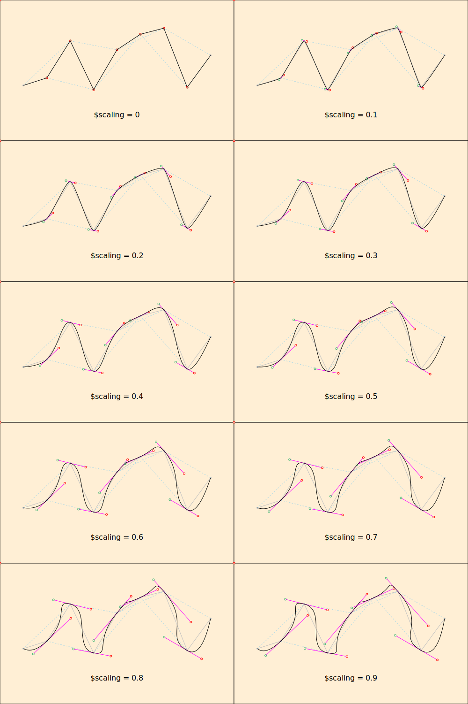
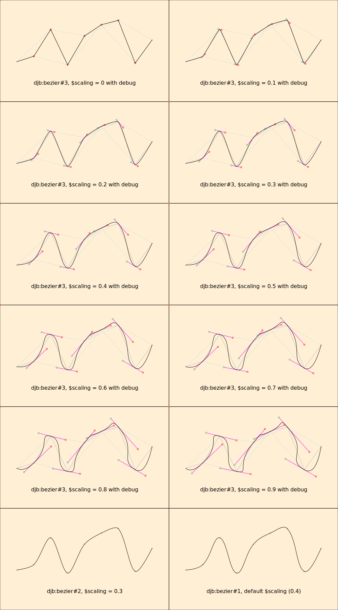

# Bézier curves in SVG using XSLT

## Synopsis

Inspired by Giel Berkers’s [Drawing a smooth bezier line through several points](https://gielberkers.com/drawing-a-smooth-bezier-line-through-several-points/) and Coty Embry’s [Spline interpolation with cubic Bezier curves using SVG and path (make lines curvy)](https://www.youtube.com/watch?v=o9tY9eQ0DgU), this tutorial describes how we developed an XSLT library function that smooths a line graph by using Bézier curves to round off the meeting points. 

The package that contains the final version of the function is *bezier.xsl* and the Saxon configuration files that make it available for the Saxon HE and EE processors are *he-config.xml* and *ee-config.xml*. (These configurations assume that the configuration file and *bezier.xsl* are in the same directory.) There are three versions for the function, with different arities, about which see below.

This tutorial is long because it include the full XSLT code for each step of the development, but the prose descriptions and illustrative SVG output can be read on their own, skipping over the XSLT code, by those who are not interested in how intemediate stages were implemented. It is not necessary to read the tutorial to use the function, but it might prove insightful for those who do not already know how Bézier curves work.

## Signature

### Arity 3

```xpath
djb:bezier($points as xs:string, $scaling as xs:double, $debug as xs:boolean) as element()+
```

`djb:bezier()` always returns an SVG `<g>` element. If `$debug` is True, the arity-3 version, intended for debugging and documentation, includes diagnostic artifacts (polyline, control lines and points) in the SVG `<g>` element, and it also returns an HTML `<html>` element with a table of diagnostic values. This means that the user has to handle the return to separate the `<g>` and the `<html>`.

If `$debug` is false, the output is the same as that of the arity-2 version.

### Arity 2

```xpath
djb:bezier($points as xs:string, $scaling as xs:double) as element(svg:g)
```

The arity-2 version of `djb:bezier()` returns an SVG `<g>` element with just the spline. It is equivalent to the arity-3 version with `$debug` equal to False. Use this version to specify a `$scaling` value other than the default (`0.4`).

### Arity 1

```xpath
djb:bezier($points as xs:string) as element(svg:g)
```

The arity-1 version of `djb:bezier()` returns an SVG `<g>` element with just the spline, and with a default `$scaling` value of `0.4`.

### Arguments and results

Argument | Type | Default | Meaning
----|----|----|----
`$points` | xs:string | (required) | A string that conforms to a subset of the syntax of the `@points` attribute of an SVG `<polyline>`, specifically, a whitespace-delimited sequence of `X,Y` coordinates, where the `X` and `Y` values are separated by a comma without intervening whitespace. (For example, `50,182 100,166 150,87 200,191 250,106` describes five points. The syntax of the `$points` argument to our function is stricter than the syntax of the `@points` attribute for an SVG `<polyline>`, about which see <https://www.w3.org/TR/SVG11/shapes.html#PointsBNF>.) The function raises a fatal error if `$points` does not match this pattern or if it includes fewer than three points.
`$scaling` | xs:double? | 0.4 | If present, must be a number between 0 and 1. The function raises a fatal error if the value is not within this range. Embry tells us that `$scaling`, which controls the curviness of the spline, gives the best results when it ranges between "0.33" and "0.5". A value of "0" creates a `<polyline>`, that is, a line graph with straight segments. If `$scaling is not supplied`, a default value of "0.4" is used.
`$debug` | xs:boolean? | False | A True of `$debug` causes the rendering to include not only the spline (curved connected sequence of points), but also the illustrative artifacts (other lines and circles) used in this tutorial. A True value also causes an XHTML file with diagnostic information, as an HTML `<table>`, to be written to a file called *diagnostic.xhtml*. A False value, which is the default, outputs only the spline.
*Result* | `element(svg:g)` | (none) | An SVG `<g>` element that contains an SVG `<path>` element that describes the spline. If `$debug` is True, the `<g>` also contains diagnostic SVG artifacts.
*Result* | `element(html:html)?` | (none) | If `$debug` is True, numeric diagnostic information as an XHTML `<table>` element returned alongside the SVG `<g>` element. In this case the user must postprocess the function return to handle the `<g>` and `<table>` separately.

## Terminology

* **Bézier curve.** A smooth curve between two endpoints, with the shape of the curve determined by additional control points not located on the curve.
* **Spline** or **polybézier.** A smoothly connected sequence of individual Bézier curves. Our function returns a spline, implemented as an SVG `<path>` element. We refer to the Bézier curves that make up a spline as either **curves** or **curve segments**, much as **line segments** make up a **polyline**.
* **Knot.** A point on the spline. The first knot is the starting point of the first curve segment, the last knot is the ending point of the last curve segment, and each other knot is simultaneously the ending point of the incoming curve segment and the starting point of the outgoing one. Technically knots connect two Bézier curve segments as parts of a spline, and the first and last points on the spline do not connect anything. We nonetheless refer to the starting and ending points of all Bézier curves, including the first and last, as knots.
* **Starting point** and **ending point.** The two endpoints of a Bézier curve segment, distinct from the **control points**, which are not located on the curve.
* **Control point**, **anchor point**, or **handle**. A point not on the curve (except accidentally) that determines the shape of the curve between two knots (endpoints of a curve segment).
* **Quadratic Bézier curve.** A Bézier curve with a single handle. We use quadratic Bézier curves as the first and last curve segments of our spline.
* **Cubic Bézier curve.** A Bézier curve with two handles, one anchored at the starting knot and one at the ending knot. We use cubic Bézier curves for all curve segments of our spline except the first and last.

We also use the following non-standard terms in this tutorial:

* **Joining line.** An imaginary line connecting two knots immediately next to a single intervening knot, e.g., points 1 and 3 (2 is the intervening knot), 2 and 4 (3 is the intervening knot), 3 and 5 (4 is the intervening knot), etc.
* **Control line.** An imaginary line connecting the two control points that are associated with a knot, passing through the knot in the middle.

As we explain below, to create a smooth spline these two lines must observe the following relationships:

1. The control line that passes through a knot must be parallel to the joining line that connects the points immediately next to that knot. For example, the control line that passes through knot 2 must be parallel to the joining line that connects knots 1 and 3.
2. For all control lines, the length of each control line is proportional to its corresponding (opposing, parallel) joining line.

## The mathematics of Bézier curves

**Cubic Bézier curves** are defined by four **points**. Two, located on the **spline**, are the **starting point** and **ending point** of the **curve segment**. The other two, called **control points** (also **anchor points** or **handles**), are typically not located on the curve (if they are, it is accidental), but nonetheless control its shape. Complex continuous shapes with multiple curves in different directions, called **splines**, can be created by joining individual Bézier curve segements at **knots**, that is, points on the spline where two curve segments meet. In order to ensure that these segments meet smoothly, without a visible **cusp** (angle), the individual cubic Bézier curves that make up a spline must have the following properties:

1. Alternating points on the curve (e.g., the first and third, second and fourth, third and fifth, etc.) are connected by an imaginary **joining line**, which, with the point on the curve between the two endpoints of the joining line, form a triangle, where the intermediate point is opposite the joining line. For example, if points A, B, and C, in that order, lie on the spline, we connect A to B and B to C because they are consecutive and then draw an imaginary joining line between A and C to form an imaginary triangle ABC.
2. An imaginary **control line** is drawn through the point opposite the imaginary joining line (point B in the example above), and *parallel to it*; all points on the spline except the first and last have such a control line. The control line extends a certain distance to either side of that point and terminates in a **control point**. The distance of each control point from the point on the curve through which the control line passes affects the shape of the curve; we set that distance initially at a uniform 20% of the length of the joining line and fine-tune it later.
3. When a cubic Bézier curve is drawn, then, it is defined by two adjacent points on the curve (the starting and ending points), the outgoing control point of the starting point, and the incoming control point of the ending point. The shape of a quadratic Bézier curve is determined by a single control point, about which see immediately below.
4. The first and last points on the spline do not have control points, which means that their shape is determined only by the control point at the other end of the curve segment. The first curve has a control point associated only with its ending point, which is the second point on the spline; the last curve has a control point associated only with its starting point, which is the penultimate point on the spline. We begin this tutorial by drawing all curve segments, including the first and last curve, as cubic Bézier curves (which means supplying an approximate additional control point for the degenerate first and last curve segments); we then refine our implementation by replacing the first and last curve segments with quadratic Bézier curves, as is more appropriate where there is only a single control point. 

The following image (from <https://en.wikipedia.org/wiki/B%C3%A9zier_curve>) illustrates how the starting point and ending point (P<sub>0</sub> and P<sub>3</sub>) define the endpoints of a cubic Bézier curve and the control points (P<sub>1</sub> and P<sub>2</sub>) control the shape of the curve:


You can experiment with an interactive cubic Bézier visualization webapp, moving the knots and control points and observing the effect on the shape of the curve, at <https://cubic-bezier.com/>.

The following sample output was created by our XSLT transformation:


The components of the image are as follows:

* Bézier spline: black
* Polyline: solid and silver, with silver dots at the knots
* Joining lines: dotted and pale blue
* Control lines: magenta
* Incoming control point: green circle
* Outgoing control point: red circle

Note that control lines are parallel to the joining lines opposite them, and the lengths of the control and joining lines observe a constant proportion.

## Bézier curves and SVG

The SVG `<path>` element can describe the shape of the spline by recording the four control points for each cubic Bézier curve segment (and the three for each quadratic Bézier curve segment) that make up the spline. The input supplies the points on the spline, which means that the challenge is to place the control points, that is, to determine their location, angle, and length. The syntax of the how the path is represented in SVG is described below.

## Berkers’s method and Embry’s adjustments

### Berkers’s method

Berkers’s method for plotting Bézier curves, which is the starting point for our implementation in XSLT below, is as follows:

1. Plot a line graph the connects the points with line segments.
3. Superimpose secondary line graphs that connect alternating points, e.g., connecting *X<sub>1</sub>Y<sub>1</sub>* to *X<sub>3</sub>Y<sub>3</sub>*, *X<sub>2</sub>Y<sub>2</sub>* to *X<sub>4</sub>Y<sub>4</sub>*, etc. (we use one-based counting, as is appropriate for XPath). These are the joining lines described above.
4. Get the lengths of the joining lines. (Use the Pythagorean theorem, where the distances between the two X values and the two Y values of the endpoints are the lengths of the legs, that is, the sides adjacent to the right angle, and the line between the points, the joining line, is the hypotenuse.)
5. Divide the original distances between the X points and the Y points by the length of the hypotenuse to get the unit vectors. Call these `$unitX` and `$unitY`.
6. The two normals (endpoints of a perpendicular unit vector) are `-$unitY, $unitX` and `$unitY, -$unitX`, which rotates the unit vector around its center by 90º. See <https://stackoverflow.com/questions/1243614/how-do-i-calculate-the-normal-vector-of-a-line-segment> for how this works. (As one of the comments there explains, no division is involved, which removes the risk of division by zero.)
7. Determine the angles of the two anchor points.
8. Set the lengths of the handles (by default) to 20% of the length of the joining line.
9. Construct an SVG `<path>` element, employing the `C` (*curve to*) command to create the cubic Bézier curves that make up a spline.

### Embry’s adjustments

We then make three modifications to Berkers’s method, taken from Embry’s video tutorial:

1. Berkers uses the `C` command to create a sequence of cubic Bézier curves from the first knot to the last. Because the first and last curves on the spline have only a single control point, Embry uses the `Q` command to create them as quadratic Bézier curves, using cubic curves for all of the other spline segments.
1. Berkers sets the lengths of the anchors arbitrarily at 20% of the length of the imaginary joining line, so that both anchors coming out of a single knot are the same length. Embry sets them at different lengths in a way that yields a smoother curve. 
2. Embry uses a *scaling factor* to control the curviness of the spline; we incorporate this as an user-supplied parameter.

Berkers’s visualizations are created in PHP and Embry’s in JavaScript. The implementation below is in XSLT 3.0.

## Step by step using XSLT

### 1. Plot a line graph that connects the points with line segments

X values are evenly spaced; Y values are random. We use the same points throughout this tutorial.

#### Output


#### XSLT

```xslt
<?xml version="1.0" encoding="UTF-8"?>
<xsl:stylesheet xmlns:xsl="http://www.w3.org/1999/XSL/Transform"
    xmlns:xs="http://www.w3.org/2001/XMLSchema"
    xmlns:math="http://www.w3.org/2005/xpath-functions/math" exclude-result-prefixes="#all"
    xmlns="http://www.w3.org/2000/svg" version="3.0">
    <xsl:output method="xml" indent="yes"/>
    <!--
        9 points, X values evenly spaced, Y values random
    -->
    <xsl:variable name="xPoints" as="xs:integer+"
        select="50, 100, 150, 200, 250, 300, 350, 400, 450"/>
    <xsl:variable name="yPoints" as="xs:integer+" select="182, 166, 87, 191, 106, 73, 60, 186, 118"/>
    <xsl:variable name="points" as="element(Q{}point)+">
        <xsl:for-each select="1 to count($xPoints)">
            <xsl:element name="point" xmlns="">
                <xsl:value-of select="string-join(($xPoints[current()], $yPoints[current()]), ',')"
                />
            </xsl:element>
        </xsl:for-each>
    </xsl:variable>
    <xsl:variable name="cRadius" as="xs:integer" select="2"/>

    <xsl:template name="xsl:initial-template">
        <svg width="1000" height="600" viewBox="0 0 500 300">
            <style type="text/css"><![CDATA[
                .mainLine {
                    fill: none;
                    stroke: black;
                    stroke-width: 1;
                }
                .mainCircle {
                    fill: black;
                }
                .alternatingLine {
                    fill: none;
                    stroke: blue;
                    stroke-width: 1;
                    stroke-dasharray: 3 3;
                }]]></style>
            <g>
                <!-- background-->
                <rect x="0" y="0" width="500" height="300" stroke="black" stroke-width="1"
                    fill="papayawhip"/>
                <!-- main circles and connecting lines -->
                <xsl:for-each select="1 to count($xPoints)">
                    <circle class="mainCircle" cx="{$xPoints[current()]}" cy="{$yPoints[current()]}"
                        r="{$cRadius}"/>
                </xsl:for-each>
                <polyline class="mainLine" points="{string-join($points, ' ')}"/>
            </g>
        </svg>

    </xsl:template>
</xsl:stylesheet>
```

### 2. Draw connecting lines between alternating points

#### Output


#### XSLT

```xslt
<?xml version="1.0" encoding="UTF-8"?>
<xsl:stylesheet xmlns:xsl="http://www.w3.org/1999/XSL/Transform"
    xmlns:xs="http://www.w3.org/2001/XMLSchema"
    xmlns:math="http://www.w3.org/2005/xpath-functions/math" exclude-result-prefixes="#all"
    xmlns="http://www.w3.org/2000/svg" version="3.0">
    <xsl:output method="xml" indent="yes"/>
    <!--
        9 points, X values evenly spaced, Y values random
    -->
    <xsl:variable name="xPoints" as="xs:integer+"
        select="50, 100, 150, 200, 250, 300, 350, 400, 450"/>
    <xsl:variable name="yPoints" as="xs:integer+" select="182, 166, 87, 191, 106, 73, 60, 186, 118"/>
    <xsl:variable name="points" as="element(Q{}point)+">
        <xsl:for-each select="1 to count($xPoints)">
            <xsl:element name="point" xmlns="">
                <xsl:value-of select="string-join(($xPoints[current()], $yPoints[current()]), ',')"
                />
            </xsl:element>
        </xsl:for-each>
    </xsl:variable>
    <xsl:variable name="cRadius" as="xs:integer" select="2"/>

    <xsl:template name="xsl:initial-template">
        <svg width="1000" height="600" viewBox="0 0 500 300">
            <style type="text/css"><![CDATA[
                .mainLine {
                    fill: none;
                    stroke: black;
                    stroke-width: 1;
                }
                .mainCircle {
                    fill: black;
                }
                .alternatingLine {
                    fill: none;
                    stroke: blue;
                    stroke-width: 1;
                    stroke-dasharray: 3 3;
                }]]></style>
            <g>
                <!-- background-->
                <rect x="0" y="0" width="500" height="300" stroke="black" stroke-width="1"
                    fill="papayawhip"/>
                <!-- main circles and connecting lines -->
                <xsl:for-each select="1 to count($xPoints)">
                    <circle class="mainCircle" cx="{$xPoints[current()]}" cy="{$yPoints[current()]}"
                        r="{$cRadius}"/>
                </xsl:for-each>
                <polyline class="mainLine" points="{string-join($points, ' ')}"/>
                <!-- alternatingLines -->
                <polyline class="alternatingLine" points="{$points[position() mod 2 eq 0]}"/>
                <polyline class="alternatingLine" points="{$points[position() mod 2 eq 1]}"/>
            </g>
        </svg>

    </xsl:template>
</xsl:stylesheet>
```

### 3. Get the lengths of the connecting lines

We create some additional variables here and output them, for diagnostic purposes, using `<xsl:message>`.

#### Output


#### Diagnostics

```text
bezierLength 1: 137.93
bezierLength 2: 103.08
bezierLength 3: 101.79
bezierLength 4: 154.67
bezierLength 5: 110.07
bezierLength 6: 150.89
bezierLength 7: 115.60
```

#### XSLT

```xslt
<?xml version="1.0" encoding="UTF-8"?>
<xsl:stylesheet xmlns:xsl="http://www.w3.org/1999/XSL/Transform"
    xmlns:xs="http://www.w3.org/2001/XMLSchema"
    xmlns:math="http://www.w3.org/2005/xpath-functions/math" exclude-result-prefixes="#all"
    xmlns="http://www.w3.org/2000/svg" xmlns:svg="http://www.w3.org/2000/svg" version="3.0">
    <xsl:output method="xml" indent="yes"/>

    <!-- ================================================================= -->
    <!-- Stylesheet variables                                              -->
    <!-- ================================================================= -->
    <!-- Line points: X values evenly spaced, Y values random              -->
    <!-- ================================================================= -->
    <xsl:variable name="xPoints" as="xs:integer+"
        select="50, 100, 150, 200, 250, 300, 350, 400, 450"/>
    <xsl:variable name="yPoints" as="xs:integer+" select="182, 166, 87, 191, 106, 73, 60, 186, 118"/>
    <xsl:variable name="points" as="element(point)+">
        <xsl:for-each select="1 to count($xPoints)">
            <xsl:element name="point" xmlns="">
                <xsl:value-of select="string-join(($xPoints[current()], $yPoints[current()]), ',')"
                />
            </xsl:element>
        </xsl:for-each>
    </xsl:variable>
    <xsl:variable name="connectingLineLenghts" as="xs:double+">
        <xsl:for-each select="1 to count($points) - 2">
            <xsl:variable name="x1" as="xs:integer" select="$xPoints[position() eq current()]"/>
            <xsl:variable name="x2" as="xs:integer" select="$xPoints[position() eq current() + 2]"/>
            <xsl:variable name="y1" as="xs:integer" select="$yPoints[position() eq current()]"/>
            <xsl:variable name="y2" as="xs:integer" select="$yPoints[position() eq current() + 2]"/>
            <xsl:variable name="xDistance" as="xs:integer" select="$x2 - $x1"/>
            <xsl:variable name="yDistance" as="xs:integer" select="$y2 - $y1"/>
            <xsl:sequence
                select="(math:pow($xDistance, 2) + math:pow($yDistance, 2)) => math:sqrt()"/>
        </xsl:for-each>
    </xsl:variable>
    <!-- ================================================================= -->
    <!-- SVG constants                                                     -->
    <!--                                                                   -->
    <!-- $svgWidth as xs:integer : width of viewport                       -->
    <!-- $svgHeight as xs:integer : height of viewport                     -->
    <!--   Note: halve these values in viewBox to scale up to 200%         -->
    <!-- $cRadius as xs:integer : radius of main and anchor points         -->
    <!-- $css as element(svg:style) : convenience variable                 -->
    <!-- ================================================================= -->
    <xsl:variable name="svgWidth" as="xs:integer" select="1000"/>
    <xsl:variable name="svgHeight" as="xs:integer" select="600"/>
    <xsl:variable name="cRadius" as="xs:integer" select="2"/>
    <xsl:variable name="css" as="element(svg:style)">
        <style type="text/css"><![CDATA[
            .mainLine {
                fill: none;
                stroke: black;
                stroke-width: 1;
            }
            .mainCircle {
                fill: black;
            }
            .alternatingLine {
                fill: none;
                stroke: blue;
                stroke-width: 1;
                stroke-dasharray: 3 3;
            }]]></style>
    </xsl:variable>
    <!-- ================================================================= -->

    <!-- ================================================================= -->
    <!-- Main                                                              -->
    <!-- ================================================================= -->
    <xsl:template name="xsl:initial-template">
        <!-- ============================================================= -->
        <!-- Diagnostics                                                   -->
        <!--                                                               -->
        <!-- $connectingLineLengths                                        -->
        <!-- ============================================================= -->
        <xsl:message
            select="
                '$connectingLineLenghts&#x0a;' ||
                string-join($connectingLineLenghts ! round(., 2), ' ')"/>
        <!-- ============================================================= -->
        <svg width="{$svgWidth}" height="{$svgHeight}"
            viewBox="0 0 {$svgWidth div 2} {$svgHeight div 2}">
            <xsl:sequence select="$css"/>
            <g>
                <!-- background-->
                <rect x="0" y="0" width="500" height="300" stroke="black" stroke-width="1"
                    fill="papayawhip"/>
                <!-- main circles and connecting lines -->
                <xsl:for-each select="1 to count($xPoints)">
                    <circle class="mainCircle" cx="{$xPoints[current()]}" cy="{$yPoints[current()]}"
                        r="{$cRadius}"/>
                </xsl:for-each>
                <polyline class="mainLine" points="{string-join($points, ' ')}"/>
                <!-- alternatingLines -->
                <polyline class="alternatingLine" points="{$points[position() mod 2 eq 0]}"/>
                <polyline class="alternatingLine" points="{$points[position() mod 2 eq 1]}"/>
            </g>
        </svg>
    </xsl:template>
</xsl:stylesheet>
```

### 4. Get the unit vectors of the lines

As the number of variables grows, we switch to outputting them as an HTML `<table>` element (instead of as an `<xsl:message>`), for insertion into this tutorial. 

*Note:* We will raise a division-by-zero error if the length of the hypotenuse is 0, which can happen only if the two endpoints of a joining line are the same point, that is, have the same X and Y coordinates. Because we do not anticipate needing to process a graph of this shape (in line and spline graphs, positions on the independent axis normally increase or decrease monotonically), we do not trap this error.

#### Output


#### Diagnostics

<table style="text-align: right;">
   <tr style="text-align: center;">
      <th>#</th>
      <th>dirX</th>
      <th>dirY</th>
      <th>length</th>
      <th>unitX</th>
      <th>$unitY</th>
   </tr>
   <tr>
      <td>1</td>
      <td>100</td>
      <td>-95</td>
      <td>137.93</td>
      <td>0.72</td>
      <td>-0.69</td>
   </tr>
   <tr>
      <td>2</td>
      <td>100</td>
      <td>25</td>
      <td>103.08</td>
      <td>0.97</td>
      <td>0.24</td>
   </tr>
   <tr>
      <td>3</td>
      <td>100</td>
      <td>19</td>
      <td>101.79</td>
      <td>0.98</td>
      <td>0.19</td>
   </tr>
   <tr>
      <td>4</td>
      <td>100</td>
      <td>-118</td>
      <td>154.67</td>
      <td>0.65</td>
      <td>-0.76</td>
   </tr>
   <tr>
      <td>5</td>
      <td>100</td>
      <td>-46</td>
      <td>110.07</td>
      <td>0.91</td>
      <td>-0.42</td>
   </tr>
   <tr>
      <td>6</td>
      <td>100</td>
      <td>113</td>
      <td>150.89</td>
      <td>0.66</td>
      <td>0.75</td>
   </tr>
   <tr>
      <td>7</td>
      <td>100</td>
      <td>58</td>
      <td>115.60</td>
      <td>0.87</td>
      <td>0.50</td>
   </tr>
</table>

#### XSLT

```xslt
<?xml version="1.0" encoding="UTF-8"?>
<xsl:stylesheet xmlns:xsl="http://www.w3.org/1999/XSL/Transform"
    xmlns:xs="http://www.w3.org/2001/XMLSchema"
    xmlns:math="http://www.w3.org/2005/xpath-functions/math" exclude-result-prefixes="#all"
    xmlns="http://www.w3.org/2000/svg" xmlns:svg="http://www.w3.org/2000/svg" version="3.0">
    <xsl:output method="xml" indent="yes"/>

    <!-- ================================================================= -->
    <!-- Stylesheet variables                                              -->
    <!-- ================================================================= -->
    <!-- Line points: X values evenly spaced, Y values random              -->
    <!-- $xPoints as xs:integer+ : X coordinates of points                 -->
    <!-- $yPoints as xs:integer+ : Y coordinates of points                 -->
    <!-- $points as element(point)+ : comma separated X,Y values of points -->
    <!-- ================================================================= -->
    <xsl:variable name="xPoints" as="xs:integer+"
        select="50, 100, 150, 200, 250, 300, 350, 400, 450"/>
    <xsl:variable name="yPoints" as="xs:integer+" select="182, 166, 87, 191, 106, 73, 60, 186, 118"/>
    <xsl:variable name="points" as="element(point)+">
        <xsl:for-each select="1 to count($xPoints)">
            <xsl:element name="point" xmlns="">
                <xsl:value-of select="string-join(($xPoints[current()], $yPoints[current()]), ',')"
                />
            </xsl:element>
        </xsl:for-each>
    </xsl:variable>
    <!-- ================================================================= -->


    <!-- ================================================================= -->
    <!-- Computed values                                                   -->
    <!--                                                                   -->
    <!-- $dirXs as xs:double+ : X coordinates of hypotenuses               -->
    <!-- $dirYs as xs:double+ : Y coordinates of hypotenuses               -->
    <!-- $connectingLineLengths as xs:double+ : formed by                  -->
    <!--   connecting alternate points                                     -->
    <!-- $unitXs as xs:double+ : X coordinates of unit vectors             -->
    <!-- $unitYs as xs:double+ " Y coordinates of unit vectors             -->
    <!-- ================================================================= -->

    <xsl:variable name="dirXs" as="xs:integer+">
        <xsl:for-each select="1 to count($points) - 2">
            <xsl:variable name="x1" as="xs:integer" select="$xPoints[position() eq current()]"/>
            <xsl:variable name="x2" as="xs:integer" select="$xPoints[position() eq current() + 2]"/>
            <xsl:sequence select="$x2 - $x1"/>
        </xsl:for-each>
    </xsl:variable>
    <xsl:variable name="dirYs" as="xs:integer+">
        <xsl:for-each select="1 to count($points) - 2">
            <xsl:variable name="y1" as="xs:integer" select="$yPoints[position() eq current()]"/>
            <xsl:variable name="y2" as="xs:integer" select="$yPoints[position() eq current() + 2]"/>
            <xsl:sequence select="$y2 - $y1"/>
        </xsl:for-each>
    </xsl:variable>
    <xsl:variable name="lengths" as="xs:double+">
        <xsl:for-each select="1 to count($points) - 2">
            <xsl:variable name="xDistance" as="xs:integer" select="$dirXs[current()]"/>
            <xsl:variable name="yDistance" as="xs:integer" select="$dirYs[current()]"/>
            <xsl:sequence
                select="(math:pow($xDistance, 2) + math:pow($yDistance, 2)) => math:sqrt()"/>
        </xsl:for-each>
    </xsl:variable>
    <xsl:variable name="unitXs" as="xs:double+">
        <xsl:for-each select="1 to count($points) - 2">
            <xsl:sequence select="$dirXs[current()] div $lengths[current()]"/>
        </xsl:for-each>
    </xsl:variable>
    <xsl:variable name="unitYs" as="xs:double+">
        <xsl:for-each select="1 to count($points) - 2">
            <xsl:sequence select="$dirYs[current()] div $lengths[current()]"/>
        </xsl:for-each>
    </xsl:variable>
    <!-- ================================================================= -->

    <!-- ================================================================= -->
    <!-- SVG constants                                                     -->
    <!--                                                                   -->
    <!-- $svgWidth as xs:integer : width of viewport                       -->
    <!-- $svgHeight as xs:integer : height of viewport                     -->
    <!--   Note: halve these values in viewBox to scale up to 200%         -->
    <!-- $cRadius as xs:integer : radius of main and anchor points         -->
    <!-- $css as element(svg:style) : convenience variable                 -->
    <!-- ================================================================= -->
    <xsl:variable name="svgWidth" as="xs:integer" select="1000"/>
    <xsl:variable name="svgHeight" as="xs:integer" select="600"/>
    <xsl:variable name="cRadius" as="xs:integer" select="2"/>
    <xsl:variable name="css" as="element(svg:style)">
        <style type="text/css"><![CDATA[
            .mainLine {
                fill: none;
                stroke: black;
                stroke-width: 1;
            }
            .mainCircle {
                fill: black;
            }
            .alternatingLine {
                fill: none;
                stroke: blue;
                stroke-width: 1;
                stroke-dasharray: 3 3;
            }]]></style>
    </xsl:variable>
    <!-- ================================================================= -->

    <!-- ================================================================= -->
    <!-- Main                                                              -->
    <!-- ================================================================= -->
    <xsl:template name="xsl:initial-template">
        <!-- ============================================================= -->
        <!-- Diagnostics                                                   -->
        <!--                                                               -->
        <!-- $dirXs, $dirYs, $connectingLineLengths                        -->
        <!-- ============================================================= -->
        <xsl:result-document href="diagnostics.xml" omit-xml-declaration="yes" indent="yes">
            <table xmlns="" style="text-align: right;">
                <tr style="text-align: center;">
                    <th>#</th>
                    <th>dirY</th>
                    <th>dirY</th>
                    <th>length</th>
                    <th>unitX</th>
                    <th>unitY</th>
                </tr>
                <xsl:for-each select="1 to count($points) - 2">
                    <tr>
                        <td>
                            <xsl:sequence select="."/>
                        </td>
                        <td>
                            <xsl:sequence select="$dirXs[current()]"/>
                        </td>
                        <td>
                            <xsl:sequence select="$dirYs[current()]"/>
                        </td>
                        <td>
                            <xsl:sequence select="$lengths[current()] ! format-number(., '#.00')"/>
                        </td>
                        <td>
                            <xsl:sequence select="$unitXs[current()] ! format-number(., '0.00')"/>
                        </td>
                        <td>
                            <xsl:sequence select="$unitYs[current()] ! format-number(., '0.00')"/>
                        </td>

                    </tr>
                </xsl:for-each>
            </table>
        </xsl:result-document>
        
        <!-- ============================================================= -->
        <!-- Now draw the SVG image                                        -->
        <!-- ============================================================= -->
        <svg width="{$svgWidth}" height="{$svgHeight}"
            viewBox="0 0 {$svgWidth div 2} {$svgHeight div 2}">
            <xsl:sequence select="$css"/>
            <g>
                <!-- ===================================================== -->
                <!-- Background                                            -->
                <!-- ===================================================== -->
                <rect x="0" y="0" width="500" height="300" stroke="black" stroke-width="1"
                    fill="papayawhip"/>
                <!-- ===================================================== -->
                <!-- Data points and connecting lines                      -->
                <!-- ===================================================== -->
                <xsl:for-each select="1 to count($xPoints)">
                    <circle class="mainCircle" cx="{$xPoints[current()]}" cy="{$yPoints[current()]}"
                        r="{$cRadius}"/>
                </xsl:for-each>
                <polyline class="mainLine" points="{string-join($points, ' ')}"/>
                <!-- ===================================================== -->
                <!-- Alternating (hypotenuse) lines                        -->
                <!-- ===================================================== -->
                <xsl:for-each select="0, 1">
                    <polyline class="alternatingLine"
                        points="{$points[position() mod 2 eq current()]}"/>
                </xsl:for-each>
            </g>
        </svg>
    </xsl:template>
</xsl:stylesheet>
```

### 5. Get the normals (perpendiculars)

#### SVG


#### Diagnostics

<table style="text-align: right;">
   <tr style="text-align: center;">
      <th>#</th>
      <th>dirX</th>
      <th>dirY</th>
      <th>length</th>
      <th>unitX</th>
      <th>unitY</th>
      <th>normal1</th>
      <th>normal2</th>
   </tr>
   <tr>
      <td>1</td>
      <td>100</td>
      <td>-95</td>
      <td>137.93</td>
      <td>0.72</td>
      <td>-0.69</td>
      <td>0.69, 0.72</td>
      <td>-0.69, -0.72</td>
   </tr>
   <tr>
      <td>2</td>
      <td>100</td>
      <td>25</td>
      <td>103.08</td>
      <td>0.97</td>
      <td>0.24</td>
      <td>-0.24, 0.97</td>
      <td>0.24, -0.97</td>
   </tr>
   <tr>
      <td>3</td>
      <td>100</td>
      <td>19</td>
      <td>101.79</td>
      <td>0.98</td>
      <td>0.19</td>
      <td>-0.19, 0.98</td>
      <td>0.19, -0.98</td>
   </tr>
   <tr>
      <td>4</td>
      <td>100</td>
      <td>-118</td>
      <td>154.67</td>
      <td>0.65</td>
      <td>-0.76</td>
      <td>0.76, 0.65</td>
      <td>-0.76, -0.65</td>
   </tr>
   <tr>
      <td>5</td>
      <td>100</td>
      <td>-46</td>
      <td>110.07</td>
      <td>0.91</td>
      <td>-0.42</td>
      <td>0.42, 0.91</td>
      <td>-0.42, -0.91</td>
   </tr>
   <tr>
      <td>6</td>
      <td>100</td>
      <td>113</td>
      <td>150.89</td>
      <td>0.66</td>
      <td>0.75</td>
      <td>-0.75, 0.66</td>
      <td>0.75, -0.66</td>
   </tr>
   <tr>
      <td>7</td>
      <td>100</td>
      <td>58</td>
      <td>115.60</td>
      <td>0.87</td>
      <td>0.50</td>
      <td>-0.50, 0.87</td>
      <td>0.50, -0.87</td>
   </tr>
</table>

#### XSLT

```xslt
<?xml version="1.0" encoding="UTF-8"?>
<xsl:stylesheet xmlns:xsl="http://www.w3.org/1999/XSL/Transform"
    xmlns:xs="http://www.w3.org/2001/XMLSchema"
    xmlns:math="http://www.w3.org/2005/xpath-functions/math" exclude-result-prefixes="#all"
    xmlns="http://www.w3.org/2000/svg" xmlns:svg="http://www.w3.org/2000/svg" version="3.0">
    <xsl:output method="xml" indent="yes"/>

    <!-- ================================================================= -->
    <!-- Stylesheet variables                                              -->
    <!-- ================================================================= -->
    <!-- Line points: X values evenly spaced, Y values random              -->
    <!-- $xPoints as xs:integer+ : X coordinates of points                 -->
    <!-- $yPoints as xs:integer+ : Y coordinates of points                 -->
    <!-- $points as element(point)+ : comma separated X,Y values of points -->
    <!-- ================================================================= -->
    <xsl:variable name="xPoints" as="xs:integer+"
        select="50, 100, 150, 200, 250, 300, 350, 400, 450"/>
    <xsl:variable name="yPoints" as="xs:integer+" select="182, 166, 87, 191, 106, 73, 60, 186, 118"/>
    <xsl:variable name="points" as="element(point)+">
        <xsl:for-each select="1 to count($xPoints)">
            <xsl:element name="point" xmlns="">
                <xsl:value-of select="string-join(($xPoints[current()], $yPoints[current()]), ',')"
                />
            </xsl:element>
        </xsl:for-each>
    </xsl:variable>
    <!-- ================================================================= -->


    <!-- ================================================================= -->
    <!-- Computed values                                                   -->
    <!--                                                                   -->
    <!-- $dirXs as xs:double+ : X coordinates of hypotenuses               -->
    <!-- $dirYs as xs:double+ : Y coordinates of hypotenuses               -->
    <!-- $connectingLineLengths as xs:double+ : formed by                  -->
    <!--   connecting alternate points                                     -->
    <!-- $unitXs as xs:double+ : X coordinates of unit vectors             -->
    <!-- $unitYs as xs:double+ : Y coordinates of unit vectors             -->
    <!-- $normal1Xs as xs:double+ : X coordinates of endpoint 1 of normal  -->
    <!-- $normal1Ys as xs:double+ : Y coordinates of endpoint 1 of normal  -->
    <!-- $normal2Xs as xs:double+ : X coordinates of endpoint 2 of normal  -->
    <!-- $normal2Ys as xs:double+ : Y coordinates of endpoint 2 of normal  -->
    <!-- ================================================================= -->

    <xsl:variable name="dirXs" as="xs:integer+">
        <xsl:for-each select="1 to count($points) - 2">
            <xsl:variable name="x1" as="xs:integer" select="$xPoints[position() eq current()]"/>
            <xsl:variable name="x2" as="xs:integer" select="$xPoints[position() eq current() + 2]"/>
            <xsl:sequence select="$x2 - $x1"/>
        </xsl:for-each>
    </xsl:variable>
    <xsl:variable name="dirYs" as="xs:integer+">
        <xsl:for-each select="1 to count($points) - 2">
            <xsl:variable name="y1" as="xs:integer" select="$yPoints[position() eq current()]"/>
            <xsl:variable name="y2" as="xs:integer" select="$yPoints[position() eq current() + 2]"/>
            <xsl:sequence select="$y2 - $y1"/>
        </xsl:for-each>
    </xsl:variable>
    <xsl:variable name="lengths" as="xs:double+">
        <xsl:for-each select="1 to count($points) - 2">
            <xsl:variable name="xDistance" as="xs:integer" select="$dirXs[current()]"/>
            <xsl:variable name="yDistance" as="xs:integer" select="$dirYs[current()]"/>
            <xsl:sequence
                select="(math:pow($xDistance, 2) + math:pow($yDistance, 2)) => math:sqrt()"/>
        </xsl:for-each>
    </xsl:variable>
    <xsl:variable name="unitXs" as="xs:double+">
        <xsl:for-each select="1 to count($points) - 2">
            <xsl:sequence select="$dirXs[current()] div $lengths[current()]"/>
        </xsl:for-each>
    </xsl:variable>
    <xsl:variable name="unitYs" as="xs:double+">
        <xsl:for-each select="1 to count($points) - 2">
            <xsl:sequence select="$dirYs[current()] div $lengths[current()]"/>
        </xsl:for-each>
    </xsl:variable>
    <xsl:variable name="normal1Xs" as="xs:double+">
        <xsl:for-each select="1 to count($points) - 2">
            <xsl:sequence select="-$unitYs[current()]"/>
        </xsl:for-each>
    </xsl:variable>
    <xsl:variable name="normal1Ys" as="xs:double+">
        <xsl:for-each select="1 to count($points) - 2">
            <xsl:sequence select="$unitXs[current()]"/>
        </xsl:for-each>
    </xsl:variable>
    <xsl:variable name="normal2Xs" as="xs:double+">
        <xsl:for-each select="1 to count($points) - 2">
            <xsl:sequence select="$unitYs[current()]"/>
        </xsl:for-each>
    </xsl:variable>
    <xsl:variable name="normal2Ys" as="xs:double+">
        <xsl:for-each select="1 to count($points) - 2">
            <xsl:sequence select="-$unitXs[current()]"/>
        </xsl:for-each>
    </xsl:variable>
    <!-- ================================================================= -->

    <!-- ================================================================= -->
    <!-- SVG constants                                                     -->
    <!--                                                                   -->
    <!-- $svgWidth as xs:integer : width of viewport                       -->
    <!-- $svgHeight as xs:integer : height of viewport                     -->
    <!--   Note: halve these values in viewBox to scale up to 200%         -->
    <!-- $cRadius as xs:integer : radius of main and anchor points         -->
    <!-- $css as element(svg:style) : convenience variable                 -->
    <!-- ================================================================= -->
    <xsl:variable name="svgWidth" as="xs:integer" select="1000"/>
    <xsl:variable name="svgHeight" as="xs:integer" select="600"/>
    <xsl:variable name="cRadius" as="xs:integer" select="2"/>
    <xsl:variable name="css" as="element(svg:style)">
        <style type="text/css"><![CDATA[
            .mainLine {
                fill: none;
                stroke: black;
                stroke-width: 1;
            }
            .mainCircle {
                fill: black;
            }
            .alternatingLine {
                fill: none;
                stroke: blue;
                stroke-width: 1;
                stroke-dasharray: 3 3;
            }]]></style>
    </xsl:variable>
    <!-- ================================================================= -->

    <!-- ================================================================= -->
    <!-- Main                                                              -->
    <!-- ================================================================= -->
    <xsl:template name="xsl:initial-template">
        <!-- ============================================================= -->
        <!-- Diagnostics                                                   -->
        <!--                                                               -->
        <!-- $dirXs, $dirYs, $connectingLineLengths                        -->
        <!-- ============================================================= -->
        <xsl:result-document href="diagnostics.xml" omit-xml-declaration="yes" indent="yes">
            <table xmlns="" style="text-align: right;">
                <tr style="text-align: center;">
                    <th>#</th>
                    <th>dirX</th>
                    <th>dirY</th>
                    <th>length</th>
                    <th>unitX</th>
                    <th>unitY</th>
                    <th>normal1</th>
                    <th>normal2</th>
                </tr>
                <xsl:for-each select="1 to count($points) - 2">
                    <tr>
                        <td>
                            <xsl:sequence select="."/>
                        </td>
                        <td>
                            <xsl:sequence select="$dirXs[current()]"/>
                        </td>
                        <td>
                            <xsl:sequence select="$dirYs[current()]"/>
                        </td>
                        <td>
                            <xsl:sequence select="$lengths[current()] ! format-number(., '#.00')"/>
                        </td>
                        <td>
                            <xsl:sequence select="$unitXs[current()] ! format-number(., '0.00')"/>
                        </td>
                        <td>
                            <xsl:sequence select="$unitYs[current()] ! format-number(., '0.00')"/>
                        </td>
                        <td>
                            <xsl:sequence
                                select="
                                    string-join(
                                    (
                                    $normal1Xs[current()] ! format-number(., '0.00'),
                                    $normal1Ys[current()] ! format-number(., '0.00')
                                    ),
                                    ', ')"
                            />
                        </td>
                        <td>
                            <xsl:sequence
                                select="
                                    string-join(
                                    (
                                    $normal2Xs[current()] ! format-number(., '0.00'),
                                    $normal2Ys[current()] ! format-number(., '0.00')
                                    ),
                                    ', ')"
                            />
                        </td>
                    </tr>
                </xsl:for-each>
            </table>
        </xsl:result-document>

        <!-- ============================================================= -->
        <!-- Now draw the SVG image                                        -->
        <!-- ============================================================= -->
        <svg width="{$svgWidth}" height="{$svgHeight}"
            viewBox="0 0 {$svgWidth div 2} {$svgHeight div 2}">
            <xsl:sequence select="$css"/>
            <g>
                <!-- ===================================================== -->
                <!-- Background                                            -->
                <!-- ===================================================== -->
                <rect x="0" y="0" width="500" height="300" stroke="black" stroke-width="1"
                    fill="papayawhip"/>
                <!-- ===================================================== -->
                <!-- Data points and connecting lines                      -->
                <!-- ===================================================== -->
                <xsl:for-each select="1 to count($xPoints)">
                    <circle class="mainCircle" cx="{$xPoints[current()]}" cy="{$yPoints[current()]}"
                        r="{$cRadius}"/>
                </xsl:for-each>
                <polyline class="mainLine" points="{string-join($points, ' ')}"/>
                <!-- ===================================================== -->
                <!-- Alternating (hypotenuse) lines                        -->
                <!-- ===================================================== -->
                <xsl:for-each select="0, 1">
                    <polyline class="alternatingLine"
                        points="{$points[position() mod 2 eq current()]}"/>
                </xsl:for-each>
            </g>
        </svg>
    </xsl:template>
</xsl:stylesheet>
```

### 6. Get the angles

#### SVG


#### Diagnostics

<table style="text-align: right;">
   <tr style="text-align: center;">
      <th>#</th>
      <th>dirX</th>
      <th>dirY</th>
      <th>length</th>
      <th>unitX</th>
      <th>unitY</th>
      <th>normal1</th>
      <th>normal2</th>
      <th>angle1</th>
      <th>angle2</th>
   </tr>
   <tr>
      <td>1</td>
      <td>100</td>
      <td>-95</td>
      <td>137.93</td>
      <td>0.72</td>
      <td>-0.69</td>
      <td>0.69, 0.72</td>
      <td>-0.69, -0.72</td>
      <td>2.38</td>
      <td>-0.76</td>
   </tr>
   <tr>
      <td>2</td>
      <td>100</td>
      <td>25</td>
      <td>103.08</td>
      <td>0.97</td>
      <td>0.24</td>
      <td>-0.24, 0.97</td>
      <td>0.24, -0.97</td>
      <td>3.39</td>
      <td>0.24</td>
   </tr>
   <tr>
      <td>3</td>
      <td>100</td>
      <td>19</td>
      <td>101.79</td>
      <td>0.98</td>
      <td>0.19</td>
      <td>-0.19, 0.98</td>
      <td>0.19, -0.98</td>
      <td>3.33</td>
      <td>0.19</td>
   </tr>
   <tr>
      <td>4</td>
      <td>100</td>
      <td>-118</td>
      <td>154.67</td>
      <td>0.65</td>
      <td>-0.76</td>
      <td>0.76, 0.65</td>
      <td>-0.76, -0.65</td>
      <td>2.27</td>
      <td>-0.87</td>
   </tr>
   <tr>
      <td>5</td>
      <td>100</td>
      <td>-46</td>
      <td>110.07</td>
      <td>0.91</td>
      <td>-0.42</td>
      <td>0.42, 0.91</td>
      <td>-0.42, -0.91</td>
      <td>2.71</td>
      <td>-0.43</td>
   </tr>
   <tr>
      <td>6</td>
      <td>100</td>
      <td>113</td>
      <td>150.89</td>
      <td>0.66</td>
      <td>0.75</td>
      <td>-0.75, 0.66</td>
      <td>0.75, -0.66</td>
      <td>3.99</td>
      <td>0.85</td>
   </tr>
   <tr>
      <td>7</td>
      <td>100</td>
      <td>58</td>
      <td>115.60</td>
      <td>0.87</td>
      <td>0.50</td>
      <td>-0.50, 0.87</td>
      <td>0.50, -0.87</td>
      <td>3.67</td>
      <td>0.53</td>
   </tr>
</table>

#### XSLT

```xslt
<?xml version="1.0" encoding="UTF-8"?>
<xsl:stylesheet xmlns:xsl="http://www.w3.org/1999/XSL/Transform"
    xmlns:xs="http://www.w3.org/2001/XMLSchema"
    xmlns:math="http://www.w3.org/2005/xpath-functions/math" exclude-result-prefixes="#all"
    xmlns="http://www.w3.org/2000/svg" xmlns:svg="http://www.w3.org/2000/svg" version="3.0">
    <xsl:output method="xml" indent="yes"/>

    <!-- ================================================================= -->
    <!-- Stylesheet variables                                              -->
    <!-- ================================================================= -->
    <!-- Line points: X values evenly spaced, Y values random              -->
    <!-- $xPoints as xs:integer+ : X coordinates of points                 -->
    <!-- $yPoints as xs:integer+ : Y coordinates of points                 -->
    <!-- $points as element(point)+ : comma separated X,Y values of points -->
    <!-- ================================================================= -->
    <xsl:variable name="xPoints" as="xs:integer+"
        select="50, 100, 150, 200, 250, 300, 350, 400, 450"/>
    <xsl:variable name="yPoints" as="xs:integer+" select="182, 166, 87, 191, 106, 73, 60, 186, 118"/>
    <xsl:variable name="points" as="element(point)+">
        <xsl:for-each select="1 to count($xPoints)">
            <xsl:element name="point" xmlns="">
                <xsl:value-of select="string-join(($xPoints[current()], $yPoints[current()]), ',')"
                />
            </xsl:element>
        </xsl:for-each>
    </xsl:variable>
    <!-- ================================================================= -->

    <!-- ================================================================= -->
    <!-- Computed values                                                   -->
    <!--                                                                   -->
    <!-- $dirXs as xs:double+ : X coordinates of hypotenuses               -->
    <!-- $dirYs as xs:double+ : Y coordinates of hypotenuses               -->
    <!-- $connectingLineLengths as xs:double+ : formed by                  -->
    <!--   connecting alternate points                                     -->
    <!-- $unitXs as xs:double+ : X coordinates of unit vectors             -->
    <!-- $unitYs as xs:double+ : Y coordinates of unit vectors             -->
    <!-- $normal1Xs as xs:double+ : X coordinates of endpoint 1 of normal  -->
    <!-- $normal1Ys as xs:double+ : Y coordinates of endpoint 1 of normal  -->
    <!-- $normal2Xs as xs:double+ : X coordinates of endpoint 2 of normal  -->
    <!-- $normal2Ys as xs:double+ : Y coordinates of endpoint 2 of normal  -->
    <!-- $angle1s as xs:double+ : angle for normal1                        -->
    <!-- $angle2s as xs:double+ : angle for normal2                        -->
    <!-- ================================================================= -->

    <xsl:variable name="dirXs" as="xs:integer+">
        <xsl:for-each select="1 to count($points) - 2">
            <xsl:variable name="x1" as="xs:integer" select="$xPoints[position() eq current()]"/>
            <xsl:variable name="x2" as="xs:integer" select="$xPoints[position() eq current() + 2]"/>
            <xsl:sequence select="$x2 - $x1"/>
        </xsl:for-each>
    </xsl:variable>
    <xsl:variable name="dirYs" as="xs:integer+">
        <xsl:for-each select="1 to count($points) - 2">
            <xsl:variable name="y1" as="xs:integer" select="$yPoints[position() eq current()]"/>
            <xsl:variable name="y2" as="xs:integer" select="$yPoints[position() eq current() + 2]"/>
            <xsl:sequence select="$y2 - $y1"/>
        </xsl:for-each>
    </xsl:variable>
    <xsl:variable name="lengths" as="xs:double+">
        <xsl:for-each select="1 to count($points) - 2">
            <xsl:variable name="xDistance" as="xs:integer" select="$dirXs[current()]"/>
            <xsl:variable name="yDistance" as="xs:integer" select="$dirYs[current()]"/>
            <xsl:sequence
                select="(math:pow($xDistance, 2) + math:pow($yDistance, 2)) => math:sqrt()"/>
        </xsl:for-each>
    </xsl:variable>
    <xsl:variable name="unitXs" as="xs:double+">
        <xsl:for-each select="1 to count($points) - 2">
            <xsl:sequence select="$dirXs[current()] div $lengths[current()]"/>
        </xsl:for-each>
    </xsl:variable>
    <xsl:variable name="unitYs" as="xs:double+">
        <xsl:for-each select="1 to count($points) - 2">
            <xsl:sequence select="$dirYs[current()] div $lengths[current()]"/>
        </xsl:for-each>
    </xsl:variable>
    <xsl:variable name="normal1Xs" as="xs:double+">
        <xsl:for-each select="1 to count($points) - 2">
            <xsl:sequence select="-$unitYs[current()]"/>
        </xsl:for-each>
    </xsl:variable>
    <xsl:variable name="normal1Ys" as="xs:double+">
        <xsl:for-each select="1 to count($points) - 2">
            <xsl:sequence select="$unitXs[current()]"/>
        </xsl:for-each>
    </xsl:variable>
    <xsl:variable name="normal2Xs" as="xs:double+">
        <xsl:for-each select="1 to count($points) - 2">
            <xsl:sequence select="$unitYs[current()]"/>
        </xsl:for-each>
    </xsl:variable>
    <xsl:variable name="normal2Ys" as="xs:double+">
        <xsl:for-each select="1 to count($points) - 2">
            <xsl:sequence select="-$unitXs[current()]"/>
        </xsl:for-each>
    </xsl:variable>
    <xsl:variable name="angle1s" as="xs:double+">
        <xsl:for-each select="1 to count($points) - 2">
            <xsl:sequence
                select="math:atan2($normal1Ys[current()], $normal1Xs[current()]) + math:pi() div 2"
            />
        </xsl:for-each>
    </xsl:variable>
    <xsl:variable name="angle2s" as="xs:double+">
        <xsl:for-each select="1 to count($points) - 2">
            <xsl:sequence
                select="math:atan2($normal2Ys[current()], $normal2Xs[current()]) + math:pi() div 2"
            />
        </xsl:for-each>
    </xsl:variable>
    <!-- ================================================================= -->

    <!-- ================================================================= -->
    <!-- SVG constants                                                     -->
    <!--                                                                   -->
    <!-- $svgWidth as xs:integer : width of viewport                       -->
    <!-- $svgHeight as xs:integer : height of viewport                     -->
    <!--   Note: halve these values in viewBox to scale up to 200%         -->
    <!-- $cRadius as xs:integer : radius of main and anchor points         -->
    <!-- $css as element(svg:style) : convenience variable                 -->
    <!-- ================================================================= -->
    <xsl:variable name="svgWidth" as="xs:integer" select="1000"/>
    <xsl:variable name="svgHeight" as="xs:integer" select="600"/>
    <xsl:variable name="cRadius" as="xs:integer" select="2"/>
    <xsl:variable name="css" as="element(svg:style)">
        <style type="text/css"><![CDATA[
            .mainLine {
                fill: none;
                stroke: black;
                stroke-width: 1;
            }
            .mainCircle {
                fill: black;
            }
            .alternatingLine {
                fill: none;
                stroke: blue;
                stroke-width: 1;
                stroke-dasharray: 3 3;
            }]]></style>
    </xsl:variable>
    <!-- ================================================================= -->

    <!-- ================================================================= -->
    <!-- Main                                                              -->
    <!-- ================================================================= -->
    <xsl:template name="xsl:initial-template">
        <!-- ============================================================= -->
        <!-- Diagnostics                                                   -->
        <!--                                                               -->
        <!-- $dirXs, $dirYs, $connectingLineLengths                        -->
        <!-- ============================================================= -->
        <xsl:result-document href="diagnostics.xml" omit-xml-declaration="yes" indent="yes">
            <table xmlns="" style="text-align: right;">
                <tr style="text-align: center;">
                    <th>#</th>
                    <th>dirX</th>
                    <th>dirY</th>
                    <th>length</th>
                    <th>unitX</th>
                    <th>unitY</th>
                    <th>normal1</th>
                    <th>normal2</th>
                    <th>angle1</th>
                    <th>angle2</th>
                </tr>
                <xsl:for-each select="1 to count($points) - 2">
                    <tr>
                        <td>
                            <xsl:sequence select="."/>
                        </td>
                        <td>
                            <xsl:sequence select="$dirXs[current()]"/>
                        </td>
                        <td>
                            <xsl:sequence select="$dirYs[current()]"/>
                        </td>
                        <td>
                            <xsl:sequence select="$lengths[current()] ! format-number(., '#.00')"/>
                        </td>
                        <td>
                            <xsl:sequence select="$unitXs[current()] ! format-number(., '0.00')"/>
                        </td>
                        <td>
                            <xsl:sequence select="$unitYs[current()] ! format-number(., '0.00')"/>
                        </td>
                        <td>
                            <xsl:sequence
                                select="
                                    string-join(
                                    (
                                    $normal1Xs[current()] ! format-number(., '0.00'),
                                    $normal1Ys[current()] ! format-number(., '0.00')
                                    ),
                                    ', ')"
                            />
                        </td>
                        <td>
                            <xsl:sequence
                                select="
                                    string-join(
                                    (
                                    $normal2Xs[current()] ! format-number(., '0.00'),
                                    $normal2Ys[current()] ! format-number(., '0.00')
                                    ),
                                    ', ')"
                            />
                        </td>
                        <td>
                            <xsl:sequence select="$angle1s[current()] ! format-number(., '0.00')"/>
                        </td>
                        <td>
                            <xsl:sequence select="$angle2s[current()] ! format-number(., '0.00')"/>
                        </td>
                    </tr>
                </xsl:for-each>
            </table>
        </xsl:result-document>

        <!-- ============================================================= -->
        <!-- Now draw the SVG image                                        -->
        <!-- ============================================================= -->
        <svg width="{$svgWidth}" height="{$svgHeight}"
            viewBox="0 0 {$svgWidth div 2} {$svgHeight div 2}">
            <xsl:sequence select="$css"/>
            <g>
                <!-- ===================================================== -->
                <!-- Background                                            -->
                <!-- ===================================================== -->
                <rect x="0" y="0" width="500" height="300" stroke="black" stroke-width="1"
                    fill="papayawhip"/>
                <!-- ===================================================== -->
                <!-- Data points and connecting lines                      -->
                <!-- ===================================================== -->
                <xsl:for-each select="1 to count($xPoints)">
                    <circle class="mainCircle" cx="{$xPoints[current()]}" cy="{$yPoints[current()]}"
                        r="{$cRadius}"/>
                </xsl:for-each>
                <polyline class="mainLine" points="{string-join($points, ' ')}"/>
                <!-- ===================================================== -->
                <!-- Alternating (hypotenuse) lines                        -->
                <!-- ===================================================== -->
                <xsl:for-each select="0, 1">
                    <polyline class="alternatingLine"
                        points="{$points[position() mod 2 eq current()]}"/>
                </xsl:for-each>
            </g>
        </svg>
    </xsl:template>
</xsl:stylesheet>
```

### 7. Get the lengths of the handles and plot them

We initially set the length of each handle to 20% of the length of the joining line, so that the length of the entire control line is 40% of the joining line. In a subsequent refinement we adjust the relationship of the length of the handles in a way that creates smoother curves.

#### SVG


#### Diagnostics

<table style="text-align: right;">
   <tr style="text-align: center;">
      <th>#</th>
      <th>dirX</th>
      <th>dirY</th>
      <th>length</th>
      <th>unitX</th>
      <th>unitY</th>
      <th>normal1</th>
      <th>normal2</th>
      <th>angle1</th>
      <th>angle2</th>
      <th>anchor1X</th>
      <th>anchor1Y</th>
      <th>anchor2X</th>
      <th>anchor2Y</th>
   </tr>
   <tr>
      <td>1</td>
      <td>100</td>
      <td>-95</td>
      <td>137.93</td>
      <td>0.72</td>
      <td>-0.69</td>
      <td>0.69, 0.72</td>
      <td>-0.69, -0.72</td>
      <td>2.38</td>
      <td>-0.76</td>
      <td>80.00</td>
      <td>185.00</td>
      <td>120.00</td>
      <td>147.00</td>
   </tr>
   <tr>
      <td>2</td>
      <td>100</td>
      <td>25</td>
      <td>103.08</td>
      <td>0.97</td>
      <td>0.24</td>
      <td>-0.24, 0.97</td>
      <td>0.24, -0.97</td>
      <td>3.39</td>
      <td>0.24</td>
      <td>130.00</td>
      <td>82.00</td>
      <td>170.00</td>
      <td>92.00</td>
   </tr>
   <tr>
      <td>3</td>
      <td>100</td>
      <td>19</td>
      <td>101.79</td>
      <td>0.98</td>
      <td>0.19</td>
      <td>-0.19, 0.98</td>
      <td>0.19, -0.98</td>
      <td>3.33</td>
      <td>0.19</td>
      <td>180.00</td>
      <td>187.20</td>
      <td>220.00</td>
      <td>194.80</td>
   </tr>
   <tr>
      <td>4</td>
      <td>100</td>
      <td>-118</td>
      <td>154.67</td>
      <td>0.65</td>
      <td>-0.76</td>
      <td>0.76, 0.65</td>
      <td>-0.76, -0.65</td>
      <td>2.27</td>
      <td>-0.87</td>
      <td>230.00</td>
      <td>129.60</td>
      <td>270.00</td>
      <td>82.40</td>
   </tr>
   <tr>
      <td>5</td>
      <td>100</td>
      <td>-46</td>
      <td>110.07</td>
      <td>0.91</td>
      <td>-0.42</td>
      <td>0.42, 0.91</td>
      <td>-0.42, -0.91</td>
      <td>2.71</td>
      <td>-0.43</td>
      <td>280.00</td>
      <td>82.20</td>
      <td>320.00</td>
      <td>63.80</td>
   </tr>
   <tr>
      <td>6</td>
      <td>100</td>
      <td>113</td>
      <td>150.89</td>
      <td>0.66</td>
      <td>0.75</td>
      <td>-0.75, 0.66</td>
      <td>0.75, -0.66</td>
      <td>3.99</td>
      <td>0.85</td>
      <td>330.00</td>
      <td>37.40</td>
      <td>370.00</td>
      <td>82.60</td>
   </tr>
   <tr>
      <td>7</td>
      <td>100</td>
      <td>58</td>
      <td>115.60</td>
      <td>0.87</td>
      <td>0.50</td>
      <td>-0.50, 0.87</td>
      <td>0.50, -0.87</td>
      <td>3.67</td>
      <td>0.53</td>
      <td>380.00</td>
      <td>174.40</td>
      <td>420.00</td>
      <td>197.60</td>
   </tr>
</table>

#### XSLT

```xslt
<?xml version="1.0" encoding="UTF-8"?>
<xsl:stylesheet xmlns:xsl="http://www.w3.org/1999/XSL/Transform"
    xmlns:xs="http://www.w3.org/2001/XMLSchema"
    xmlns:math="http://www.w3.org/2005/xpath-functions/math" exclude-result-prefixes="#all"
    xmlns="http://www.w3.org/2000/svg" xmlns:svg="http://www.w3.org/2000/svg" version="3.0">
    <xsl:output method="xml" indent="yes"/>

    <!-- ================================================================= -->
    <!-- Stylesheet variables                                              -->
    <!-- ================================================================= -->
    <!-- Line points: X values evenly spaced, Y values random              -->
    <!-- $xPoints as xs:integer+ : X coordinates of points                 -->
    <!-- $yPoints as xs:integer+ : Y coordinates of points                 -->
    <!-- $points as element(point)+ : comma separated X,Y values of points -->
    <!-- ================================================================= -->
    <xsl:variable name="xPoints" as="xs:integer+"
        select="50, 100, 150, 200, 250, 300, 350, 400, 450"/>
    <xsl:variable name="yPoints" as="xs:integer+" select="182, 166, 87, 191, 106, 73, 60, 186, 118"/>
    <xsl:variable name="points" as="element(point)+">
        <xsl:for-each select="1 to count($xPoints)">
            <xsl:element name="point" xmlns="">
                <xsl:value-of select="string-join(($xPoints[current()], $yPoints[current()]), ',')"
                />
            </xsl:element>
        </xsl:for-each>
    </xsl:variable>
    <!-- ================================================================= -->

    <!-- ================================================================= -->
    <!-- Computed values                                                   -->
    <!--                                                                   -->
    <!-- $dirXs as xs:double+ : X coordinates of hypotenuses               -->
    <!-- $dirYs as xs:double+ : Y coordinates of hypotenuses               -->
    <!-- $connectingLineLengths as xs:double+ : formed by                  -->
    <!--   connecting alternate points                                     -->
    <!-- $unitXs as xs:double+ : X coordinates of unit vectors             -->
    <!-- $unitYs as xs:double+ : Y coordinates of unit vectors             -->
    <!-- $normal1Xs as xs:double+ : X coordinates of endpoint 1 of normal  -->
    <!-- $normal1Ys as xs:double+ : Y coordinates of endpoint 1 of normal  -->
    <!-- $normal2Xs as xs:double+ : X coordinates of endpoint 2 of normal  -->
    <!-- $normal2Ys as xs:double+ : Y coordinates of endpoint 2 of normal  -->
    <!-- $angle1s as xs:double+ : angle for normal1                        -->
    <!-- $angle2s as xs:double+ : angle for normal2                        -->
    <!-- $anchor1Xs as xs:double+ : X for endpoint 1 of anchor1            -->
    <!-- $anchor1Ys as xs:double+ : Y for endpoint 1 of anchor1            -->
    <!-- $anchor2Xs as xs:double+ : X for endpoint 1 of anchor2            -->
    <!-- $anchor2Ys as xs:double+ : Y for endpoint 1 of anchor2            -->
    <!-- ================================================================= -->

    <xsl:variable name="dirXs" as="xs:integer+">
        <xsl:for-each select="1 to count($points) - 2">
            <xsl:variable name="x1" as="xs:integer" select="$xPoints[position() eq current()]"/>
            <xsl:variable name="x2" as="xs:integer" select="$xPoints[position() eq current() + 2]"/>
            <xsl:sequence select="$x2 - $x1"/>
        </xsl:for-each>
    </xsl:variable>
    <xsl:variable name="dirYs" as="xs:integer+">
        <xsl:for-each select="1 to count($points) - 2">
            <xsl:variable name="y1" as="xs:integer" select="$yPoints[position() eq current()]"/>
            <xsl:variable name="y2" as="xs:integer" select="$yPoints[position() eq current() + 2]"/>
            <xsl:sequence select="$y2 - $y1"/>
        </xsl:for-each>
    </xsl:variable>
    <xsl:variable name="lengths" as="xs:double+">
        <xsl:for-each select="1 to count($points) - 2">
            <xsl:variable name="xDistance" as="xs:integer" select="$dirXs[current()]"/>
            <xsl:variable name="yDistance" as="xs:integer" select="$dirYs[current()]"/>
            <xsl:sequence
                select="(math:pow($xDistance, 2) + math:pow($yDistance, 2)) => math:sqrt()"/>
        </xsl:for-each>
    </xsl:variable>
    <xsl:variable name="unitXs" as="xs:double+">
        <xsl:for-each select="1 to count($points) - 2">
            <xsl:sequence select="$dirXs[current()] div $lengths[current()]"/>
        </xsl:for-each>
    </xsl:variable>
    <xsl:variable name="unitYs" as="xs:double+">
        <xsl:for-each select="1 to count($points) - 2">
            <xsl:sequence select="$dirYs[current()] div $lengths[current()]"/>
        </xsl:for-each>
    </xsl:variable>
    <xsl:variable name="normal1Xs" as="xs:double+">
        <xsl:for-each select="1 to count($points) - 2">
            <xsl:sequence select="-$unitYs[current()]"/>
        </xsl:for-each>
    </xsl:variable>
    <xsl:variable name="normal1Ys" as="xs:double+">
        <xsl:for-each select="1 to count($points) - 2">
            <xsl:sequence select="$unitXs[current()]"/>
        </xsl:for-each>
    </xsl:variable>
    <xsl:variable name="normal2Xs" as="xs:double+">
        <xsl:for-each select="1 to count($points) - 2">
            <xsl:sequence select="$unitYs[current()]"/>
        </xsl:for-each>
    </xsl:variable>
    <xsl:variable name="normal2Ys" as="xs:double+">
        <xsl:for-each select="1 to count($points) - 2">
            <xsl:sequence select="-$unitXs[current()]"/>
        </xsl:for-each>
    </xsl:variable>
    <xsl:variable name="angle1s" as="xs:double+">
        <xsl:for-each select="1 to count($points) - 2">
            <xsl:sequence
                select="math:atan2($normal1Ys[current()], $normal1Xs[current()]) + math:pi() div 2"
            />
        </xsl:for-each>
    </xsl:variable>
    <xsl:variable name="angle2s" as="xs:double+">
        <xsl:for-each select="1 to count($points) - 2">
            <xsl:sequence
                select="math:atan2($normal2Ys[current()], $normal2Xs[current()]) + math:pi() div 2"
            />
        </xsl:for-each>
    </xsl:variable>
    <xsl:variable name="anchor1Xs" as="xs:double+">
        <xsl:for-each select="1 to count($points) - 2">
            <xsl:sequence
                select="$xPoints[current() + 1] + math:cos($angle1s[current()]) * ($lengths[current()] div 5)"
            />
        </xsl:for-each>
    </xsl:variable>
    <xsl:variable name="anchor1Ys" as="xs:double+">
        <xsl:for-each select="1 to count($points) - 2">
            <xsl:sequence
                select="$yPoints[current() + 1] + math:sin($angle1s[current()]) * ($lengths[current()] div 5)"
            />
        </xsl:for-each>
    </xsl:variable>
    <xsl:variable name="anchor2Xs" as="xs:double+">
        <xsl:for-each select="1 to count($points) - 2">
            <xsl:sequence
                select="$xPoints[current() + 1] + math:cos($angle2s[current()]) * ($lengths[current()] div 5)"
            />
        </xsl:for-each>
    </xsl:variable>
    <xsl:variable name="anchor2Ys" as="xs:double+">
        <xsl:for-each select="1 to count($points) - 2">
            <xsl:sequence
                select="$yPoints[current() + 1] + math:sin($angle2s[current()]) * ($lengths[current()] div 5)"
            />
        </xsl:for-each>
    </xsl:variable>
    <!-- ================================================================= -->

    <!-- ================================================================= -->
    <!-- SVG constants                                                     -->
    <!--                                                                   -->
    <!-- $svgWidth as xs:integer : width of viewport                       -->
    <!-- $svgHeight as xs:integer : height of viewport                     -->
    <!--   Note: halve these values in viewBox to scale up to 200%         -->
    <!-- $cRadius as xs:integer : radius of main and anchor points         -->
    <!-- $bcColor as xs:string : background color                          -->
    <!-- $css as element(svg:style) : convenience variable                 -->
    <!-- ================================================================= -->
    <xsl:variable name="svgWidth" as="xs:integer" select="1000"/>
    <xsl:variable name="svgHeight" as="xs:integer" select="600"/>
    <xsl:variable name="cRadius" as="xs:integer" select="2"/>
    <xsl:variable name="css" as="element(svg:style)">
        <style type="text/css"><![CDATA[
            .mainLine {
                fill: none;
                stroke: silver;
                stroke-width: 1;
            }
            .mainCircle {
                fill: silver;
            }
            .alternatingLine {
                fill: none;
                stroke: lightblue;
                stroke-width: 1;
                stroke-dasharray: 3 3;
            }
            .anchorLine {
                stroke: magenta;
                stroke-width: 1;
            }
            .anchorCircle1 {
                stroke: mediumseagreen;
                stroke-width: 1;
                fill: papayawhip;
            }
            .anchorCircle2 {
                stroke: red;
                stroke-width: 1;
                fill: papayawhip;
            }]]></style>
    </xsl:variable>
    <!-- ================================================================= -->

    <!-- ================================================================= -->
    <!-- Main                                                              -->
    <!-- ================================================================= -->
    <xsl:template name="xsl:initial-template">
        <!-- ============================================================= -->
        <!-- Diagnostics                                                   -->
        <!--                                                               -->
        <!-- $dirXs, $dirYs, $connectingLineLengths                        -->
        <!-- ============================================================= -->
        <xsl:result-document href="diagnostics.xml" omit-xml-declaration="yes" indent="yes">
            <table xmlns="" style="text-align: right;">
                <tr style="text-align: center;">
                    <th>#</th>
                    <th>dirX</th>
                    <th>dirY</th>
                    <th>length</th>
                    <th>unitX</th>
                    <th>unitY</th>
                    <th>normal1</th>
                    <th>normal2</th>
                    <th>angle1</th>
                    <th>angle2</th>
                    <th>anchor1X</th>
                    <th>anchor1Y</th>
                    <th>anchor2X</th>
                    <th>anchor2Y</th>
                </tr>
                <xsl:for-each select="1 to count($points) - 2">
                    <tr>
                        <td>
                            <xsl:sequence select="."/>
                        </td>
                        <td>
                            <xsl:sequence select="$dirXs[current()]"/>
                        </td>
                        <td>
                            <xsl:sequence select="$dirYs[current()]"/>
                        </td>
                        <td>
                            <xsl:sequence select="$lengths[current()] ! format-number(., '#.00')"/>
                        </td>
                        <td>
                            <xsl:sequence select="$unitXs[current()] ! format-number(., '0.00')"/>
                        </td>
                        <td>
                            <xsl:sequence select="$unitYs[current()] ! format-number(., '0.00')"/>
                        </td>
                        <td>
                            <xsl:sequence
                                select="
                                    string-join(
                                    (
                                    $normal1Xs[current()] ! format-number(., '0.00'),
                                    $normal1Ys[current()] ! format-number(., '0.00')
                                    ),
                                    ', ')"
                            />
                        </td>
                        <td>
                            <xsl:sequence
                                select="
                                    string-join(
                                    (
                                    $normal2Xs[current()] ! format-number(., '0.00'),
                                    $normal2Ys[current()] ! format-number(., '0.00')
                                    ),
                                    ', ')"
                            />
                        </td>
                        <td>
                            <xsl:sequence select="$angle1s[current()] ! format-number(., '0.00')"/>
                        </td>
                        <td>
                            <xsl:sequence select="$angle2s[current()] ! format-number(., '0.00')"/>
                        </td>
                        <td>
                            <xsl:sequence select="$anchor1Xs[current()] ! format-number(., '0.00')"
                            />
                        </td>
                        <td>
                            <xsl:sequence select="$anchor1Ys[current()] ! format-number(., '0.00')"
                            />
                        </td>
                        <td>
                            <xsl:sequence select="$anchor2Xs[current()] ! format-number(., '0.00')"
                            />
                        </td>
                        <td>
                            <xsl:sequence select="$anchor2Ys[current()] ! format-number(., '0.00')"
                            />
                        </td>
                    </tr>
                </xsl:for-each>
            </table>
        </xsl:result-document>

        <!-- ============================================================= -->
        <!-- Now draw the SVG image                                        -->
        <!-- ============================================================= -->
        <svg width="{$svgWidth}" height="{$svgHeight}"
            viewBox="0 0 {$svgWidth div 2} {$svgHeight div 2}">
            <xsl:sequence select="$css"/>
            <g>
                <!-- ===================================================== -->
                <!-- Background                                            -->
                <!-- ===================================================== -->
                <rect x="0" y="0" width="500" height="300" stroke="black" stroke-width="1"
                    fill="papayawhip"/>
                <!-- ===================================================== -->
                <!-- Data points and connecting lines                      -->
                <!-- ===================================================== -->
                <xsl:for-each select="1 to count($xPoints)">
                    <circle class="mainCircle" cx="{$xPoints[current()]}" cy="{$yPoints[current()]}"
                        r="{$cRadius}"/>
                </xsl:for-each>
                <polyline class="mainLine" points="{string-join($points, ' ')}"/>
                <!-- ===================================================== -->
                <!-- Alternating (hypotenuse) lines                        -->
                <!-- ===================================================== -->
                <xsl:for-each select="0, 1">
                    <polyline class="alternatingLine"
                        points="{$points[position() mod 2 eq current()]}"/>
                </xsl:for-each>
                <!-- ===================================================== -->
                <!-- Anchor points and lines                               -->
                <!-- ===================================================== -->
                <xsl:for-each select="1 to count($points) - 2">
                    <line class="anchorLine" x1="{$anchor1Xs[current()]}"
                        y1="{$anchor1Ys[current()]}" x2="{$anchor2Xs[current()]}"
                        y2="{$anchor2Ys[current()]}"/>
                    <circle class="anchorCircle1" cx="{$anchor1Xs[current()]}"
                        cy="{$anchor1Ys[current()]}" r="{$cRadius}"/>
                    <circle class="anchorCircle2" cx="{$anchor2Xs[current()]}"
                        cy="{$anchor2Ys[current()]}" r="{$cRadius}"/>
                </xsl:for-each>
            </g>
        </svg>
    </xsl:template>
</xsl:stylesheet>
```

### 8. Draw the curve

Draw a cubic Bézier curve with the SVG `<path>` element, setting the `@d` (“path data”) attribute value equal to the path of the spline, as described below. Each `C` (cubic Bézier curve from the current position to a new absolute position) requires four pieces of coordinate information, as follows:

1. The **starting point of the curve segment** is not specified because it is implicit; it is the ending point of the immediately preceding `M` or `C` instruction.
2. The **starting anchor point** is the *second* anchor point associated with the starting point, which pertains to the outgoing curve segment, the one currently being drawn. Because the first curve segment in the spline does not have this anchor point (since there are no anchor points associated with the first point on the spline, which is the starting point for that first curve segment), reuse the coordinates of the first point of the spline instead.
3. The **ending anchor point** is the *first* anchor point associated with the ending point, which pertains to the incoming curve segment, the one currently being drawn. Because the last curve segment does not have this anchor point (that is, there are no anchor points associated with the last point on the spline, which is the ending point of the last segment), reuse the coordinates of the last point of the spline instead.
4. The **ending point of the curve segment.**

The `@d` value is constructed as follows:

<ol>
<li>Start with <code>MX,Y</code>, replacing <code>X</code> and <code>Y</code> with the numerical X and Y coordinates of the first point on the spline. <code>M</code> stands for <i>move to</i>.</li>
<li>Draw a cubic Bézier curve segment to each new point with <code>CX1,Y1 X2,Y2 X,Y</code>, replacing the parts as follows:<ol type="a">
   <li><code>X1,Y1</code> The anchor point for the start of the curve segment.</li>
   <li><code>X2,Y2</code> The anchor points at the end of the curve.</li>
   <li><code>X,Y</code> The endpoint of the curve segment. (The starting point is not specified because it is automatically the endpoint of the previous segment.)</li></ol></li>
</ol>

#### SVG


#### Diagnostics

<table style="text-align: right;">
   <tr style="text-align: center;">
      <th>#</th>
      <th>dirX</th>
      <th>dirY</th>
      <th>length</th>
      <th>unitX</th>
      <th>unitY</th>
      <th>normal1</th>
      <th>normal2</th>
      <th>angle1</th>
      <th>angle2</th>
      <th>anchor1X</th>
      <th>anchor1Y</th>
      <th>anchor2X</th>
      <th>anchor2Y</th>
   </tr>
   <tr>
      <td>1</td>
      <td>100</td>
      <td>-95</td>
      <td>137.93</td>
      <td>0.72</td>
      <td>-0.69</td>
      <td>0.69, 0.72</td>
      <td>-0.69, -0.72</td>
      <td>2.38</td>
      <td>-0.76</td>
      <td>80.00</td>
      <td>185.00</td>
      <td>120.00</td>
      <td>147.00</td>
   </tr>
   <tr>
      <td>2</td>
      <td>100</td>
      <td>25</td>
      <td>103.08</td>
      <td>0.97</td>
      <td>0.24</td>
      <td>-0.24, 0.97</td>
      <td>0.24, -0.97</td>
      <td>3.39</td>
      <td>0.24</td>
      <td>130.00</td>
      <td>82.00</td>
      <td>170.00</td>
      <td>92.00</td>
   </tr>
   <tr>
      <td>3</td>
      <td>100</td>
      <td>19</td>
      <td>101.79</td>
      <td>0.98</td>
      <td>0.19</td>
      <td>-0.19, 0.98</td>
      <td>0.19, -0.98</td>
      <td>3.33</td>
      <td>0.19</td>
      <td>180.00</td>
      <td>187.20</td>
      <td>220.00</td>
      <td>194.80</td>
   </tr>
   <tr>
      <td>4</td>
      <td>100</td>
      <td>-118</td>
      <td>154.67</td>
      <td>0.65</td>
      <td>-0.76</td>
      <td>0.76, 0.65</td>
      <td>-0.76, -0.65</td>
      <td>2.27</td>
      <td>-0.87</td>
      <td>230.00</td>
      <td>129.60</td>
      <td>270.00</td>
      <td>82.40</td>
   </tr>
   <tr>
      <td>5</td>
      <td>100</td>
      <td>-46</td>
      <td>110.07</td>
      <td>0.91</td>
      <td>-0.42</td>
      <td>0.42, 0.91</td>
      <td>-0.42, -0.91</td>
      <td>2.71</td>
      <td>-0.43</td>
      <td>280.00</td>
      <td>82.20</td>
      <td>320.00</td>
      <td>63.80</td>
   </tr>
   <tr>
      <td>6</td>
      <td>100</td>
      <td>113</td>
      <td>150.89</td>
      <td>0.66</td>
      <td>0.75</td>
      <td>-0.75, 0.66</td>
      <td>0.75, -0.66</td>
      <td>3.99</td>
      <td>0.85</td>
      <td>330.00</td>
      <td>37.40</td>
      <td>370.00</td>
      <td>82.60</td>
   </tr>
   <tr>
      <td>7</td>
      <td>100</td>
      <td>58</td>
      <td>115.60</td>
      <td>0.87</td>
      <td>0.50</td>
      <td>-0.50, 0.87</td>
      <td>0.50, -0.87</td>
      <td>3.67</td>
      <td>0.53</td>
      <td>380.00</td>
      <td>174.40</td>
      <td>420.00</td>
      <td>197.60</td>
   </tr>
</table>

#### XSLT

Construct and `M` and the first and last `C` in the `<path>` individually, using a loop to create the intermediary `C` statements.

```xslt
<?xml version="1.0" encoding="UTF-8"?>
<xsl:stylesheet xmlns:xsl="http://www.w3.org/1999/XSL/Transform"
    xmlns:xs="http://www.w3.org/2001/XMLSchema"
    xmlns:math="http://www.w3.org/2005/xpath-functions/math" exclude-result-prefixes="#all"
    xmlns="http://www.w3.org/2000/svg" xmlns:svg="http://www.w3.org/2000/svg" version="3.0">
    <xsl:output method="xml" indent="yes"/>

    <!-- ================================================================= -->
    <!-- Stylesheet variables                                              -->
    <!-- ================================================================= -->
    <!-- Line points: X values evenly spaced, Y values random              -->
    <!-- $xPoints as xs:integer+ : X coordinates of points                 -->
    <!-- $yPoints as xs:integer+ : Y coordinates of points                 -->
    <!-- $points as element(point)+ : comma separated X,Y values of points -->
    <!-- ================================================================= -->
    <xsl:variable name="xPoints" as="xs:integer+"
        select="50, 100, 150, 200, 250, 300, 350, 400, 450"/>
    <xsl:variable name="yPoints" as="xs:integer+" select="182, 166, 87, 191, 106, 73, 60, 186, 118"/>
    <xsl:variable name="points" as="element(point)+">
        <xsl:for-each select="1 to count($xPoints)">
            <xsl:element name="point" xmlns="">
                <xsl:value-of select="string-join(($xPoints[current()], $yPoints[current()]), ',')"
                />
            </xsl:element>
        </xsl:for-each>
    </xsl:variable>
    <!-- ================================================================= -->

    <!-- ================================================================= -->
    <!-- Computed values                                                   -->
    <!--                                                                   -->
    <!-- $dirXs as xs:double+ : X coordinates of hypotenuses               -->
    <!-- $dirYs as xs:double+ : Y coordinates of hypotenuses               -->
    <!-- $connectingLineLengths as xs:double+ : formed by                  -->
    <!--   connecting alternate points                                     -->
    <!-- $unitXs as xs:double+ : X coordinates of unit vectors             -->
    <!-- $unitYs as xs:double+ : Y coordinates of unit vectors             -->
    <!-- $normal1Xs as xs:double+ : X coordinates of endpoint 1 of normal  -->
    <!-- $normal1Ys as xs:double+ : Y coordinates of endpoint 1 of normal  -->
    <!-- $normal2Xs as xs:double+ : X coordinates of endpoint 2 of normal  -->
    <!-- $normal2Ys as xs:double+ : Y coordinates of endpoint 2 of normal  -->
    <!-- $angle1s as xs:double+ : angle for normal1                        -->
    <!-- $angle2s as xs:double+ : angle for normal2                        -->
    <!-- $anchor1Xs as xs:double+ : X for endpoint 1 of anchor1            -->
    <!-- $anchor1Ys as xs:double+ : Y for endpoint 1 of anchor1            -->
    <!-- $anchor2Xs as xs:double+ : X for endpoint 1 of anchor2            -->
    <!-- $anchor2Ys as xs:double+ : Y for endpoint 1 of anchor2            -->
    <!-- ================================================================= -->

    <xsl:variable name="dirXs" as="xs:integer+">
        <xsl:for-each select="1 to count($points) - 2">
            <xsl:variable name="x1" as="xs:integer" select="$xPoints[position() eq current()]"/>
            <xsl:variable name="x2" as="xs:integer" select="$xPoints[position() eq current() + 2]"/>
            <xsl:sequence select="$x2 - $x1"/>
        </xsl:for-each>
    </xsl:variable>
    <xsl:variable name="dirYs" as="xs:integer+">
        <xsl:for-each select="1 to count($points) - 2">
            <xsl:variable name="y1" as="xs:integer" select="$yPoints[position() eq current()]"/>
            <xsl:variable name="y2" as="xs:integer" select="$yPoints[position() eq current() + 2]"/>
            <xsl:sequence select="$y2 - $y1"/>
        </xsl:for-each>
    </xsl:variable>
    <xsl:variable name="lengths" as="xs:double+">
        <xsl:for-each select="1 to count($points) - 2">
            <xsl:variable name="xDistance" as="xs:integer" select="$dirXs[current()]"/>
            <xsl:variable name="yDistance" as="xs:integer" select="$dirYs[current()]"/>
            <xsl:sequence
                select="(math:pow($xDistance, 2) + math:pow($yDistance, 2)) => math:sqrt()"/>
        </xsl:for-each>
    </xsl:variable>
    <xsl:variable name="unitXs" as="xs:double+">
        <xsl:for-each select="1 to count($points) - 2">
            <xsl:sequence select="$dirXs[current()] div $lengths[current()]"/>
        </xsl:for-each>
    </xsl:variable>
    <xsl:variable name="unitYs" as="xs:double+">
        <xsl:for-each select="1 to count($points) - 2">
            <xsl:sequence select="$dirYs[current()] div $lengths[current()]"/>
        </xsl:for-each>
    </xsl:variable>
    <xsl:variable name="normal1Xs" as="xs:double+">
        <xsl:for-each select="1 to count($points) - 2">
            <xsl:sequence select="-$unitYs[current()]"/>
        </xsl:for-each>
    </xsl:variable>
    <xsl:variable name="normal1Ys" as="xs:double+">
        <xsl:for-each select="1 to count($points) - 2">
            <xsl:sequence select="$unitXs[current()]"/>
        </xsl:for-each>
    </xsl:variable>
    <xsl:variable name="normal2Xs" as="xs:double+">
        <xsl:for-each select="1 to count($points) - 2">
            <xsl:sequence select="$unitYs[current()]"/>
        </xsl:for-each>
    </xsl:variable>
    <xsl:variable name="normal2Ys" as="xs:double+">
        <xsl:for-each select="1 to count($points) - 2">
            <xsl:sequence select="-$unitXs[current()]"/>
        </xsl:for-each>
    </xsl:variable>
    <xsl:variable name="angle1s" as="xs:double+">
        <xsl:for-each select="1 to count($points) - 2">
            <xsl:sequence
                select="math:atan2($normal1Ys[current()], $normal1Xs[current()]) + math:pi() div 2"
            />
        </xsl:for-each>
    </xsl:variable>
    <xsl:variable name="angle2s" as="xs:double+">
        <xsl:for-each select="1 to count($points) - 2">
            <xsl:sequence
                select="math:atan2($normal2Ys[current()], $normal2Xs[current()]) + math:pi() div 2"
            />
        </xsl:for-each>
    </xsl:variable>
    <xsl:variable name="anchor1Xs" as="xs:double+">
        <xsl:for-each select="1 to count($points) - 2">
            <xsl:sequence
                select="$xPoints[current() + 1] + math:cos($angle1s[current()]) * ($lengths[current()] div 5)"
            />
        </xsl:for-each>
    </xsl:variable>
    <xsl:variable name="anchor1Ys" as="xs:double+">
        <xsl:for-each select="1 to count($points) - 2">
            <xsl:sequence
                select="$yPoints[current() + 1] + math:sin($angle1s[current()]) * ($lengths[current()] div 5)"
            />
        </xsl:for-each>
    </xsl:variable>
    <xsl:variable name="anchor2Xs" as="xs:double+">
        <xsl:for-each select="1 to count($points) - 2">
            <xsl:sequence
                select="$xPoints[current() + 1] + math:cos($angle2s[current()]) * ($lengths[current()] div 5)"
            />
        </xsl:for-each>
    </xsl:variable>
    <xsl:variable name="anchor2Ys" as="xs:double+">
        <xsl:for-each select="1 to count($points) - 2">
            <xsl:sequence
                select="$yPoints[current() + 1] + math:sin($angle2s[current()]) * ($lengths[current()] div 5)"
            />
        </xsl:for-each>
    </xsl:variable>
    <!-- ================================================================= -->

    <!-- ================================================================= -->
    <!-- SVG constants                                                     -->
    <!--                                                                   -->
    <!-- $svgWidth as xs:integer : width of viewport                       -->
    <!-- $svgHeight as xs:integer : height of viewport                     -->
    <!--   Note: halve these values in viewBox to scale up to 200%         -->
    <!-- $cRadius as xs:integer : radius of main and anchor points         -->
    <!-- $bcColor as xs:string : background color                          -->
    <!-- $css as element(svg:style) : convenience variable                 -->
    <!-- ================================================================= -->
    <xsl:variable name="svgWidth" as="xs:integer" select="1000"/>
    <xsl:variable name="svgHeight" as="xs:integer" select="600"/>
    <xsl:variable name="cRadius" as="xs:integer" select="2"/>
    <xsl:variable name="css" as="element(svg:style)">
        <style type="text/css"><![CDATA[
            .mainLine {
                fill: none;
                stroke: silver;
                stroke-width: 1;
            }
            .mainCircle {
                fill: silver;
            }
            .alternatingLine {
                fill: none;
                stroke: lightblue;
                stroke-width: 1;
                stroke-dasharray: 3 3;
            }
            .anchorLine {
                stroke: magenta;
                stroke-width: 1;
            }
            .anchorCircle1 {
                stroke: mediumseagreen;
                stroke-width: 1;
                fill: none;
            }
            .anchorCircle2 {
                stroke: red;
                stroke-width: 1;
                fill: papayawhip;
            }]]></style>
    </xsl:variable>
    <!-- ================================================================= -->

    <!-- ================================================================= -->
    <!-- Main                                                              -->
    <!-- ================================================================= -->
    <xsl:template name="xsl:initial-template">
        <!-- ============================================================= -->
        <!-- Diagnostics                                                   -->
        <!--                                                               -->
        <!-- $dirXs, $dirYs, $connectingLineLengths                        -->
        <!-- ============================================================= -->
        <xsl:result-document href="diagnostics.xml" omit-xml-declaration="yes" indent="yes">
            <table xmlns="" style="text-align: right;">
                <tr style="text-align: center;">
                    <th>#</th>
                    <th>dirX</th>
                    <th>dirY</th>
                    <th>length</th>
                    <th>unitX</th>
                    <th>unitY</th>
                    <th>normal1</th>
                    <th>normal2</th>
                    <th>angle1</th>
                    <th>angle2</th>
                    <th>anchor1X</th>
                    <th>anchor1Y</th>
                    <th>anchor2X</th>
                    <th>anchor2Y</th>
                </tr>
                <xsl:for-each select="1 to count($points) - 2">
                    <tr>
                        <td>
                            <xsl:sequence select="."/>
                        </td>
                        <td>
                            <xsl:sequence select="$dirXs[current()]"/>
                        </td>
                        <td>
                            <xsl:sequence select="$dirYs[current()]"/>
                        </td>
                        <td>
                            <xsl:sequence select="$lengths[current()] ! format-number(., '#.00')"/>
                        </td>
                        <td>
                            <xsl:sequence select="$unitXs[current()] ! format-number(., '0.00')"/>
                        </td>
                        <td>
                            <xsl:sequence select="$unitYs[current()] ! format-number(., '0.00')"/>
                        </td>
                        <td>
                            <xsl:sequence
                                select="
                                    string-join(
                                    (
                                    $normal1Xs[current()] ! format-number(., '0.00'),
                                    $normal1Ys[current()] ! format-number(., '0.00')
                                    ),
                                    ', ')"
                            />
                        </td>
                        <td>
                            <xsl:sequence
                                select="
                                    string-join(
                                    (
                                    $normal2Xs[current()] ! format-number(., '0.00'),
                                    $normal2Ys[current()] ! format-number(., '0.00')
                                    ),
                                    ', ')"
                            />
                        </td>
                        <td>
                            <xsl:sequence select="$angle1s[current()] ! format-number(., '0.00')"/>
                        </td>
                        <td>
                            <xsl:sequence select="$angle2s[current()] ! format-number(., '0.00')"/>
                        </td>
                        <td>
                            <xsl:sequence select="$anchor1Xs[current()] ! format-number(., '0.00')"
                            />
                        </td>
                        <td>
                            <xsl:sequence select="$anchor1Ys[current()] ! format-number(., '0.00')"
                            />
                        </td>
                        <td>
                            <xsl:sequence select="$anchor2Xs[current()] ! format-number(., '0.00')"
                            />
                        </td>
                        <td>
                            <xsl:sequence select="$anchor2Ys[current()] ! format-number(., '0.00')"
                            />
                        </td>
                    </tr>
                </xsl:for-each>
            </table>
        </xsl:result-document>

        <!-- ============================================================= -->
        <!-- Now draw the SVG image                                        -->
        <!-- ============================================================= -->
        <svg width="{$svgWidth}" height="{$svgHeight}"
            viewBox="0 0 {$svgWidth div 2} {$svgHeight div 2}">
            <xsl:sequence select="$css"/>
            <g>
                <!-- ===================================================== -->
                <!-- Background                                            -->
                <!-- ===================================================== -->
                <rect x="0" y="0" width="500" height="300" stroke="black" stroke-width="1"
                    fill="papayawhip"/>
                <!-- ===================================================== -->
                <!-- Data points and connecting lines                      -->
                <!-- ===================================================== -->
                <xsl:for-each select="1 to count($xPoints)">
                    <circle class="mainCircle" cx="{$xPoints[current()]}" cy="{$yPoints[current()]}"
                        r="{$cRadius}"/>
                </xsl:for-each>
                <polyline class="mainLine" points="{string-join($points, ' ')}"/>
                <!-- ===================================================== -->
                <!-- Alternating (hypotenuse) lines                        -->
                <!-- ===================================================== -->
                <xsl:for-each select="0, 1">
                    <polyline class="alternatingLine"
                        points="{$points[position() mod 2 eq current()]}"/>
                </xsl:for-each>
                <!-- ===================================================== -->
                <!-- Anchor points and lines                               -->
                <!-- ===================================================== -->
                <xsl:for-each select="1 to count($points) - 2">
                    <line class="anchorLine" x1="{$anchor1Xs[current()]}"
                        y1="{$anchor1Ys[current()]}" x2="{$anchor2Xs[current()]}"
                        y2="{$anchor2Ys[current()]}"/>
                    <circle class="anchorCircle1" cx="{$anchor1Xs[current()]}"
                        cy="{$anchor1Ys[current()]}" r="{$cRadius}"/>
                    <circle class="anchorCircle2" cx="{$anchor2Xs[current()]}"
                        cy="{$anchor2Ys[current()]}" r="{$cRadius}"/>
                </xsl:for-each>
                <!-- ===================================================== -->
                <!-- Plot the spline                                       -->
                <!-- ===================================================== -->
                <xsl:variable name="bezierPoints" as="xs:string+">
                    <!-- start at first point -->
                    <xsl:sequence
                        select="
                            concat(
                            'M',
                            $xPoints[1],
                            ',',
                            $yPoints[1])"/>
                    <!-- first curve has only one control point -->
                    <xsl:sequence
                        select="
                            concat(
                            'C',
                            $xPoints[1],
                            ',',
                            $yPoints[1],
                            ' ',
                            $anchor1Xs[1],
                            ',',
                            $anchor1Ys[1],
                            ' ',
                            $xPoints[2],
                            ',',
                            $yPoints[2])
                            "/>
                    <!-- all but first and last curves have two control points -->
                    <xsl:for-each select="2 to (count($points) - 2)">
                        <xsl:variable name="c1" as="xs:string"
                            select="$anchor2Xs[current() - 1] || ',' || $anchor2Ys[current() - 1]"/>
                        <xsl:variable name="c2" as="xs:string"
                            select="$anchor1Xs[current()] || ',' || $anchor1Ys[current()]"/>
                        <xsl:variable name="endPoint" as="xs:string"
                            select="$xPoints[current() + 1] || ',' || $yPoints[current() + 1]"/>
                        <xsl:value-of select="'C' || string-join(($c1, $c2, $endPoint), ' ')"/>
                    </xsl:for-each>
                    <!-- last curve has one control point-->
                    <xsl:sequence
                        select="
                            concat(
                            'C',
                            $anchor2Xs[last()],
                            ',',
                            $anchor2Ys[last()],
                            ' ',
                            $xPoints[last()],
                            ',',
                            $yPoints[last()],
                            ' ',
                            $xPoints[last()],
                            ',',
                            $yPoints[last()])
                            "
                    />
                </xsl:variable>
                <xsl:for-each select="$bezierPoints">
                    <xsl:message select="current()"/>
                </xsl:for-each>
                <path d="{string-join($bezierPoints, ' ')}" stroke="black" stroke-width="1"
                    fill="none"/>
            </g>
        </svg>
    </xsl:template>
</xsl:stylesheet>
```

### 9. Initial and final Bézier curves are different

Because the endpoints of the spline do not have handles, the initial and final Bézier curves have only one control point. Berkers plots them as cubic Bézier curves by repurposing the starting or ending point of the curve as the missing control point, while Embry plots them as quadratic Bézier curves, which only have one control point by design. A quadratic Bézier path step is described with `QX1,Y1 X,Y`, where `X1,Y1` are the coordinators of the single control point and `X,Y` are the coordinates of the ending point. As with cubic Bézier curves, the starting point is automatically the ending point of the immediately preceding path instruction.

In the image below, Berkers’s (fully cubic) implementation is in thin semi-transparent red and Embry’s (using quadratic curves at the beginning and end of the spline) is in thin semi-transparent green. The difference in appearance is very slight, and you will have to zoom in the first or last curve segments of the spline to see it. Where there is overlap (all curve segments except the first and last), the colors blend into a medium brown tone. 

We use the quadratic Bézier curves going forward. The diagnostic debugging output has not changed, so it is not reproduced here.

#### SVG


#### XSLT

```xslt
<?xml version="1.0" encoding="UTF-8"?>
<xsl:stylesheet xmlns:xsl="http://www.w3.org/1999/XSL/Transform"
    xmlns:xs="http://www.w3.org/2001/XMLSchema"
    xmlns:math="http://www.w3.org/2005/xpath-functions/math" exclude-result-prefixes="#all"
    xmlns="http://www.w3.org/2000/svg" xmlns:svg="http://www.w3.org/2000/svg" version="3.0">
    <xsl:output method="xml" indent="yes"/>

    <!-- ================================================================= -->
    <!-- Stylesheet variables                                              -->
    <!-- ================================================================= -->
    <!-- Line points: X values evenly spaced, Y values random              -->
    <!-- $xPoints as xs:integer+ : X coordinates of points                 -->
    <!-- $yPoints as xs:integer+ : Y coordinates of points                 -->
    <!-- $points as element(point)+ : comma separated X,Y values of points -->
    <!-- ================================================================= -->
    <xsl:variable name="xPoints" as="xs:integer+"
        select="50, 100, 150, 200, 250, 300, 350, 400, 450"/>
    <xsl:variable name="yPoints" as="xs:integer+" select="182, 166, 87, 191, 106, 73, 60, 186, 118"/>
    <xsl:variable name="points" as="element(point)+">
        <xsl:for-each select="1 to count($xPoints)">
            <xsl:element name="point" xmlns="">
                <xsl:value-of select="string-join(($xPoints[current()], $yPoints[current()]), ',')"
                />
            </xsl:element>
        </xsl:for-each>
    </xsl:variable>
    <!-- ================================================================= -->

    <!-- ================================================================= -->
    <!-- Computed values                                                   -->
    <!--                                                                   -->
    <!-- $dirXs as xs:double+ : X coordinates of hypotenuses               -->
    <!-- $dirYs as xs:double+ : Y coordinates of hypotenuses               -->
    <!-- $connectingLineLengths as xs:double+ : formed by                  -->
    <!--   connecting alternate points                                     -->
    <!-- $unitXs as xs:double+ : X coordinates of unit vectors             -->
    <!-- $unitYs as xs:double+ : Y coordinates of unit vectors             -->
    <!-- $normal1Xs as xs:double+ : X coordinates of endpoint 1 of normal  -->
    <!-- $normal1Ys as xs:double+ : Y coordinates of endpoint 1 of normal  -->
    <!-- $normal2Xs as xs:double+ : X coordinates of endpoint 2 of normal  -->
    <!-- $normal2Ys as xs:double+ : Y coordinates of endpoint 2 of normal  -->
    <!-- $angle1s as xs:double+ : angle for normal1                        -->
    <!-- $angle2s as xs:double+ : angle for normal2                        -->
    <!-- $anchor1Xs as xs:double+ : X for endpoint 1 of anchor1            -->
    <!-- $anchor1Ys as xs:double+ : Y for endpoint 1 of anchor1            -->
    <!-- $anchor2Xs as xs:double+ : X for endpoint 1 of anchor2            -->
    <!-- $anchor2Ys as xs:double+ : Y for endpoint 1 of anchor2            -->
    <!-- ================================================================= -->

    <xsl:variable name="dirXs" as="xs:integer+">
        <xsl:for-each select="1 to count($points) - 2">
            <xsl:variable name="x1" as="xs:integer" select="$xPoints[position() eq current()]"/>
            <xsl:variable name="x2" as="xs:integer" select="$xPoints[position() eq current() + 2]"/>
            <xsl:sequence select="$x2 - $x1"/>
        </xsl:for-each>
    </xsl:variable>
    <xsl:variable name="dirYs" as="xs:integer+">
        <xsl:for-each select="1 to count($points) - 2">
            <xsl:variable name="y1" as="xs:integer" select="$yPoints[position() eq current()]"/>
            <xsl:variable name="y2" as="xs:integer" select="$yPoints[position() eq current() + 2]"/>
            <xsl:sequence select="$y2 - $y1"/>
        </xsl:for-each>
    </xsl:variable>
    <xsl:variable name="lengths" as="xs:double+">
        <xsl:for-each select="1 to count($points) - 2">
            <xsl:variable name="xDistance" as="xs:integer" select="$dirXs[current()]"/>
            <xsl:variable name="yDistance" as="xs:integer" select="$dirYs[current()]"/>
            <xsl:sequence
                select="(math:pow($xDistance, 2) + math:pow($yDistance, 2)) => math:sqrt()"/>
        </xsl:for-each>
    </xsl:variable>
    <xsl:variable name="unitXs" as="xs:double+">
        <xsl:for-each select="1 to count($points) - 2">
            <xsl:sequence select="$dirXs[current()] div $lengths[current()]"/>
        </xsl:for-each>
    </xsl:variable>
    <xsl:variable name="unitYs" as="xs:double+">
        <xsl:for-each select="1 to count($points) - 2">
            <xsl:sequence select="$dirYs[current()] div $lengths[current()]"/>
        </xsl:for-each>
    </xsl:variable>
    <xsl:variable name="normal1Xs" as="xs:double+">
        <xsl:for-each select="1 to count($points) - 2">
            <xsl:sequence select="-$unitYs[current()]"/>
        </xsl:for-each>
    </xsl:variable>
    <xsl:variable name="normal1Ys" as="xs:double+">
        <xsl:for-each select="1 to count($points) - 2">
            <xsl:sequence select="$unitXs[current()]"/>
        </xsl:for-each>
    </xsl:variable>
    <xsl:variable name="normal2Xs" as="xs:double+">
        <xsl:for-each select="1 to count($points) - 2">
            <xsl:sequence select="$unitYs[current()]"/>
        </xsl:for-each>
    </xsl:variable>
    <xsl:variable name="normal2Ys" as="xs:double+">
        <xsl:for-each select="1 to count($points) - 2">
            <xsl:sequence select="-$unitXs[current()]"/>
        </xsl:for-each>
    </xsl:variable>
    <xsl:variable name="angle1s" as="xs:double+">
        <xsl:for-each select="1 to count($points) - 2">
            <xsl:sequence
                select="math:atan2($normal1Ys[current()], $normal1Xs[current()]) + math:pi() div 2"
            />
        </xsl:for-each>
    </xsl:variable>
    <xsl:variable name="angle2s" as="xs:double+">
        <xsl:for-each select="1 to count($points) - 2">
            <xsl:sequence
                select="math:atan2($normal2Ys[current()], $normal2Xs[current()]) + math:pi() div 2"
            />
        </xsl:for-each>
    </xsl:variable>
    <xsl:variable name="anchor1Xs" as="xs:double+">
        <xsl:for-each select="1 to count($points) - 2">
            <xsl:sequence
                select="$xPoints[current() + 1] + math:cos($angle1s[current()]) * ($lengths[current()] div 5)"
            />
        </xsl:for-each>
    </xsl:variable>
    <xsl:variable name="anchor1Ys" as="xs:double+">
        <xsl:for-each select="1 to count($points) - 2">
            <xsl:sequence
                select="$yPoints[current() + 1] + math:sin($angle1s[current()]) * ($lengths[current()] div 5)"
            />
        </xsl:for-each>
    </xsl:variable>
    <xsl:variable name="anchor2Xs" as="xs:double+">
        <xsl:for-each select="1 to count($points) - 2">
            <xsl:sequence
                select="$xPoints[current() + 1] + math:cos($angle2s[current()]) * ($lengths[current()] div 5)"
            />
        </xsl:for-each>
    </xsl:variable>
    <xsl:variable name="anchor2Ys" as="xs:double+">
        <xsl:for-each select="1 to count($points) - 2">
            <xsl:sequence
                select="$yPoints[current() + 1] + math:sin($angle2s[current()]) * ($lengths[current()] div 5)"
            />
        </xsl:for-each>
    </xsl:variable>
    <!-- ================================================================= -->

    <!-- ================================================================= -->
    <!-- SVG constants                                                     -->
    <!--                                                                   -->
    <!-- $svgWidth as xs:integer : width of viewport                       -->
    <!-- $svgHeight as xs:integer : height of viewport                     -->
    <!--   Note: halve these values in viewBox to scale up to 200%         -->
    <!-- $cRadius as xs:integer : radius of main and anchor points         -->
    <!-- $bcColor as xs:string : background color                          -->
    <!-- $css as element(svg:style) : convenience variable                 -->
    <!-- ================================================================= -->
    <xsl:variable name="svgWidth" as="xs:integer" select="1000"/>
    <xsl:variable name="svgHeight" as="xs:integer" select="600"/>
    <xsl:variable name="cRadius" as="xs:integer" select="2"/>
    <xsl:variable name="css" as="element(svg:style)">
        <style type="text/css"><![CDATA[
            .mainLine {
                fill: none;
                stroke: silver;
                stroke-width: 1;
            }
            .mainCircle {
                fill: silver;
            }
            .alternatingLine {
                fill: none;
                stroke: lightblue;
                stroke-width: 1;
                stroke-dasharray: 3 3;
            }
            .anchorLine {
                stroke: magenta;
                stroke-width: 1;
            }
            .anchorCircle1 {
                stroke: mediumseagreen;
                stroke-width: 1;
                fill: papayawhip;
            }
            .anchorCircle2 {
                stroke: red;
                stroke-width: 1;
                fill: papayawhip;
            }]]></style>
    </xsl:variable>
    <!-- ================================================================= -->

    <!-- ================================================================= -->
    <!-- Main                                                              -->
    <!-- ================================================================= -->
    <xsl:template name="xsl:initial-template">
        <!-- ============================================================= -->
        <!-- Diagnostics                                                   -->
        <!--                                                               -->
        <!-- $dirXs, $dirYs, $connectingLineLengths                        -->
        <!-- ============================================================= -->
        <xsl:result-document href="diagnostics.xml" omit-xml-declaration="yes" indent="yes">
            <table xmlns="" style="text-align: right;">
                <tr style="text-align: center;">
                    <th>#</th>
                    <th>dirX</th>
                    <th>dirY</th>
                    <th>length</th>
                    <th>unitX</th>
                    <th>unitY</th>
                    <th>normal1</th>
                    <th>normal2</th>
                    <th>angle1</th>
                    <th>angle2</th>
                    <th>anchor1X</th>
                    <th>anchor1Y</th>
                    <th>anchor2X</th>
                    <th>anchor2Y</th>
                </tr>
                <xsl:for-each select="1 to count($points) - 2">
                    <tr>
                        <td>
                            <xsl:sequence select="."/>
                        </td>
                        <td>
                            <xsl:sequence select="$dirXs[current()]"/>
                        </td>
                        <td>
                            <xsl:sequence select="$dirYs[current()]"/>
                        </td>
                        <td>
                            <xsl:sequence select="$lengths[current()] ! format-number(., '#.00')"/>
                        </td>
                        <td>
                            <xsl:sequence select="$unitXs[current()] ! format-number(., '0.00')"/>
                        </td>
                        <td>
                            <xsl:sequence select="$unitYs[current()] ! format-number(., '0.00')"/>
                        </td>
                        <td>
                            <xsl:sequence
                                select="
                                    string-join(
                                    (
                                    $normal1Xs[current()] ! format-number(., '0.00'),
                                    $normal1Ys[current()] ! format-number(., '0.00')
                                    ),
                                    ', ')"
                            />
                        </td>
                        <td>
                            <xsl:sequence
                                select="
                                    string-join(
                                    (
                                    $normal2Xs[current()] ! format-number(., '0.00'),
                                    $normal2Ys[current()] ! format-number(., '0.00')
                                    ),
                                    ', ')"
                            />
                        </td>
                        <td>
                            <xsl:sequence select="$angle1s[current()] ! format-number(., '0.00')"/>
                        </td>
                        <td>
                            <xsl:sequence select="$angle2s[current()] ! format-number(., '0.00')"/>
                        </td>
                        <td>
                            <xsl:sequence select="$anchor1Xs[current()] ! format-number(., '0.00')"
                            />
                        </td>
                        <td>
                            <xsl:sequence select="$anchor1Ys[current()] ! format-number(., '0.00')"
                            />
                        </td>
                        <td>
                            <xsl:sequence select="$anchor2Xs[current()] ! format-number(., '0.00')"
                            />
                        </td>
                        <td>
                            <xsl:sequence select="$anchor2Ys[current()] ! format-number(., '0.00')"
                            />
                        </td>
                    </tr>
                </xsl:for-each>
            </table>
        </xsl:result-document>

        <!-- ============================================================= -->
        <!-- Now draw the SVG image                                        -->
        <!-- ============================================================= -->
        <svg width="{$svgWidth}" height="{$svgHeight}"
            viewBox="0 0 {$svgWidth div 2} {$svgHeight div 2}">
            <xsl:sequence select="$css"/>
            <g>
                <!-- ===================================================== -->
                <!-- Background                                            -->
                <!-- ===================================================== -->
                <rect x="0" y="0" width="500" height="300" stroke="black" stroke-width="1"
                    fill="papayawhip"/>
                <!-- ===================================================== -->
                <!-- Data points and connecting lines                      -->
                <!-- ===================================================== -->
                <xsl:for-each select="1 to count($xPoints)">
                    <circle class="mainCircle" cx="{$xPoints[current()]}" cy="{$yPoints[current()]}"
                        r="{$cRadius}"/>
                </xsl:for-each>
                <polyline class="mainLine" points="{string-join($points, ' ')}"/>
                <!-- ===================================================== -->
                <!-- Alternating (hypotenuse) lines                        -->
                <!-- ===================================================== -->
                <xsl:for-each select="0, 1">
                    <polyline class="alternatingLine"
                        points="{$points[position() mod 2 eq current()]}"/>
                </xsl:for-each>
                <!-- ===================================================== -->
                <!-- Anchor points and lines                               -->
                <!-- ===================================================== -->
                <xsl:for-each select="1 to count($points) - 2">
                    <line class="anchorLine" x1="{$anchor1Xs[current()]}"
                        y1="{$anchor1Ys[current()]}" x2="{$anchor2Xs[current()]}"
                        y2="{$anchor2Ys[current()]}"/>
                    <circle class="anchorCircle1" cx="{$anchor1Xs[current()]}"
                        cy="{$anchor1Ys[current()]}" r="{$cRadius}"/>
                    <circle class="anchorCircle2" cx="{$anchor2Xs[current()]}"
                        cy="{$anchor2Ys[current()]}" r="{$cRadius}"/>
                </xsl:for-each>
                <!-- ===================================================== -->
                <!-- Plot the spline                                       -->
                <!-- ===================================================== -->
                <xsl:variable name="bezierPoints" as="xs:string+">
                    <!-- start at first point -->
                    <xsl:sequence
                        select="
                            concat(
                            'M',
                            $xPoints[1],
                            ',',
                            $yPoints[1])"/>
                    <!-- first curve has only one control point -->
                    <xsl:sequence
                        select="
                            concat(
                            'C',
                            $xPoints[1],
                            ',',
                            $yPoints[1],
                            ' ',
                            $anchor1Xs[1],
                            ',',
                            $anchor1Ys[1],
                            ' ',
                            $xPoints[2],
                            ',',
                            $yPoints[2])
                            "/>
                    <!-- all but first and last curves have two control points -->
                    <xsl:for-each select="2 to (count($points) - 2)">
                        <xsl:variable name="c1" as="xs:string"
                            select="$anchor2Xs[current() - 1] || ',' || $anchor2Ys[current() - 1]"/>
                        <xsl:variable name="c2" as="xs:string"
                            select="$anchor1Xs[current()] || ',' || $anchor1Ys[current()]"/>
                        <xsl:variable name="endPoint" as="xs:string"
                            select="$xPoints[current() + 1] || ',' || $yPoints[current() + 1]"/>
                        <xsl:value-of select="'C' || string-join(($c1, $c2, $endPoint), ' ')"/>
                    </xsl:for-each>
                    <!-- last curve has one control point-->
                    <xsl:sequence
                        select="
                            concat(
                            'C',
                            $anchor2Xs[last()],
                            ',',
                            $anchor2Ys[last()],
                            ' ',
                            $xPoints[last()],
                            ',',
                            $yPoints[last()],
                            ' ',
                            $xPoints[last()],
                            ',',
                            $yPoints[last()])
                            "
                    />
                </xsl:variable>
                <!--                <xsl:for-each select="$bezierPoints">
                    <xsl:message select="current()"/>
                </xsl:for-each>-->
                <path d="{string-join($bezierPoints, ' ')}" stroke="red" stroke-opacity="0.3"
                    stroke-width="0.5" fill="none"/>
                <xsl:variable name="embryPath" as="xs:string+">
                    <!-- start at first point -->
                    <xsl:sequence
                        select="
                            concat(
                            'M',
                            $xPoints[1],
                            ',',
                            $yPoints[1])"/>
                    <!-- first curve has only one control point -->
                    <xsl:sequence
                        select="
                            concat(
                            'Q',
                            $anchor1Xs[1],
                            ',',
                            $anchor1Ys[1],
                            ' ',
                            $xPoints[2],
                            ',',
                            $yPoints[2])
                            "/>
                    <!-- all but first and last curves have two control points -->
                    <xsl:for-each select="2 to (count($points) - 2)">
                        <xsl:variable name="c1" as="xs:string"
                            select="$anchor2Xs[current() - 1] || ',' || $anchor2Ys[current() - 1]"/>
                        <xsl:variable name="c2" as="xs:string"
                            select="$anchor1Xs[current()] || ',' || $anchor1Ys[current()]"/>
                        <xsl:variable name="endPoint" as="xs:string"
                            select="$xPoints[current() + 1] || ',' || $yPoints[current() + 1]"/>
                        <xsl:value-of select="'C' || string-join(($c1, $c2, $endPoint), ' ')"/>
                    </xsl:for-each>
                    <!-- last curve has one control point-->
                    <xsl:sequence
                        select="
                            concat(
                            'Q',
                            $anchor2Xs[last()],
                            ',',
                            $anchor2Ys[last()],
                            ' ',
                            $xPoints[last()],
                            ',',
                            $yPoints[last()])
                            "
                    />
                </xsl:variable>
                <path d="{string-join($embryPath, ' ')}" stroke="green" stroke-opacity="0.3"
                    stroke-width="0.5" fill="none"/>
            </g>
        </svg>
    </xsl:template>
</xsl:stylesheet>
```

### 10. Handle length

In Berkers’s implementation all handle lengths are set as 20% of the opposite joining line, which means that the two handles that share a control line are of the same length. One consequence of this simplification is that the curve, although smoothly joined, may bulge in situations where the distances between points vary by large amounts. This type of artifact can be seen in the bulge on the right side of the sixth Bézier curve segment in the image above.

Embry sets the handle length in a way that is proportional to the distances between the points, with shorter handles controlling shorter curves and vice versa, which reduces the bulging. For example, if the control line passes through point B in an imaginary triangle formed by segments AB, BC (lines between consecutive knots), and AC (imaginary joining line), in Embry’s implementation the ratio of the distance between the control points on either side of point B is AB:BC. Initially we set the total length of the control line 40% of the length of joining line (following Berkers’s recommendation), but instead of extending for 20% on each side, we distribute the 40% according to the AB:BC ratio. The total length is within Embry’s recommended scaling range of 33–50%, which we explore in more detail below.

The scaling is set as variable `$scaling`, which is a number that ranges between 0 and 1. It is fixed at "0.4" (that is, 40%) currently, but we can convert the variable to a parameter and let the user supply the scaling value when we refactor the code as a callable function. Supplying a value less than 0 or greater than 1 raises a fatal error.

#### SVG


#### Diagnostic information

<table style="text-align: right;">
 <tr style="text-align: center;">
    <th>#</th>
    <th>dirX</th>
    <th>dirY</th>
    <th>joining<br/>length</th>
    <th>unitX</th>
    <th>unitY</th>
    <th>normal1</th>
    <th>normal2</th>
    <th>angle1</th>
    <th>angle2</th>
    <th>anchor1X</th>
    <th>anchor1Y</th>
    <th>anchor2X</th>
    <th>anchor2Y</th>
    <th>scaling<br/>(constant)</th>
    <th>total anchor<br/>length</th>
    <th>anchorLength1<br/>(in)</th>
    <th>anchorLength2<br/>(out)</th>
 </tr>
 <tr>
    <td>1</td>
    <td>100</td>
    <td>-95</td>
    <td>137.93</td>
    <td>0.72</td>
    <td>-0.69</td>
    <td>0.69, 0.72</td>
    <td>-0.69, -0.72</td>
    <td>2.38</td>
    <td>-0.76</td>
    <td>85.62</td>
    <td>179.66</td>
    <td>125.62</td>
    <td>141.66</td>
    <td>0.4</td>
    <td>55.17</td>
    <td>19.84</td>
    <td>35.33</td>
 </tr>
 <tr>
    <td>2</td>
    <td>100</td>
    <td>25</td>
    <td>103.08</td>
    <td>0.97</td>
    <td>0.24</td>
    <td>-0.24, 0.97</td>
    <td>0.24, -0.97</td>
    <td>3.39</td>
    <td>0.24</td>
    <td>132.10</td>
    <td>82.52</td>
    <td>172.10</td>
    <td>92.52</td>
    <td>0.4</td>
    <td>41.23</td>
    <td>18.45</td>
    <td>22.78</td>
 </tr>
 <tr>
    <td>3</td>
    <td>100</td>
    <td>19</td>
    <td>101.79</td>
    <td>0.98</td>
    <td>0.19</td>
    <td>-0.19, 0.98</td>
    <td>0.19, -0.98</td>
    <td>3.33</td>
    <td>0.19</td>
    <td>178.43</td>
    <td>186.90</td>
    <td>218.43</td>
    <td>194.50</td>
    <td>0.4</td>
    <td>40.72</td>
    <td>21.95</td>
    <td>18.76</td>
 </tr>
 <tr>
    <td>4</td>
    <td>100</td>
    <td>-118</td>
    <td>154.67</td>
    <td>0.65</td>
    <td>-0.76</td>
    <td>0.76, 0.65</td>
    <td>-0.76, -0.65</td>
    <td>2.27</td>
    <td>-0.87</td>
    <td>225.12</td>
    <td>135.36</td>
    <td>265.12</td>
    <td>88.16</td>
    <td>0.4</td>
    <td>61.87</td>
    <td>38.49</td>
    <td>23.38</td>
 </tr>
 <tr>
    <td>5</td>
    <td>100</td>
    <td>-46</td>
    <td>110.07</td>
    <td>0.91</td>
    <td>-0.42</td>
    <td>0.42, 0.91</td>
    <td>-0.42, -0.91</td>
    <td>2.71</td>
    <td>-0.43</td>
    <td>278.52</td>
    <td>82.88</td>
    <td>318.52</td>
    <td>64.48</td>
    <td>0.4</td>
    <td>44.03</td>
    <td>23.64</td>
    <td>20.39</td>
 </tr>
 <tr>
    <td>6</td>
    <td>100</td>
    <td>113</td>
    <td>150.89</td>
    <td>0.66</td>
    <td>0.75</td>
    <td>-0.75, 0.66</td>
    <td>0.75, -0.66</td>
    <td>3.99</td>
    <td>0.85</td>
    <td>338.96</td>
    <td>47.53</td>
    <td>378.96</td>
    <td>92.73</td>
    <td>0.4</td>
    <td>60.36</td>
    <td>16.66</td>
    <td>43.70</td>
 </tr>
 <tr>
    <td>7</td>
    <td>100</td>
    <td>58</td>
    <td>115.60</td>
    <td>0.87</td>
    <td>0.50</td>
    <td>-0.50, 0.87</td>
    <td>0.50, -0.87</td>
    <td>3.67</td>
    <td>0.53</td>
    <td>375.35</td>
    <td>171.70</td>
    <td>415.35</td>
    <td>194.90</td>
    <td>0.4</td>
    <td>46.24</td>
    <td>28.50</td>
    <td>17.74</td>
 </tr>
</table>

#### XSLT

```xslt
<?xml version="1.0" encoding="UTF-8"?>
<xsl:stylesheet xmlns:xsl="http://www.w3.org/1999/XSL/Transform"
    xmlns:xs="http://www.w3.org/2001/XMLSchema"
    xmlns:math="http://www.w3.org/2005/xpath-functions/math" exclude-result-prefixes="#all"
    xmlns="http://www.w3.org/2000/svg" xmlns:svg="http://www.w3.org/2000/svg" version="3.0">
    <xsl:output method="xml" indent="yes"/>

    <!-- ================================================================= -->
    <!-- Stylesheet variables                                              -->
    <!-- ================================================================= -->
    <!-- Line points: X values evenly spaced, Y values random              -->
    <!-- $xPoints as xs:integer+ : X coordinates of points                 -->
    <!-- $yPoints as xs:integer+ : Y coordinates of points                 -->
    <!-- $points as element(point)+ : comma separated X,Y values of points -->
    <!-- $scaling as xs:double : scaling of Bézier curves (range 0–1)      -->
    <!-- ================================================================= -->
    <xsl:variable name="xPoints" as="xs:integer+"
        select="50, 100, 150, 200, 250, 300, 350, 400, 450"/>
    <xsl:variable name="yPoints" as="xs:integer+" select="182, 166, 87, 191, 106, 73, 60, 186, 118"/>
    <xsl:variable name="points" as="element(point)+">
        <xsl:for-each select="1 to count($xPoints)">
            <xsl:element name="point" xmlns="">
                <xsl:value-of select="string-join(($xPoints[current()], $yPoints[current()]), ',')"
                />
            </xsl:element>
        </xsl:for-each>
    </xsl:variable>
    <xsl:variable name="scaling" as="xs:double" select=".4"/>
    <!-- ================================================================= -->

    <!-- ================================================================= -->
    <!-- Computed values                                                   -->
    <!--                                                                   -->
    <!-- Each is a sequence of values, one for each Bézier curve           -->
    <!-- ================================================================= -->

    <!-- ================================================================= -->
    <!-- $dirXs as xs:double+ : X coordinates of joining line              -->
    <!-- $dirYs as xs:double+ : Y coordinates of joining line              -->
    <!-- $lengths as xs:double+ : length of joining line                   -->
    <!-- ================================================================= -->
    <xsl:variable name="dirXs" as="xs:integer+">
        <xsl:for-each select="1 to count($points) - 2">
            <xsl:variable name="x1" as="xs:integer" select="$xPoints[position() eq current()]"/>
            <xsl:variable name="x2" as="xs:integer" select="$xPoints[position() eq current() + 2]"/>
            <xsl:sequence select="$x2 - $x1"/>
        </xsl:for-each>
    </xsl:variable>
    <xsl:variable name="dirYs" as="xs:integer+">
        <xsl:for-each select="1 to count($points) - 2">
            <xsl:variable name="y1" as="xs:integer" select="$yPoints[position() eq current()]"/>
            <xsl:variable name="y2" as="xs:integer" select="$yPoints[position() eq current() + 2]"/>
            <xsl:sequence select="$y2 - $y1"/>
        </xsl:for-each>
    </xsl:variable>
    <xsl:variable name="lengths" as="xs:double+">
        <xsl:for-each select="1 to count($points) - 2">
            <xsl:variable name="xDistance" as="xs:integer" select="$dirXs[current()]"/>
            <xsl:variable name="yDistance" as="xs:integer" select="$dirYs[current()]"/>
            <xsl:sequence
                select="(math:pow($xDistance, 2) + math:pow($yDistance, 2)) => math:sqrt()"/>
        </xsl:for-each>
    </xsl:variable>
    <!-- ================================================================= -->

    <!-- ================================================================= -->
    <!-- $unitXs as xs:double+ : X coordinates of unit vector              -->
    <!-- $unitYs as xs:double+ : Y coordinates of unit vector              -->
    <!-- ================================================================= -->
    <xsl:variable name="unitXs" as="xs:double+">
        <xsl:for-each select="1 to count($points) - 2">
            <xsl:sequence select="$dirXs[current()] div $lengths[current()]"/>
        </xsl:for-each>
    </xsl:variable>
    <xsl:variable name="unitYs" as="xs:double+">
        <xsl:for-each select="1 to count($points) - 2">
            <xsl:sequence select="$dirYs[current()] div $lengths[current()]"/>
        </xsl:for-each>
    </xsl:variable>
    <!-- ================================================================= -->

    <!-- ================================================================= -->
    <!-- $normal1Xs as xs:double+ : X coordinates of endpoint 1 of normal  -->
    <!-- $normal1Ys as xs:double+ : Y coordinates of endpoint 1 of normal  -->
    <!-- $normal2Xs as xs:double+ : X coordinates of endpoint 2 of normal  -->
    <!-- $normal2Ys as xs:double+ : Y coordinates of endpoint 2 of normal  -->
    <!-- ================================================================= -->
    <xsl:variable name="normal1Xs" as="xs:double+">
        <xsl:for-each select="1 to count($points) - 2">
            <xsl:sequence select="-$unitYs[current()]"/>
        </xsl:for-each>
    </xsl:variable>
    <xsl:variable name="normal1Ys" as="xs:double+">
        <xsl:for-each select="1 to count($points) - 2">
            <xsl:sequence select="$unitXs[current()]"/>
        </xsl:for-each>
    </xsl:variable>
    <xsl:variable name="normal2Xs" as="xs:double+">
        <xsl:for-each select="1 to count($points) - 2">
            <xsl:sequence select="$unitYs[current()]"/>
        </xsl:for-each>
    </xsl:variable>
    <xsl:variable name="normal2Ys" as="xs:double+">
        <xsl:for-each select="1 to count($points) - 2">
            <xsl:sequence select="-$unitXs[current()]"/>
        </xsl:for-each>
    </xsl:variable>
    <!-- ================================================================= -->

    <!-- ================================================================= -->
    <!-- $angle1s as xs:double+ : angle for normal1                        -->
    <!-- $angle2s as xs:double+ : angle for normal2                        -->
    <!-- ================================================================= -->
    <xsl:variable name="angle1s" as="xs:double+">
        <xsl:for-each select="1 to count($points) - 2">
            <xsl:sequence
                select="math:atan2($normal1Ys[current()], $normal1Xs[current()]) + math:pi() div 2"
            />
        </xsl:for-each>
    </xsl:variable>
    <xsl:variable name="angle2s" as="xs:double+">
        <xsl:for-each select="1 to count($points) - 2">
            <xsl:sequence
                select="math:atan2($normal2Ys[current()], $normal2Xs[current()]) + math:pi() div 2"
            />
        </xsl:for-each>
    </xsl:variable>
    <!-- ================================================================= -->

    <!-- ================================================================= -->
    <!-- One more than count of inner knots                                -->
    <!--                                                                   -->
    <!-- $xLengths as xs:double+ : x distance between adjacent points      -->
    <!-- $yLengths as xs:double+ : y distance between adjacent points      -->
    <!-- $segLengths as xs:double+ :                                       -->
    <!--   diagonal distance between adjacent points                       -->
    <!-- ================================================================= -->
    <xsl:variable name="xLengths" as="xs:double+">
        <xsl:for-each select="1 to count($points) - 1">
            <xsl:sequence select="$xPoints[current() + 1] - $xPoints[current()]"/>
        </xsl:for-each>
    </xsl:variable>
    <xsl:variable name="yLengths" as="xs:double+">
        <xsl:for-each select="1 to count($points) - 1">
            <xsl:sequence select="$yPoints[current() + 1] - $yPoints[current()]"/>
        </xsl:for-each>
    </xsl:variable>
    <xsl:variable name="segLengths" as="xs:double+">
        <xsl:for-each select="1 to count($points) - 1">
            <xsl:sequence
                select="(math:pow($xLengths[current()], 2) + math:pow($yLengths[current()], 2)) => math:sqrt()"
            />
        </xsl:for-each>
    </xsl:variable>
    <!-- ================================================================= -->

    <!-- ================================================================= -->
    <!-- $totalAnchorLengths as xs:double : length of control line         -->
    <!-- $inAnchorLengths as xs:double+ : length of incoming handles       -->
    <!-- $outAnchorLengths as xs:double+ : length of outgoing handles      -->
    <!-- ================================================================= -->
    <xsl:variable name="totalAnchorLengths" as="xs:double+">
        <xsl:for-each select="1 to count($lengths)">
            <xsl:sequence select="$scaling * $lengths[current()]"/>
        </xsl:for-each>
    </xsl:variable>
    <xsl:variable name="inAnchorLengths" as="xs:double+">
        <xsl:for-each select="1 to count($points) - 2">
            <xsl:sequence
                select="
                    $totalAnchorLengths[current()] *
                    $segLengths[current()] div
                    ($segLengths[current()] + $segLengths[current() + 1])"
            />
        </xsl:for-each>
    </xsl:variable>
    <xsl:variable name="outAnchorLengths" as="xs:double+">
        <xsl:for-each select="1 to count($points) - 2">
            <xsl:sequence
                select="
                    $totalAnchorLengths[current()] *
                    $segLengths[current() + 1] div
                    ($segLengths[current()] + $segLengths[current() + 1])"
            />
        </xsl:for-each>
    </xsl:variable>
    <!-- ================================================================= -->

    <!-- ================================================================= -->
    <!-- $anchor1Xs as xs:double+ : X for endpoint 1 of anchor1            -->
    <!-- $anchor1Ys as xs:double+ : Y for endpoint 1 of anchor1            -->
    <!-- $anchor2Xs as xs:double+ : X for endpoint 1 of anchor2            -->
    <!-- $anchor2Ys as xs:double+ : Y for endpoint 1 of anchor2            -->
    <!-- ================================================================= -->
    <xsl:variable name="anchor1Xs" as="xs:double+">
        <xsl:for-each select="1 to count($points) - 2">
            <xsl:sequence
                select="$xPoints[current() + 1] + math:cos($angle1s[current()]) * ($inAnchorLengths[current()])"
            />
        </xsl:for-each>
    </xsl:variable>
    <xsl:variable name="anchor1Ys" as="xs:double+">
        <xsl:for-each select="1 to count($points) - 2">
            <xsl:sequence
                select="$yPoints[current() + 1] + math:sin($angle1s[current()]) * ($inAnchorLengths[current()])"
            />
        </xsl:for-each>
    </xsl:variable>
    <xsl:variable name="anchor2Xs" as="xs:double+">
        <xsl:for-each select="1 to count($points) - 2">
            <xsl:sequence
                select="$xPoints[current() + 1] + math:cos($angle2s[current()]) * ($outAnchorLengths[current()])"
            />
        </xsl:for-each>
    </xsl:variable>
    <xsl:variable name="anchor2Ys" as="xs:double+">
        <xsl:for-each select="1 to count($points) - 2">
            <xsl:sequence
                select="$yPoints[current() + 1] + math:sin($angle2s[current()]) * ($outAnchorLengths[current()])"
            />
        </xsl:for-each>
    </xsl:variable>
    <!-- ================================================================= -->

    <!-- ================================================================= -->
    <!-- SVG constants                                                     -->
    <!--                                                                   -->
    <!-- $svgWidth as xs:integer : width of viewport                       -->
    <!-- $svgHeight as xs:integer : height of viewport                     -->
    <!--   Note: halve these values in viewBox to scale up to 200%         -->
    <!-- $cRadius as xs:integer : radius of main and anchor points         -->
    <!-- $bcColor as xs:string : background color                          -->
    <!-- $css as element(svg:style) : convenience variable                 -->
    <!-- ================================================================= -->
    <xsl:variable name="svgWidth" as="xs:integer" select="1000"/>
    <xsl:variable name="svgHeight" as="xs:integer" select="600"/>
    <xsl:variable name="cRadius" as="xs:integer" select="2"/>
    <xsl:variable name="css" as="element(svg:style)">
        <style type="text/css"><![CDATA[
            .mainLine {
                fill: none;
                stroke: silver;
                stroke-width: 1;
            }
            .mainCircle {
                fill: silver;
            }
            .alternatingLine {
                fill: none;
                stroke: lightblue;
                stroke-width: 1;
                stroke-dasharray: 3 3;
            }
            .anchorLine {
                stroke: magenta;
                stroke-width: 1;
            }
            .anchorCircle1 {
                stroke: mediumseagreen;
                stroke-width: 1;
                fill: papayawhip;
            }
            .anchorCircle2 {
                stroke: red;
                stroke-width: 1;
                fill: papayawhip;
            }]]></style>
    </xsl:variable>
    <!-- ================================================================= -->

    <!-- ================================================================= -->
    <!-- Main                                                              -->
    <!-- ================================================================= -->
    <xsl:template name="xsl:initial-template">
        <!-- ============================================================= -->
        <!-- Diagnostics                                                   -->
        <!--                                                               -->
        <!-- $dirXs, $dirYs, $connectingLineLengths                        -->
        <!-- ============================================================= -->
        <xsl:result-document href="diagnostics.xhtml" omit-xml-declaration="yes" indent="yes"
            doctype-system="about:legacy-compat" method="xml">
            <html xmlns="http://www.w3.org/1999/xhtml">
                <head>
                    <title>Diagnostics</title>
                    <style type="text/css">
                        table,
                        tr,
                        th,
                        td {
                            border: 1px black solid;
                        }
                        table {
                            border-collapse: collapse;
                        }
                        tr:nth-child(even) {
                            background-color: lightgray;
                        }
                        th,
                        td {
                            padding: 4px;
                        }</style>
                </head>
                <body>
                    <table style="text-align: right;">
                        <tr style="text-align: center;">
                            <th>#</th>
                            <th>dirX</th>
                            <th>dirY</th>
                            <th>joining<br/>length</th>
                            <th>unitX</th>
                            <th>unitY</th>
                            <th>normal1</th>
                            <th>normal2</th>
                            <th>angle1</th>
                            <th>angle2</th>
                            <th>anchor1X</th>
                            <th>anchor1Y</th>
                            <th>anchor2X</th>
                            <th>anchor2Y</th>
                            <th>scaling<br/>(constant)</th>
                            <th>total anchor<br/>length</th>
                            <th>anchorLength1<br/>(in)</th>
                            <th>anchorLength2<br/>(out)</th>
                        </tr>
                        <xsl:for-each select="1 to count($points) - 2">
                            <tr>
                                <!-- Bézier number -->
                                <td>
                                    <xsl:sequence select="."/>
                                </td>
                                <!-- dir X -->
                                <td>
                                    <xsl:sequence select="$dirXs[current()]"/>
                                </td>
                                <!-- dir Y -->
                                <td>
                                    <xsl:sequence select="$dirYs[current()]"/>
                                </td>
                                <!-- length of joining line -->
                                <td>
                                    <xsl:sequence
                                        select="$lengths[current()] ! format-number(., '#.00')"/>
                                </td>
                                <!-- unit X -->
                                <td>
                                    <xsl:sequence
                                        select="$unitXs[current()] ! format-number(., '0.00')"/>
                                </td>
                                <!-- unit Y -->
                                <td>
                                    <xsl:sequence
                                        select="$unitYs[current()] ! format-number(., '0.00')"/>
                                </td>
                                <!-- normal 1 -->
                                <td>
                                    <xsl:sequence
                                        select="
                                            string-join(
                                            (
                                            $normal1Xs[current()] ! format-number(., '0.00'),
                                            $normal1Ys[current()] ! format-number(., '0.00')
                                            ),
                                            ', ')"
                                    />
                                </td>
                                <!-- normal 2 -->
                                <td>
                                    <xsl:sequence
                                        select="
                                            string-join(
                                            (
                                            $normal2Xs[current()] ! format-number(., '0.00'),
                                            $normal2Ys[current()] ! format-number(., '0.00')
                                            ),
                                            ', ')"
                                    />
                                </td>
                                <!-- angle 1 -->
                                <td>
                                    <xsl:sequence
                                        select="$angle1s[current()] ! format-number(., '0.00')"/>
                                </td>
                                <!-- angle 2 -->
                                <td>
                                    <xsl:sequence
                                        select="$angle2s[current()] ! format-number(., '0.00')"/>
                                </td>
                                <!-- anchor 1 X -->
                                <td>
                                    <xsl:sequence
                                        select="$anchor1Xs[current()] ! format-number(., '0.00')"/>
                                </td>
                                <!-- anchor 1 Y-->
                                <td>
                                    <xsl:sequence
                                        select="$anchor1Ys[current()] ! format-number(., '0.00')"/>
                                </td>
                                <!-- anchor 2 X -->
                                <td>
                                    <xsl:sequence
                                        select="$anchor2Xs[current()] ! format-number(., '0.00')"/>
                                </td>
                                <!-- anchor 2 Y -->
                                <td>
                                    <xsl:sequence
                                        select="$anchor2Ys[current()] ! format-number(., '0.00')"/>
                                </td>
                                <!-- scaling factor (constant) -->
                                <td>
                                    <xsl:sequence select="$scaling"/>
                                </td>
                                <!-- total length of control line -->
                                <td>
                                    <xsl:sequence
                                        select="$totalAnchorLengths[current()] ! format-number(., '0.00')"
                                    />
                                </td>
                                <!-- in handle length -->
                                <td>
                                    <xsl:sequence
                                        select="$inAnchorLengths[current()] ! format-number(., '0.00')"
                                    />
                                </td>
                                <!-- out handle length -->
                                <td>
                                    <xsl:sequence
                                        select="$outAnchorLengths[current()] ! format-number(., '0.00')"
                                    />
                                </td>
                            </tr>
                        </xsl:for-each>
                    </table>
                </body>
            </html>
        </xsl:result-document>

        <!-- ============================================================= -->
        <!-- Now draw the SVG image                                        -->
        <!-- ============================================================= -->
        <svg width="{$svgWidth}" height="{$svgHeight}"
            viewBox="0 0 {$svgWidth div 2} {$svgHeight div 2}">
            <xsl:sequence select="$css"/>
            <g>
                <!-- ===================================================== -->
                <!-- Background                                            -->
                <!-- ===================================================== -->
                <rect x="0" y="0" width="500" height="300" stroke="black" stroke-width="1"
                    fill="papayawhip"/>
                <!-- ===================================================== -->
                <!-- Data points and connecting lines                      -->
                <!-- ===================================================== -->
                <xsl:for-each select="1 to count($xPoints)">
                    <circle class="mainCircle" cx="{$xPoints[current()]}" cy="{$yPoints[current()]}"
                        r="{$cRadius}"/>
                </xsl:for-each>
                <polyline class="mainLine" points="{string-join($points, ' ')}"/>
                <!-- ===================================================== -->
                <!-- Alternating (hypotenuse) lines                        -->
                <!-- ===================================================== -->
                <xsl:for-each select="0, 1">
                    <polyline class="alternatingLine"
                        points="{$points[position() mod 2 eq current()]}"/>
                </xsl:for-each>
                <!-- ===================================================== -->
                <!-- Anchor points and lines                               -->
                <!-- ===================================================== -->
                <xsl:for-each select="1 to count($points) - 2">
                    <line class="anchorLine" x1="{$anchor1Xs[current()]}"
                        y1="{$anchor1Ys[current()]}" x2="{$anchor2Xs[current()]}"
                        y2="{$anchor2Ys[current()]}"/>
                    <circle class="anchorCircle1" cx="{$anchor1Xs[current()]}"
                        cy="{$anchor1Ys[current()]}" r="{$cRadius}"/>
                    <circle class="anchorCircle2" cx="{$anchor2Xs[current()]}"
                        cy="{$anchor2Ys[current()]}" r="{$cRadius}"/>
                </xsl:for-each>
                <!-- ===================================================== -->
                <!-- Plot the spline                                       -->
                <!-- ===================================================== -->
                <xsl:variable name="bezierPath" as="xs:string+">
                    <!-- start at first point -->
                    <xsl:sequence
                        select="
                            concat(
                            'M',
                            $xPoints[1],
                            ',',
                            $yPoints[1])"/>
                    <!-- first curve has only one control point -->
                    <xsl:sequence
                        select="
                            concat(
                            'Q',
                            $anchor1Xs[1],
                            ',',
                            $anchor1Ys[1],
                            ' ',
                            $xPoints[2],
                            ',',
                            $yPoints[2])
                            "/>
                    <!-- all but first and last curves have two control points -->
                    <xsl:for-each select="2 to (count($points) - 2)">
                        <xsl:variable name="c1" as="xs:string"
                            select="$anchor2Xs[current() - 1] || ',' || $anchor2Ys[current() - 1]"/>
                        <xsl:variable name="c2" as="xs:string"
                            select="$anchor1Xs[current()] || ',' || $anchor1Ys[current()]"/>
                        <xsl:variable name="endPoint" as="xs:string"
                            select="$xPoints[current() + 1] || ',' || $yPoints[current() + 1]"/>
                        <xsl:value-of select="'C' || string-join(($c1, $c2, $endPoint), ' ')"/>
                    </xsl:for-each>
                    <!-- last curve has one control point-->
                    <xsl:sequence
                        select="
                            concat(
                            'Q',
                            $anchor2Xs[last()],
                            ',',
                            $anchor2Ys[last()],
                            ' ',
                            $xPoints[last()],
                            ',',
                            $yPoints[last()])
                            "
                    />
                </xsl:variable>
                <path d="{string-join($bezierPath, ' ')}" stroke="black" stroke-width="1"
                    fill="none"/>
            </g>
        </svg>
    </xsl:template>
</xsl:stylesheet>
```

### 11. Convert to a function

Up to this point the XSLT has used hard-coded values as points. We now refactor the code as three functions (all called `djb:bezier()`, with arities of 3, 2, and 1) that can be made available with `<xsl:import>` or `<xsl:include>` (and, below, `<xsl:use-package>`):

Arity 3 (user specifies point, scaling, and debug value):

```xpath
djb:bezier($points as xs:string, $scaling as xs:double, $debug as xs:boolean)
```

Arity 2 (user specifies points and scaling, no debug output):

```xpath
djb:bezier($points as xs:string, $scaling as xs:double)
```

Arity 1 (user specifies points, scaling defaults to 0.4, no debug output):

```xpath
djb:bezier($points as xs:string)
```

The value of `$points` is a string that conforms to a subset of the syntax of the `@points` attribute of an SVG `<polyline>`, specifically, a whitespace-delimited sequence of `X,Y` coordinates, where the `X` and `Y` values are separated by a comma without intervening whitespace. (For example, `50,182 100,166 150,87 200,191 250,106` describes five points. The syntax of the `$points` argument to our function is stricter than the syntax of the `@points` attribute for an SVG `<polyline>`, about which see <https://www.w3.org/TR/SVG11/shapes.html#PointsBNF>.) The function raises a fatal error if `$points` does not match this pattern or if it includes fewer than three points.

The value of `$scaling`, if present, must be a number between 0 and 1. The function raises a fatal error if the value is not within this range. Embry tells us that `$scaling`, which controls the curviness of the spline, gives the best results when it ranges between "0.33" and "0.5". A value of "0" creates a `<polyline>`, that is, a line graph with straight segments. If `$scaling `is not supplied, a default value of "0.4" is used.

A True value of `$debug` causes the rendering to include not only the spline (SVG `<path>`), but also the illustrative artifacts (other lines and circles) used in this tutorial, wrapped in an SVG `<g>` element. Additionally, if `$debug` is True, numeric diagnostic information as an XHTML document is returned after the `<g>`, which means that the user is responsible for separating the `<g>` and `<html>` and handling them appropriately.

We illustrate the function call and the effect of the `$scaling` parameter with a driver XSLT stylesheet that imports the function and creates small multiples of the SVG with `$scaling` values that range from 0 to 0.9 by multiples of 0.1, and that includes diagnostic output. As noted above, a `$scaling` value of 0 produces a `<polyline>` because the values of the control points are the same as those of the knots.

#### SVG



#### XSLT (function)

```xslt
<?xml version="1.0" encoding="UTF-8"?>
<xsl:stylesheet xmlns:xsl="http://www.w3.org/1999/XSL/Transform"
    xmlns:xs="http://www.w3.org/2001/XMLSchema" xmlns:djb="http://www.obdurodon.org"
    xmlns:math="http://www.w3.org/2005/xpath-functions/math" exclude-result-prefixes="#all"
    xmlns="http://www.w3.org/2000/svg" xmlns:html="http://www.w3.org/1999/xhtml"
    xmlns:svg="http://www.w3.org/2000/svg" version="3.0">
    <xsl:output method="xml" indent="yes"/>

    <!-- ================================================================= -->
    <!-- Private functions                                                 -->
    <!-- ================================================================= -->

    <!-- ================================================================= -->
    <!-- validate_points                                                   -->
    <!--                                                                   -->
    <!-- Return true if matches regex and at least 3 points                -->
    <!-- ================================================================= -->
    <xsl:function name="djb:validate_points" as="xs:boolean">
        <xsl:param name="pointPairs" as="xs:string+"/>
        <!-- https://stackoverflow.com/questions/12643009/regular-expression-for-floating-point-numbers -->
        <xsl:variable name="float_regex" as="xs:string"
            select="'[+-]?([0-9]+([.][0-9]*)?|[.][0-9]+)'"/>
        <xsl:variable name="pair_regex" as="xs:string"
            select="concat('^', $float_regex, ',', $float_regex, '$')"/>
        <xsl:sequence
            select="
                every $pointPair in $pointPairs
                    satisfies matches($pointPair, $pair_regex) and (count($pointPairs) ge 3)"
        />
    </xsl:function>

    <!-- ================================================================= -->
    <!-- split_points                                                      -->
    <!-- ================================================================= -->
    <xsl:function name="djb:split_points" as="xs:string+">
        <xsl:param name="all_points" as="xs:string"/>
        <xsl:sequence select="tokenize(normalize-space($all_points), ' ')"/>
    </xsl:function>

    <!-- ================================================================= -->
    <!-- extract_xPoints                                                   -->
    <!-- ================================================================= -->
    <xsl:function name="djb:extract_xPoints" as="xs:double+">
        <xsl:param name="pointPairs" as="xs:string+"/>
        <xsl:sequence select="$pointPairs ! substring-before(., ',') ! xs:double(.)"/>
    </xsl:function>
    <!-- ================================================================= -->

    <!-- ================================================================= -->
    <!-- extract_yPoints                                                   -->
    <!-- ================================================================= -->
    <xsl:function name="djb:extract_yPoints" as="xs:double+">
        <xsl:param name="pointPairs" as="xs:string+"/>
        <xsl:sequence select="$pointPairs ! substring-after(., ',') ! xs:double(.)"/>
    </xsl:function>
    <!-- ================================================================= -->

    <!-- ================================================================= -->
    <!-- create_dirXs                                                      -->
    <!-- ================================================================= -->
    <xsl:function name="djb:create_dirXs" as="xs:double+">
        <xsl:param name="xPoints" as="xs:double+"/>
        <xsl:for-each select="1 to count($xPoints) - 2">
            <xsl:variable name="x1" as="xs:double" select="$xPoints[position() eq current()]"/>
            <xsl:variable name="x2" as="xs:double" select="$xPoints[position() eq current() + 2]"/>
            <xsl:sequence select="$x2 - $x1"/>
        </xsl:for-each>
    </xsl:function>
    <!-- ================================================================= -->

    <!-- ================================================================= -->
    <!-- create_dirYs                                                      -->
    <!-- ================================================================= -->
    <xsl:function name="djb:create_dirYs" as="xs:double+">
        <xsl:param name="yPoints" as="xs:double+"/>
        <xsl:for-each select="1 to count($yPoints) - 2">
            <xsl:variable name="y1" as="xs:double" select="$yPoints[position() eq current()]"/>
            <xsl:variable name="y2" as="xs:double" select="$yPoints[position() eq current() + 2]"/>
            <xsl:sequence select="$y2 - $y1"/>
        </xsl:for-each>
    </xsl:function>
    <!-- ================================================================= -->

    <!-- ================================================================= -->
    <!-- create_lengths                                                    -->
    <!-- ================================================================= -->
    <xsl:function name="djb:create_lengths" as="xs:double+">
        <xsl:param name="dirXs" as="xs:double+"/>
        <xsl:param name="dirYs" as="xs:double+"/>
        <xsl:for-each select="1 to count($dirXs)">
            <xsl:variable name="xDistance" as="xs:double" select="$dirXs[current()]"/>
            <xsl:variable name="yDistance" as="xs:double" select="$dirYs[current()]"/>
            <xsl:sequence
                select="(math:pow($xDistance, 2) + math:pow($yDistance, 2)) => math:sqrt()"/>
        </xsl:for-each>
    </xsl:function>
    <!-- ================================================================= -->

    <!-- ================================================================= -->
    <!-- create_unitXs                                                     -->
    <!-- ================================================================= -->
    <xsl:function name="djb:create_unitXs" as="xs:double+">
        <xsl:param name="dirXs" as="xs:double+"/>
        <xsl:param name="lengths" as="xs:double+"/>
        <xsl:for-each select="1 to count($dirXs)">
            <xsl:sequence select="$dirXs[current()] div $lengths[current()]"/>
        </xsl:for-each>
    </xsl:function>
    <!-- ================================================================= -->

    <!-- ================================================================= -->
    <!-- create_unitYs                                                     -->
    <!-- ================================================================= -->
    <xsl:function name="djb:create_unitYs" as="xs:double+">
        <xsl:param name="dirYs" as="xs:double+"/>
        <xsl:param name="lengths" as="xs:double+"/>
        <xsl:for-each select="1 to count($dirYs)">
            <xsl:sequence select="$dirYs[current()] div $lengths[current()]"/>
        </xsl:for-each>
    </xsl:function>
    <!-- ================================================================= -->

    <!-- ================================================================= -->
    <!-- create_normal1Xs : X coordinates of endpoint 1 of normals         -->
    <!-- ================================================================= -->
    <xsl:function name="djb:create_normal1Xs" as="xs:double+">
        <xsl:param name="unitYs" as="xs:double+"/>
        <xsl:sequence select="$unitYs ! (-1 * .)"/>
    </xsl:function>

    <!-- ================================================================= -->
    <!-- create_normal1Ys : Y coordinates of endpoint 1 of normals         -->
    <!-- ================================================================= -->
    <xsl:function name="djb:create_normal1Ys" as="xs:double+">
        <xsl:param name="unitXs" as="xs:double+"/>
        <xsl:sequence select="$unitXs"/>
    </xsl:function>

    <!-- ================================================================= -->
    <!-- create_normal2Xs : X coordinates of endpoint 2 of normals         -->
    <!-- ================================================================= -->
    <xsl:function name="djb:create_normal2Xs" as="xs:double+">
        <xsl:param name="unitYs" as="xs:double+"/>
        <xsl:sequence select="$unitYs"/>
    </xsl:function>

    <!-- ================================================================= -->
    <!-- create_normal2Ys : Y coordinates of endpoint 2 of normals         -->
    <!-- ================================================================= -->
    <xsl:function name="djb:create_normal2Ys" as="xs:double+">
        <xsl:param name="unitXs" as="xs:double+"/>
        <xsl:sequence select="$unitXs ! (-1 * .)"/>
    </xsl:function>

    <!-- ================================================================= -->
    <!-- create_angle1s : angle for normal1                                -->
    <!-- ================================================================= -->
    <xsl:function name="djb:create_angle1s" as="xs:double+">
        <xsl:param name="normal1Ys" as="xs:double+"/>
        <xsl:param name="normal1Xs" as="xs:double+"/>
        <xsl:for-each select="1 to count($normal1Ys)">
            <xsl:sequence
                select="math:atan2($normal1Ys[current()], $normal1Xs[current()]) + math:pi() div 2"
            />
        </xsl:for-each>
    </xsl:function>

    <!-- ================================================================= -->
    <!-- create_angle2s : angle for normal2                                -->
    <!-- ================================================================= -->
    <xsl:function name="djb:create_angle2s" as="xs:double+">
        <xsl:param name="normal2Ys" as="xs:double+"/>
        <xsl:param name="normal2Xs" as="xs:double+"/>
        <xsl:for-each select="1 to count($normal2Ys)">
            <xsl:sequence
                select="math:atan2($normal2Ys[current()], $normal2Xs[current()]) + math:pi() div 2"
            />
        </xsl:for-each>
    </xsl:function>

    <!-- ================================================================= -->
    <!-- $segLengths as xs:double+ :                                       -->
    <!--   diagonal distance between adjacent points                       -->
    <!-- ================================================================= -->
    <!-- ================================================================= -->
    <!-- create_xLengths : x distance between adjacent knots               -->
    <!-- ================================================================= -->
    <xsl:function name="djb:create_xLengths" as="xs:double+">
        <xsl:param name="xPoints" as="xs:double+"/>
        <xsl:for-each select="1 to count($xPoints) - 1">
            <xsl:sequence select="$xPoints[current() + 1] - $xPoints[current()]"/>
        </xsl:for-each>
    </xsl:function>

    <!-- ================================================================= -->
    <!-- create_yLengths : y distance between adjacent knots               -->
    <!-- ================================================================= -->
    <xsl:function name="djb:create_yLengths" as="xs:double+">
        <xsl:param name="yPoints" as="xs:double+"/>
        <xsl:for-each select="1 to count($yPoints) - 1">
            <xsl:sequence select="$yPoints[current() + 1] - $yPoints[current()]"/>
        </xsl:for-each>
    </xsl:function>

    <!-- ================================================================= -->
    <!-- create_segLengths : diagonal distance between adjacent knots      -->
    <!-- ================================================================= -->
    <xsl:function name="djb:create_segLengths" as="xs:double+">
        <xsl:param name="xLengths" as="xs:double+"/>
        <xsl:param name="yLengths" as="xs:double+"/>
        <xsl:for-each select="1 to count($xLengths)">
            <xsl:sequence
                select="(math:pow($xLengths[current()], 2) + math:pow($yLengths[current()], 2)) => math:sqrt()"
            />
        </xsl:for-each>
    </xsl:function>

    <!-- ================================================================= -->
    <!-- create_totalAnchorLengths : length of control line                -->
    <!-- ================================================================= -->
    <xsl:function name="djb:create_totalAnchorLengths" as="xs:double+">
        <xsl:param name="lengths" as="xs:double+"/>
        <xsl:param name="scaling" as="xs:double"/>
        <xsl:for-each select="1 to count($lengths)">
            <xsl:sequence select="$scaling * $lengths[current()]"/>
        </xsl:for-each>
    </xsl:function>

    <!-- ================================================================= -->
    <!-- create_inAnchorLengths : lengths of incoming handles              -->
    <!-- ================================================================= -->
    <xsl:function name="djb:create_inAnchorLengths" as="xs:double+">
        <xsl:param name="totalAnchorLengths" as="xs:double+"/>
        <xsl:param name="segLengths" as="xs:double+"/>
        <xsl:for-each select="1 to count($totalAnchorLengths)">
            <xsl:sequence
                select="
                    $totalAnchorLengths[current()] *
                    $segLengths[current()] div
                    ($segLengths[current()] + $segLengths[current() + 1])"
            />
        </xsl:for-each>
    </xsl:function>

    <!-- ================================================================= -->
    <!-- create_outAnchorLengths : lengths of outgoing handles             -->
    <!-- ================================================================= -->
    <xsl:function name="djb:create_outAnchorLengths" as="xs:double+">
        <xsl:param name="totalAnchorLengths" as="xs:double+"/>
        <xsl:param name="segLengths" as="xs:double+"/>
        <xsl:for-each select="1 to count($totalAnchorLengths)">
            <xsl:sequence
                select="
                    $totalAnchorLengths[current()] *
                    $segLengths[current() + 1] div
                    ($segLengths[current()] + $segLengths[current() + 1])"
            />
        </xsl:for-each>
    </xsl:function>

    <!-- ================================================================= -->
    <!-- create_anchor1Xs : X for endpoint 1 of incoming handle            -->
    <!-- ================================================================= -->
    <xsl:function name="djb:create_anchor1Xs" as="xs:double+">
        <xsl:param name="xPoints" as="xs:double+"/>
        <xsl:param name="angle1s" as="xs:double+"/>
        <xsl:param name="inAnchorLengths" as="xs:double+"/>
        <xsl:for-each select="1 to count($angle1s)">
            <xsl:sequence
                select="
                    $xPoints[current() + 1] +
                    math:cos($angle1s[current()]) * ($inAnchorLengths[current()])"
            />
        </xsl:for-each>
    </xsl:function>

    <!-- ================================================================= -->
    <!-- create_anchor1Ys : Y for endpoint 1 of incoming handle            -->
    <!-- ================================================================= -->
    <xsl:function name="djb:create_anchor1Ys" as="xs:double+">
        <xsl:param name="yPoints" as="xs:double+"/>
        <xsl:param name="angle1s" as="xs:double+"/>
        <xsl:param name="inAnchorLengths" as="xs:double+"/>
        <xsl:for-each select="1 to count($angle1s)">
            <xsl:sequence
                select="
                    $yPoints[current() + 1] +
                    math:sin($angle1s[current()]) * ($inAnchorLengths[current()])"
            />
        </xsl:for-each>
    </xsl:function>

    <!-- ================================================================= -->
    <!-- create_anchor2Xs : X for endpoint 2 of incoming handle            -->
    <!-- ================================================================= -->
    <xsl:function name="djb:create_anchor2Xs" as="xs:double+">
        <xsl:param name="xPoints" as="xs:double+"/>
        <xsl:param name="angle2s" as="xs:double+"/>
        <xsl:param name="outAnchorLengths" as="xs:double+"/>
        <xsl:for-each select="1 to count($angle2s)">
            <xsl:sequence
                select="
                    $xPoints[current() + 1] +
                    math:cos($angle2s[current()]) * ($outAnchorLengths[current()])"
            />
        </xsl:for-each>
    </xsl:function>

    <!-- ================================================================= -->
    <!-- create_anchor2Ys : Y for endpoint 2 of incoming handle            -->
    <!-- ================================================================= -->
    <xsl:function name="djb:create_anchor2Ys" as="xs:double+">
        <xsl:param name="yPoints" as="xs:double+"/>
        <xsl:param name="angle2s" as="xs:double+"/>
        <xsl:param name="outAnchorLengths" as="xs:double+"/>
        <xsl:for-each select="1 to count($angle2s)">
            <xsl:sequence
                select="
                    $yPoints[current() + 1] +
                    math:sin($angle2s[current()]) * ($outAnchorLengths[current()])"
            />
        </xsl:for-each>
    </xsl:function>

    <!-- ================================================================= -->
    <!-- create_diagnostics : output diagnostics if $debug                 -->
    <!-- ================================================================= -->
    <xsl:function name="djb:create_diagnostics" as="element(html:html)">
        <xsl:param name="dirXs" as="xs:double+"/>
        <xsl:param name="dirYs" as="xs:double+"/>
        <xsl:param name="lengths" as="xs:double+"/>
        <xsl:param name="unitXs" as="xs:double+"/>
        <xsl:param name="unitYs" as="xs:double+"/>
        <xsl:param name="normal1Xs" as="xs:double+"/>
        <xsl:param name="normal1Ys" as="xs:double+"/>
        <xsl:param name="normal2Xs" as="xs:double+"/>
        <xsl:param name="normal2Ys" as="xs:double+"/>
        <xsl:param name="angle1s" as="xs:double+"/>
        <xsl:param name="angle2s" as="xs:double+"/>
        <xsl:param name="anchor1Xs" as="xs:double+"/>
        <xsl:param name="anchor1Ys" as="xs:double+"/>
        <xsl:param name="anchor2Xs" as="xs:double+"/>
        <xsl:param name="anchor2Ys" as="xs:double+"/>
        <xsl:param name="totalAnchorLengths" as="xs:double+"/>
        <xsl:param name="inAnchorLengths" as="xs:double+"/>
        <xsl:param name="outAnchorLengths" as="xs:double+"/>
        <xsl:param name="scaling" as="xs:double"/>
        <html xmlns="http://www.w3.org/1999/xhtml">
            <head>
                <title>Diagnostics</title>
                <style type="text/css">
                    table,
                    tr,
                    th,
                    td {
                        border: 1px black solid;
                    }
                    table {
                        border-collapse: collapse;
                    }
                    tr:nth-child(even) {
                        background-color: lightgray;
                    }
                    th,
                    td {
                        padding: 4px;
                    }</style>
            </head>
            <body>
                <table style="text-align: right;">
                    <tr style="text-align: center;">
                        <th>#</th>
                        <th>dirX</th>
                        <th>dirY</th>
                        <th>joining<br/>length</th>
                        <th>unitX</th>
                        <th>unitY</th>
                        <th>normal1</th>
                        <th>normal2</th>
                        <th>angle1</th>
                        <th>angle2</th>
                        <th>anchor1X</th>
                        <th>anchor1Y</th>
                        <th>anchor2X</th>
                        <th>anchor2Y</th>
                        <th>scaling<br/>(constant)</th>
                        <th>total anchor<br/>length</th>
                        <th>anchorLength1<br/>(in)</th>
                        <th>anchorLength2<br/>(out)</th>
                    </tr>
                    <xsl:for-each select="1 to count($dirXs) - 2">
                        <tr>
                            <!-- Bézier number -->
                            <td>
                                <xsl:sequence select="."/>
                            </td>
                            <!-- dir X -->
                            <td>
                                <xsl:sequence select="$dirXs[current()]"/>
                            </td>
                            <!-- dir Y -->
                            <td>
                                <xsl:sequence select="$dirYs[current()]"/>
                            </td>
                            <!-- length of joining line -->
                            <td>
                                <xsl:sequence
                                    select="$lengths[current()] ! format-number(., '#.00')"/>
                            </td>
                            <!-- unit X -->
                            <td>
                                <xsl:sequence select="$unitXs[current()] ! format-number(., '0.00')"
                                />
                            </td>
                            <!-- unit Y -->
                            <td>
                                <xsl:sequence select="$unitYs[current()] ! format-number(., '0.00')"
                                />
                            </td>
                            <!-- normal 1 -->
                            <td>
                                <xsl:sequence
                                    select="
                                        string-join(
                                        (
                                        $normal1Xs[current()] ! format-number(., '0.00'),
                                        $normal1Ys[current()] ! format-number(., '0.00')
                                        ),
                                        ', ')"
                                />
                            </td>
                            <!-- normal 2 -->
                            <td>
                                <xsl:sequence
                                    select="
                                        string-join(
                                        (
                                        $normal2Xs[current()] ! format-number(., '0.00'),
                                        $normal2Ys[current()] ! format-number(., '0.00')
                                        ),
                                        ', ')"
                                />
                            </td>
                            <!-- angle 1 -->
                            <td>
                                <xsl:sequence
                                    select="$angle1s[current()] ! format-number(., '0.00')"/>
                            </td>
                            <!-- angle 2 -->
                            <td>
                                <xsl:sequence
                                    select="$angle2s[current()] ! format-number(., '0.00')"/>
                            </td>
                            <!-- anchor 1 X -->
                            <td>
                                <xsl:sequence
                                    select="$anchor1Xs[current()] ! format-number(., '0.00')"/>
                            </td>
                            <!-- anchor 1 Y-->
                            <td>
                                <xsl:sequence
                                    select="$anchor1Ys[current()] ! format-number(., '0.00')"/>
                            </td>
                            <!-- anchor 2 X -->
                            <td>
                                <xsl:sequence
                                    select="$anchor2Xs[current()] ! format-number(., '0.00')"/>
                            </td>
                            <!-- anchor 2 Y -->
                            <td>
                                <xsl:sequence
                                    select="$anchor2Ys[current()] ! format-number(., '0.00')"/>
                            </td>
                            <!-- scaling factor (constant) -->
                            <td>
                                <xsl:sequence select="$scaling"/>
                            </td>
                            <!-- total length of control line -->
                            <td>
                                <xsl:sequence
                                    select="$totalAnchorLengths[current()] ! format-number(., '0.00')"
                                />
                            </td>
                            <!-- in handle length -->
                            <td>
                                <xsl:sequence
                                    select="$inAnchorLengths[current()] ! format-number(., '0.00')"
                                />
                            </td>
                            <!-- out handle length -->
                            <td>
                                <xsl:sequence
                                    select="$outAnchorLengths[current()] ! format-number(., '0.00')"
                                />
                            </td>
                        </tr>
                    </xsl:for-each>
                </table>
            </body>
        </html>
    </xsl:function>

    <!-- ================================================================= -->
    <!-- End of private functions                                          -->
    <!-- ================================================================= -->

    <!-- ================================================================= -->
    <!-- SVG constants (public, may be overridden by caller)               -->
    <!--                                                                   -->
    <!-- $cRadius as xs:integer : radius of main and anchor points         -->
    <!-- $css as element(svg:style) : convenience variable                 -->
    <!-- ================================================================= -->
    <xsl:variable name="cRadius" as="xs:integer" select="2" visibility="public"/>
    <xsl:variable name="css" as="element(svg:style)" visibility="public">
        <style type="text/css"><![CDATA[
            .backgroundColor {
                fill: papayawhip;
            }
            .mainLine {
                fill: none;
                stroke: silver;
                stroke-width: 1;
            }
            .mainCircle {
                fill: silver;
            }
            .alternatingLine {
                fill: none;
                stroke: lightblue;
                stroke-width: 1;
                stroke-dasharray: 3 3;
            }
            .anchorLine {
                stroke: magenta;
                stroke-width: 1;
            }
            .anchorCircle1 {
                stroke: mediumseagreen;
                stroke-width: 1;
                fill: papayawhip;
            }
            .anchorCircle2 {
                stroke: red;
                stroke-width: 1;
                fill: papayawhip;
            }]]></style>
    </xsl:variable>
    <!-- ================================================================= -->

    <!-- ================================================================= -->
    <!-- bezier#3                                                          -->
    <!-- ================================================================= -->
    <xsl:function name="djb:bezier" as="element()+">
        <!-- ============================================================= -->
        <!-- Function is called with points, scaling, and debug values     -->
        <!-- ============================================================= -->
        <xsl:param name="inputPoints" as="xs:string"/>
        <xsl:param name="scaling" as="xs:double"/>
        <xsl:param name="debug" as="xs:boolean"/>
        <!-- ============================================================= -->
        <!-- Get point pairs and validate points and scaling               -->
        <!-- ============================================================= -->
        <xsl:variable name="pointPairs" as="xs:string+" select="djb:split_points($inputPoints)"/>
        <xsl:if test="not(djb:validate_points($pointPairs))">
            <xsl:message terminate="yes" select="'Invalid points: ' || $inputPoints"/>
        </xsl:if>
        <xsl:if test="not($scaling ge 0 and $scaling le 1 and $scaling castable as xs:double)">
            <xsl:message terminate="yes" select="'Invalid scaling value: ' || $scaling"/>
        </xsl:if>

        <!-- ============================================================= -->
        <!-- Helper functions compute variables from parameters            -->
        <!-- ============================================================= -->
        <xsl:variable name="xPoints" as="xs:double+" select="djb:extract_xPoints($pointPairs)"/>
        <xsl:variable name="yPoints" as="xs:double+" select="djb:extract_yPoints($pointPairs)"/>
        <xsl:variable name="dirXs" as="xs:double+" select="djb:create_dirXs($xPoints)"/>
        <xsl:variable name="dirYs" as="xs:double+" select="djb:create_dirYs($yPoints)"/>
        <xsl:variable name="lengths" as="xs:double+" select="djb:create_lengths($dirXs, $dirYs)"/>
        <xsl:variable name="unitXs" as="xs:double+" select="djb:create_unitXs($dirXs, $lengths)"/>
        <xsl:variable name="unitYs" as="xs:double+" select="djb:create_unitYs($dirYs, $lengths)"/>
        <xsl:variable name="normal1Xs" as="xs:double+" select="djb:create_normal1Xs($unitYs)"/>
        <xsl:variable name="normal1Ys" as="xs:double+" select="djb:create_normal1Ys($unitXs)"/>
        <xsl:variable name="normal2Xs" as="xs:double+" select="djb:create_normal2Xs($unitYs)"/>
        <xsl:variable name="normal2Ys" as="xs:double+" select="djb:create_normal2Ys($unitXs)"/>
        <xsl:variable name="angle1s" as="xs:double+"
            select="djb:create_angle1s($normal1Ys, $normal1Xs)"/>
        <xsl:variable name="angle2s" as="xs:double+"
            select="djb:create_angle2s($normal2Ys, $normal2Xs)"/>
        <xsl:variable name="xLengths" as="xs:double+" select="djb:create_xLengths($xPoints)"/>
        <xsl:variable name="yLengths" as="xs:double+" select="djb:create_yLengths($yPoints)"/>
        <xsl:variable name="segLengths" as="xs:double+"
            select="djb:create_segLengths($xLengths, $yLengths)"/>
        <xsl:variable name="totalAnchorLengths" as="xs:double+"
            select="djb:create_totalAnchorLengths($lengths, $scaling)"/>
        <xsl:variable name="inAnchorLengths" as="xs:double+"
            select="djb:create_inAnchorLengths($totalAnchorLengths, $segLengths)"/>
        <xsl:variable name="outAnchorLengths" as="xs:double+"
            select="djb:create_outAnchorLengths($totalAnchorLengths, $segLengths)"/>
        <xsl:variable name="anchor1Xs" as="xs:double+"
            select="djb:create_anchor1Xs($xPoints, $angle1s, $inAnchorLengths)"/>
        <xsl:variable name="anchor1Ys" as="xs:double+"
            select="djb:create_anchor1Ys($yPoints, $angle1s, $inAnchorLengths)"/>
        <xsl:variable name="anchor2Xs" as="xs:double+"
            select="djb:create_anchor2Xs($xPoints, $angle2s, $outAnchorLengths)"/>
        <xsl:variable name="anchor2Ys" as="xs:double+"
            select="djb:create_anchor2Ys($yPoints, $angle2s, $outAnchorLengths)"/>
        <!-- ============================================================= -->
        <!-- Draw the graph                                                -->
        <!-- ============================================================= -->
        <g>
            <!-- ===================================================== -->
            <!-- CSS (public variable, may be overridden)              -->
            <!-- ===================================================== -->
            <xsl:sequence select="$css"/>
            <!-- ===================================================== -->
            <!-- Background                                            -->
            <!-- ===================================================== -->
            <rect x="0" y="0" width="500" height="300" stroke="black" stroke-width="1"
                class="backgroundColor"/>
            <!-- ===================================================== -->
            <!-- Data points and connecting lines                      -->
            <!-- ===================================================== -->
            <xsl:for-each select="1 to count($xPoints)">
                <circle class="mainCircle" cx="{$xPoints[current()]}" cy="{$yPoints[current()]}"
                    r="{$cRadius}"/>
            </xsl:for-each>
            <xsl:if test="$debug">
                <polyline class="mainLine" points="{$inputPoints}"/>
            </xsl:if>
            <!-- ===================================================== -->
            <!-- Alternating (hypotenuse) lines                        -->
            <!-- ===================================================== -->
            <xsl:if test="$debug">
                <xsl:for-each select="0, 1">
                    <polyline class="alternatingLine"
                        points="{$pointPairs[position() mod 2 eq current()]}"/>
                </xsl:for-each>
            </xsl:if>
            <!-- ===================================================== -->
            <!-- Anchor points and lines                               -->
            <!-- ===================================================== -->
            <xsl:if test="$debug">
                <xsl:for-each select="1 to count($xPoints)">
                    <line class="anchorLine" x1="{$anchor1Xs[current()]}"
                        y1="{$anchor1Ys[current()]}" x2="{$anchor2Xs[current()]}"
                        y2="{$anchor2Ys[current()]}"/>
                    <circle class="anchorCircle1" cx="{$anchor1Xs[current()]}"
                        cy="{$anchor1Ys[current()]}" r="{$cRadius}"/>
                    <circle class="anchorCircle2" cx="{$anchor2Xs[current()]}"
                        cy="{$anchor2Ys[current()]}" r="{$cRadius}"/>
                </xsl:for-each>
            </xsl:if>
            <!-- ===================================================== -->
            <!-- Plot the spline                                       -->
            <!-- ===================================================== -->
            <xsl:variable name="bezierPath" as="xs:string+">
                <!-- start at first point -->
                <xsl:sequence
                    select="
                        concat(
                        'M',
                        $xPoints[1],
                        ',',
                        $yPoints[1])"/>
                <!-- first curve has only one control point -->
                <xsl:sequence
                    select="
                        concat(
                        'Q',
                        $anchor1Xs[1],
                        ',',
                        $anchor1Ys[1],
                        ' ',
                        $xPoints[2],
                        ',',
                        $yPoints[2])
                        "/>
                <!-- all but first and last curves have two control points -->
                <xsl:for-each select="2 to (count($xPoints) - 2)">
                    <xsl:variable name="c1" as="xs:string"
                        select="$anchor2Xs[current() - 1] || ',' || $anchor2Ys[current() - 1]"/>
                    <xsl:variable name="c2" as="xs:string"
                        select="$anchor1Xs[current()] || ',' || $anchor1Ys[current()]"/>
                    <xsl:variable name="endPoint" as="xs:string"
                        select="$xPoints[current() + 1] || ',' || $yPoints[current() + 1]"/>
                    <xsl:value-of select="'C' || string-join(($c1, $c2, $endPoint), ' ')"/>
                </xsl:for-each>
                <!-- last curve has one control point-->
                <xsl:sequence
                    select="
                        concat(
                        'Q',
                        $anchor2Xs[last()],
                        ',',
                        $anchor2Ys[last()],
                        ' ',
                        $xPoints[last()],
                        ',',
                        $yPoints[last()])
                        "
                />
            </xsl:variable>
            <path d="{string-join($bezierPath, ' ')}" stroke="black" stroke-width="1" fill="none"/>
        </g>
        <xsl:if test="$debug">
            <xsl:sequence
                select="djb:create_diagnostics($dirXs, $dirYs, $lengths, $unitXs, $unitYs, $normal1Xs, $normal1Ys, $normal2Xs, $normal2Ys, $angle1s, $angle2s, $anchor1Xs, $anchor1Ys, $anchor2Xs, $anchor2Ys, $totalAnchorLengths, $inAnchorLengths, $outAnchorLengths, $scaling)"
            />
        </xsl:if>
    </xsl:function>

    <!-- ================================================================= -->
    <!-- bezier#2                                                          -->
    <!-- ================================================================= -->
    <xsl:function name="djb:bezier" as="element()+">
        <!-- ============================================================= -->
        <!-- Function is called with points, scaling, but not debug        -->
        <!-- ============================================================= -->
        <xsl:param name="inputPoints" as="xs:string"/>
        <xsl:param name="scaling" as="xs:double"/>
        <xsl:sequence select="djb:bezier($inputPoints, $scaling, false())"/>
    </xsl:function>

    <!-- ================================================================= -->
    <!-- bezier#1                                                          -->
    <!-- ================================================================= -->
    <xsl:function name="djb:bezier" as="element()+">
        <!-- ============================================================= -->
        <!-- Function is called with points, scaling, but not debug        -->
        <!-- ============================================================= -->
        <xsl:param name="inputPoints" as="xs:string"/>
        <xsl:sequence select="djb:bezier($inputPoints, 0.4, false())"/>
    </xsl:function>

</xsl:stylesheet>
```

#### XSLT (driver)

```xslt
<?xml version="1.0" encoding="UTF-8"?>
<xsl:stylesheet xmlns:xsl="http://www.w3.org/1999/XSL/Transform"
    xmlns:xs="http://www.w3.org/2001/XMLSchema" xmlns:djb="http://www.obdurodon.org"
    xmlns:math="http://www.w3.org/2005/xpath-functions/math" exclude-result-prefixes="#all"
    version="3.0">
    <xsl:output method="xml" indent="yes"/>
    <xsl:import href="sample-11.xsl"/>
    <xsl:variable name="points" as="xs:string"
        select="'50,182 100,166 150,87 200,191 250,106 300,73 350,60 400,186 450,118'"/>
    <xsl:variable name="debug" as="xs:boolean" select="true()"/>
    <xsl:template name="xsl:initial-template">
        <svg xmlns="http://www.w3.org/2000/svg" width="1000" viewBox="0 0 1000 1500"
            preserveAspectRatio="xMinYMin meet">
            <xsl:for-each select="0 to 9">
                <xsl:variable name="scaling" as="xs:double" select="current() div 10"/>
                <!-- small multiples with 5 rows and 2 columns -->
                <g transform="translate({(current() mod 2) * 500}, {(current() idiv 2) * 300})">
                    <!-- $debug is true in this driver, so choose only the <g> return -->
                    <xsl:sequence select="djb:bezier($points, $scaling, $debug)[1]"/>
                    <text x="250" y="250" text-anchor="middle">
                        <xsl:value-of select="'$scaling = ' || $scaling"/>
                    </text>
                </g>
            </xsl:for-each>
        </svg>
    </xsl:template>
</xsl:stylesheet>
```

### 12. Convert to package

XSLT 3.0 introduces *packages* as a library-management alternative to `<xsl:import>` and `<xsl:include>`. For information about packages see the [XSLT 3.0 spec](https://www.w3.org/TR/xslt-30/#packages), the [Saxon documentation](https://www.saxonica.com/documentation/index.html#!xsl-elements/package), and Michael Kay’s [XSLT 3.0 packages](http://www.xmlamsterdam.com/pdf/2013/2013-michaelhkay-ansterdam.odp) (LibreOffice presentation download). The XSLT 3.0 spec defines the way `<xsl:use-package>` finds its packages as implementation dependent, and the package and driver here are configured for Saxon 10 EE or HE. The sample SVG output, below, replicates the output above, but it uses the package instead of `<xsl:import>` or `<xsl:include>`. It adds two images that the end, illustrating the arity-2 and arity-1 version of the function.

#### SVG



#### XSLT (package)

```xslt
<?xml version="1.0" encoding="UTF-8"?>
<xsl:package name="http://www.obdurodon.org/bezier" package-version="1.0"
    xmlns:xsl="http://www.w3.org/1999/XSL/Transform" xmlns:xs="http://www.w3.org/2001/XMLSchema"
    xmlns:djb="http://www.obdurodon.org" xmlns:math="http://www.w3.org/2005/xpath-functions/math"
    exclude-result-prefixes="#all" xmlns="http://www.w3.org/2000/svg"
    xmlns:html="http://www.w3.org/1999/xhtml" xmlns:svg="http://www.w3.org/2000/svg" version="3.0">

    <!-- ================================================================= -->
    <!-- Visibility                                                        -->
    <!--                                                                   -->
    <!-- Helper fuctions are all private                                   -->
    <!-- djb:bezier() (all three arities) are final                        -->
    <!-- $css and $cRadius are public                                      -->
    <!-- initial template is a fake to satisfy EE compiler                 -->
    <!-- ================================================================= -->
    <xsl:expose visibility="final" component="function"
        names="djb:bezier#3 djb:bezier#2 djb:bezier#1"/>
    <xsl:expose visibility="public" component="variable" names="css cRadius"/>

    <!-- ================================================================= -->
    <!-- Private functions                                                 -->
    <!-- ================================================================= -->

    <!-- ================================================================= -->
    <!-- validate_points                                                   -->
    <!--                                                                   -->
    <!-- Return true if matches regex and at least 3 points                -->
    <!-- ================================================================= -->
    <xsl:function name="djb:validate_points" as="xs:boolean">
        <xsl:param name="pointPairs" as="xs:string+"/>
        <!-- https://stackoverflow.com/questions/12643009/regular-expression-for-floating-point-numbers -->
        <xsl:variable name="float_regex" as="xs:string"
            select="'[+-]?([0-9]+([.][0-9]*)?|[.][0-9]+)'"/>
        <xsl:variable name="pair_regex" as="xs:string"
            select="concat('^', $float_regex, ',', $float_regex, '$')"/>
        <xsl:sequence
            select="
                every $pointPair in $pointPairs
                    satisfies matches($pointPair, $pair_regex) and (count($pointPairs) ge 3)"
        />
    </xsl:function>

    <!-- ================================================================= -->
    <!-- split_points                                                      -->
    <!-- ================================================================= -->
    <xsl:function name="djb:split_points" as="xs:string+">
        <xsl:param name="all_points" as="xs:string"/>
        <xsl:sequence select="tokenize(normalize-space($all_points), ' ')"/>
    </xsl:function>

    <!-- ================================================================= -->
    <!-- extract_xPoints                                                   -->
    <!-- ================================================================= -->
    <xsl:function name="djb:extract_xPoints" as="xs:double+">
        <xsl:param name="pointPairs" as="xs:string+"/>
        <xsl:sequence select="$pointPairs ! substring-before(., ',') ! xs:double(.)"/>
    </xsl:function>
    <!-- ================================================================= -->

    <!-- ================================================================= -->
    <!-- extract_yPoints                                                   -->
    <!-- ================================================================= -->
    <xsl:function name="djb:extract_yPoints" as="xs:double+">
        <xsl:param name="pointPairs" as="xs:string+"/>
        <xsl:sequence select="$pointPairs ! substring-after(., ',') ! xs:double(.)"/>
    </xsl:function>
    <!-- ================================================================= -->

    <!-- ================================================================= -->
    <!-- create_dirXs                                                      -->
    <!-- ================================================================= -->
    <xsl:function name="djb:create_dirXs" as="xs:double+">
        <xsl:param name="xPoints" as="xs:double+"/>
        <xsl:for-each select="1 to count($xPoints) - 2">
            <xsl:variable name="x1" as="xs:double" select="$xPoints[position() eq current()]"/>
            <xsl:variable name="x2" as="xs:double" select="$xPoints[position() eq current() + 2]"/>
            <xsl:sequence select="$x2 - $x1"/>
        </xsl:for-each>
    </xsl:function>
    <!-- ================================================================= -->

    <!-- ================================================================= -->
    <!-- create_dirYs                                                      -->
    <!-- ================================================================= -->
    <xsl:function name="djb:create_dirYs" as="xs:double+">
        <xsl:param name="yPoints" as="xs:double+"/>
        <xsl:for-each select="1 to count($yPoints) - 2">
            <xsl:variable name="y1" as="xs:double" select="$yPoints[position() eq current()]"/>
            <xsl:variable name="y2" as="xs:double" select="$yPoints[position() eq current() + 2]"/>
            <xsl:sequence select="$y2 - $y1"/>
        </xsl:for-each>
    </xsl:function>
    <!-- ================================================================= -->

    <!-- ================================================================= -->
    <!-- create_lengths                                                    -->
    <!-- ================================================================= -->
    <xsl:function name="djb:create_lengths" as="xs:double+">
        <xsl:param name="dirXs" as="xs:double+"/>
        <xsl:param name="dirYs" as="xs:double+"/>
        <xsl:for-each select="1 to count($dirXs)">
            <xsl:variable name="xDistance" as="xs:double" select="$dirXs[current()]"/>
            <xsl:variable name="yDistance" as="xs:double" select="$dirYs[current()]"/>
            <xsl:sequence
                select="(math:pow($xDistance, 2) + math:pow($yDistance, 2)) => math:sqrt()"/>
        </xsl:for-each>
    </xsl:function>
    <!-- ================================================================= -->

    <!-- ================================================================= -->
    <!-- create_unitXs                                                     -->
    <!-- ================================================================= -->
    <xsl:function name="djb:create_unitXs" as="xs:double+">
        <xsl:param name="dirXs" as="xs:double+"/>
        <xsl:param name="lengths" as="xs:double+"/>
        <xsl:for-each select="1 to count($dirXs)">
            <xsl:sequence select="$dirXs[current()] div $lengths[current()]"/>
        </xsl:for-each>
    </xsl:function>
    <!-- ================================================================= -->

    <!-- ================================================================= -->
    <!-- create_unitYs                                                     -->
    <!-- ================================================================= -->
    <xsl:function name="djb:create_unitYs" as="xs:double+">
        <xsl:param name="dirYs" as="xs:double+"/>
        <xsl:param name="lengths" as="xs:double+"/>
        <xsl:for-each select="1 to count($dirYs)">
            <xsl:sequence select="$dirYs[current()] div $lengths[current()]"/>
        </xsl:for-each>
    </xsl:function>
    <!-- ================================================================= -->

    <!-- ================================================================= -->
    <!-- create_normal1Xs : X coordinates of endpoint 1 of normals         -->
    <!-- ================================================================= -->
    <xsl:function name="djb:create_normal1Xs" as="xs:double+">
        <xsl:param name="unitYs" as="xs:double+"/>
        <xsl:sequence select="$unitYs ! (-1 * .)"/>
    </xsl:function>

    <!-- ================================================================= -->
    <!-- create_normal1Ys : Y coordinates of endpoint 1 of normals         -->
    <!-- ================================================================= -->
    <xsl:function name="djb:create_normal1Ys" as="xs:double+">
        <xsl:param name="unitXs" as="xs:double+"/>
        <xsl:sequence select="$unitXs"/>
    </xsl:function>

    <!-- ================================================================= -->
    <!-- create_normal2Xs : X coordinates of endpoint 2 of normals         -->
    <!-- ================================================================= -->
    <xsl:function name="djb:create_normal2Xs" as="xs:double+">
        <xsl:param name="unitYs" as="xs:double+"/>
        <xsl:sequence select="$unitYs"/>
    </xsl:function>

    <!-- ================================================================= -->
    <!-- create_normal2Ys : Y coordinates of endpoint 2 of normals         -->
    <!-- ================================================================= -->
    <xsl:function name="djb:create_normal2Ys" as="xs:double+">
        <xsl:param name="unitXs" as="xs:double+"/>
        <xsl:sequence select="$unitXs ! (-1 * .)"/>
    </xsl:function>

    <!-- ================================================================= -->
    <!-- create_angle1s : angle for normal1                                -->
    <!-- ================================================================= -->
    <xsl:function name="djb:create_angle1s" as="xs:double+">
        <xsl:param name="normal1Ys" as="xs:double+"/>
        <xsl:param name="normal1Xs" as="xs:double+"/>
        <xsl:for-each select="1 to count($normal1Ys)">
            <xsl:sequence
                select="math:atan2($normal1Ys[current()], $normal1Xs[current()]) + math:pi() div 2"
            />
        </xsl:for-each>
    </xsl:function>

    <!-- ================================================================= -->
    <!-- create_angle2s : angle for normal2                                -->
    <!-- ================================================================= -->
    <xsl:function name="djb:create_angle2s" as="xs:double+">
        <xsl:param name="normal2Ys" as="xs:double+"/>
        <xsl:param name="normal2Xs" as="xs:double+"/>
        <xsl:for-each select="1 to count($normal2Ys)">
            <xsl:sequence
                select="math:atan2($normal2Ys[current()], $normal2Xs[current()]) + math:pi() div 2"
            />
        </xsl:for-each>
    </xsl:function>

    <!-- ================================================================= -->
    <!-- $segLengths as xs:double+ :                                       -->
    <!--   diagonal distance between adjacent points                       -->
    <!-- ================================================================= -->
    <!-- ================================================================= -->
    <!-- create_xLengths : x distance between adjacent knots               -->
    <!-- ================================================================= -->
    <xsl:function name="djb:create_xLengths" as="xs:double+">
        <xsl:param name="xPoints" as="xs:double+"/>
        <xsl:for-each select="1 to count($xPoints) - 1">
            <xsl:sequence select="$xPoints[current() + 1] - $xPoints[current()]"/>
        </xsl:for-each>
    </xsl:function>

    <!-- ================================================================= -->
    <!-- create_yLengths : y distance between adjacent knots               -->
    <!-- ================================================================= -->
    <xsl:function name="djb:create_yLengths" as="xs:double+">
        <xsl:param name="yPoints" as="xs:double+"/>
        <xsl:for-each select="1 to count($yPoints) - 1">
            <xsl:sequence select="$yPoints[current() + 1] - $yPoints[current()]"/>
        </xsl:for-each>
    </xsl:function>

    <!-- ================================================================= -->
    <!-- create_segLengths : diagonal distance between adjacent knots      -->
    <!-- ================================================================= -->
    <xsl:function name="djb:create_segLengths" as="xs:double+">
        <xsl:param name="xLengths" as="xs:double+"/>
        <xsl:param name="yLengths" as="xs:double+"/>
        <xsl:for-each select="1 to count($xLengths)">
            <xsl:sequence
                select="(math:pow($xLengths[current()], 2) + math:pow($yLengths[current()], 2)) => math:sqrt()"
            />
        </xsl:for-each>
    </xsl:function>

    <!-- ================================================================= -->
    <!-- create_totalAnchorLengths : length of control line                -->
    <!-- ================================================================= -->
    <xsl:function name="djb:create_totalAnchorLengths" as="xs:double+">
        <xsl:param name="lengths" as="xs:double+"/>
        <xsl:param name="scaling" as="xs:double"/>
        <xsl:for-each select="1 to count($lengths)">
            <xsl:sequence select="$scaling * $lengths[current()]"/>
        </xsl:for-each>
    </xsl:function>

    <!-- ================================================================= -->
    <!-- create_inAnchorLengths : lengths of incoming handles              -->
    <!-- ================================================================= -->
    <xsl:function name="djb:create_inAnchorLengths" as="xs:double+">
        <xsl:param name="totalAnchorLengths" as="xs:double+"/>
        <xsl:param name="segLengths" as="xs:double+"/>
        <xsl:for-each select="1 to count($totalAnchorLengths)">
            <xsl:sequence
                select="
                    $totalAnchorLengths[current()] *
                    $segLengths[current()] div
                    ($segLengths[current()] + $segLengths[current() + 1])"
            />
        </xsl:for-each>
    </xsl:function>

    <!-- ================================================================= -->
    <!-- create_outAnchorLengths : lengths of outgoing handles             -->
    <!-- ================================================================= -->
    <xsl:function name="djb:create_outAnchorLengths" as="xs:double+">
        <xsl:param name="totalAnchorLengths" as="xs:double+"/>
        <xsl:param name="segLengths" as="xs:double+"/>
        <xsl:for-each select="1 to count($totalAnchorLengths)">
            <xsl:sequence
                select="
                    $totalAnchorLengths[current()] *
                    $segLengths[current() + 1] div
                    ($segLengths[current()] + $segLengths[current() + 1])"
            />
        </xsl:for-each>
    </xsl:function>

    <!-- ================================================================= -->
    <!-- create_anchor1Xs : X for endpoint 1 of incoming handle            -->
    <!-- ================================================================= -->
    <xsl:function name="djb:create_anchor1Xs" as="xs:double+">
        <xsl:param name="xPoints" as="xs:double+"/>
        <xsl:param name="angle1s" as="xs:double+"/>
        <xsl:param name="inAnchorLengths" as="xs:double+"/>
        <xsl:for-each select="1 to count($angle1s)">
            <xsl:sequence
                select="
                    $xPoints[current() + 1] +
                    math:cos($angle1s[current()]) * ($inAnchorLengths[current()])"
            />
        </xsl:for-each>
    </xsl:function>

    <!-- ================================================================= -->
    <!-- create_anchor1Ys : Y for endpoint 1 of incoming handle            -->
    <!-- ================================================================= -->
    <xsl:function name="djb:create_anchor1Ys" as="xs:double+">
        <xsl:param name="yPoints" as="xs:double+"/>
        <xsl:param name="angle1s" as="xs:double+"/>
        <xsl:param name="inAnchorLengths" as="xs:double+"/>
        <xsl:for-each select="1 to count($angle1s)">
            <xsl:sequence
                select="
                    $yPoints[current() + 1] +
                    math:sin($angle1s[current()]) * ($inAnchorLengths[current()])"
            />
        </xsl:for-each>
    </xsl:function>

    <!-- ================================================================= -->
    <!-- create_anchor2Xs : X for endpoint 2 of incoming handle            -->
    <!-- ================================================================= -->
    <xsl:function name="djb:create_anchor2Xs" as="xs:double+">
        <xsl:param name="xPoints" as="xs:double+"/>
        <xsl:param name="angle2s" as="xs:double+"/>
        <xsl:param name="outAnchorLengths" as="xs:double+"/>
        <xsl:for-each select="1 to count($angle2s)">
            <xsl:sequence
                select="
                    $xPoints[current() + 1] +
                    math:cos($angle2s[current()]) * ($outAnchorLengths[current()])"
            />
        </xsl:for-each>
    </xsl:function>

    <!-- ================================================================= -->
    <!-- create_anchor2Ys : Y for endpoint 2 of incoming handle            -->
    <!-- ================================================================= -->
    <xsl:function name="djb:create_anchor2Ys" as="xs:double+">
        <xsl:param name="yPoints" as="xs:double+"/>
        <xsl:param name="angle2s" as="xs:double+"/>
        <xsl:param name="outAnchorLengths" as="xs:double+"/>
        <xsl:for-each select="1 to count($angle2s)">
            <xsl:sequence
                select="
                    $yPoints[current() + 1] +
                    math:sin($angle2s[current()]) * ($outAnchorLengths[current()])"
            />
        </xsl:for-each>
    </xsl:function>

    <!-- ================================================================= -->
    <!-- create_diagnostics : output diagnostics if $debug                 -->
    <!-- ================================================================= -->
    <xsl:function name="djb:create_diagnostics" as="element(html:html)">
        <xsl:param name="dirXs" as="xs:double+"/>
        <xsl:param name="dirYs" as="xs:double+"/>
        <xsl:param name="lengths" as="xs:double+"/>
        <xsl:param name="unitXs" as="xs:double+"/>
        <xsl:param name="unitYs" as="xs:double+"/>
        <xsl:param name="normal1Xs" as="xs:double+"/>
        <xsl:param name="normal1Ys" as="xs:double+"/>
        <xsl:param name="normal2Xs" as="xs:double+"/>
        <xsl:param name="normal2Ys" as="xs:double+"/>
        <xsl:param name="angle1s" as="xs:double+"/>
        <xsl:param name="angle2s" as="xs:double+"/>
        <xsl:param name="anchor1Xs" as="xs:double+"/>
        <xsl:param name="anchor1Ys" as="xs:double+"/>
        <xsl:param name="anchor2Xs" as="xs:double+"/>
        <xsl:param name="anchor2Ys" as="xs:double+"/>
        <xsl:param name="totalAnchorLengths" as="xs:double+"/>
        <xsl:param name="inAnchorLengths" as="xs:double+"/>
        <xsl:param name="outAnchorLengths" as="xs:double+"/>
        <xsl:param name="scaling" as="xs:double"/>
        <html xmlns="http://www.w3.org/1999/xhtml">
            <head>
                <title>Diagnostics</title>
                <style type="text/css"> table, tr, th, td { border: 1px black solid; } table {
                    border-collapse: collapse; } tr:nth-child(even) { background-color: lightgray; }
                    th, td { padding: 4px; }</style>
            </head>
            <body>
                <table style="text-align: right;">
                    <tr style="text-align: center;">
                        <th>#</th>
                        <th>dirX</th>
                        <th>dirY</th>
                        <th>joining<br/>length</th>
                        <th>unitX</th>
                        <th>unitY</th>
                        <th>normal1</th>
                        <th>normal2</th>
                        <th>angle1</th>
                        <th>angle2</th>
                        <th>anchor1X</th>
                        <th>anchor1Y</th>
                        <th>anchor2X</th>
                        <th>anchor2Y</th>
                        <th>scaling<br/>(constant)</th>
                        <th>total anchor<br/>length</th>
                        <th>anchorLength1<br/>(in)</th>
                        <th>anchorLength2<br/>(out)</th>
                    </tr>
                    <xsl:for-each select="1 to count($dirXs) - 2">
                        <tr>
                            <!-- Bézier number -->
                            <td>
                                <xsl:sequence select="."/>
                            </td>
                            <!-- dir X -->
                            <td>
                                <xsl:sequence select="$dirXs[current()]"/>
                            </td>
                            <!-- dir Y -->
                            <td>
                                <xsl:sequence select="$dirYs[current()]"/>
                            </td>
                            <!-- length of joining line -->
                            <td>
                                <xsl:sequence
                                    select="$lengths[current()] ! format-number(., '#.00')"/>
                            </td>
                            <!-- unit X -->
                            <td>
                                <xsl:sequence select="$unitXs[current()] ! format-number(., '0.00')"
                                />
                            </td>
                            <!-- unit Y -->
                            <td>
                                <xsl:sequence select="$unitYs[current()] ! format-number(., '0.00')"
                                />
                            </td>
                            <!-- normal 1 -->
                            <td>
                                <xsl:sequence
                                    select="
                                        string-join(
                                        (
                                        $normal1Xs[current()] ! format-number(., '0.00'),
                                        $normal1Ys[current()] ! format-number(., '0.00')
                                        ),
                                        ', ')"
                                />
                            </td>
                            <!-- normal 2 -->
                            <td>
                                <xsl:sequence
                                    select="
                                        string-join(
                                        (
                                        $normal2Xs[current()] ! format-number(., '0.00'),
                                        $normal2Ys[current()] ! format-number(., '0.00')
                                        ),
                                        ', ')"
                                />
                            </td>
                            <!-- angle 1 -->
                            <td>
                                <xsl:sequence
                                    select="$angle1s[current()] ! format-number(., '0.00')"/>
                            </td>
                            <!-- angle 2 -->
                            <td>
                                <xsl:sequence
                                    select="$angle2s[current()] ! format-number(., '0.00')"/>
                            </td>
                            <!-- anchor 1 X -->
                            <td>
                                <xsl:sequence
                                    select="$anchor1Xs[current()] ! format-number(., '0.00')"/>
                            </td>
                            <!-- anchor 1 Y-->
                            <td>
                                <xsl:sequence
                                    select="$anchor1Ys[current()] ! format-number(., '0.00')"/>
                            </td>
                            <!-- anchor 2 X -->
                            <td>
                                <xsl:sequence
                                    select="$anchor2Xs[current()] ! format-number(., '0.00')"/>
                            </td>
                            <!-- anchor 2 Y -->
                            <td>
                                <xsl:sequence
                                    select="$anchor2Ys[current()] ! format-number(., '0.00')"/>
                            </td>
                            <!-- scaling factor (constant) -->
                            <td>
                                <xsl:sequence select="$scaling"/>
                            </td>
                            <!-- total length of control line -->
                            <td>
                                <xsl:sequence
                                    select="$totalAnchorLengths[current()] ! format-number(., '0.00')"
                                />
                            </td>
                            <!-- in handle length -->
                            <td>
                                <xsl:sequence
                                    select="$inAnchorLengths[current()] ! format-number(., '0.00')"
                                />
                            </td>
                            <!-- out handle length -->
                            <td>
                                <xsl:sequence
                                    select="$outAnchorLengths[current()] ! format-number(., '0.00')"
                                />
                            </td>
                        </tr>
                    </xsl:for-each>
                </table>
            </body>
        </html>
    </xsl:function>

    <!-- ================================================================= -->
    <!-- End of private functions                                          -->
    <!-- ================================================================= -->

    <!-- ================================================================= -->
    <!-- SVG constants (public, may be overridden by caller)               -->
    <!--                                                                   -->
    <!-- $cRadius as xs:integer : radius of main and anchor points         -->
    <!-- $css as element(svg:style) : convenience variable                 -->
    <!-- ================================================================= -->
    <xsl:variable name="cRadius" as="xs:integer" select="2"/>
    <xsl:variable name="css" as="element(svg:style)">
        <style type="text/css"><![CDATA[
            .backgroundColor {
                fill: papayawhip;
            }
            .mainLine {
                fill: none;
                stroke: silver;
                stroke-width: 1;
            }
            .mainCircle {
                fill: silver;
            }
            .alternatingLine {
                fill: none;
                stroke: lightblue;
                stroke-width: 1;
                stroke-dasharray: 3 3;
            }
            .anchorLine {
                stroke: magenta;
                stroke-width: 1;
            }
            .anchorCircle1 {
                stroke: mediumseagreen;
                stroke-width: 1;
                fill: papayawhip;
            }
            .anchorCircle2 {
                stroke: red;
                stroke-width: 1;
                fill: papayawhip;
            }]]></style>
    </xsl:variable>
    <!-- ================================================================= -->

    <!-- ================================================================= -->
    <!-- bezier#3                                                          -->
    <!-- ================================================================= -->
    <xsl:function name="djb:bezier" as="element()+">
        <!-- ============================================================= -->
        <!-- Function is called with points, scaling, and debug values     -->
        <!-- ============================================================= -->
        <xsl:param name="inputPoints" as="xs:string"/>
        <xsl:param name="scaling" as="xs:double"/>
        <xsl:param name="debug" as="xs:boolean"/>
        <!-- ============================================================= -->
        <!-- Get point pairs and validate points and scaling               -->
        <!-- ============================================================= -->
        <xsl:variable name="pointPairs" as="xs:string+" select="djb:split_points($inputPoints)"/>
        <xsl:if test="not(djb:validate_points($pointPairs))">
            <xsl:message terminate="yes" select="'Invalid points: ' || $inputPoints"/>
        </xsl:if>
        <xsl:if test="not($scaling ge 0 and $scaling le 1 and $scaling castable as xs:double)">
            <xsl:message terminate="yes" select="'Invalid scaling value: ' || $scaling"/>
        </xsl:if>

        <!-- ============================================================= -->
        <!-- Helper functions compute variables from parameters            -->
        <!-- ============================================================= -->
        <xsl:variable name="xPoints" as="xs:double+" select="djb:extract_xPoints($pointPairs)"/>
        <xsl:variable name="yPoints" as="xs:double+" select="djb:extract_yPoints($pointPairs)"/>
        <xsl:variable name="dirXs" as="xs:double+" select="djb:create_dirXs($xPoints)"/>
        <xsl:variable name="dirYs" as="xs:double+" select="djb:create_dirYs($yPoints)"/>
        <xsl:variable name="lengths" as="xs:double+" select="djb:create_lengths($dirXs, $dirYs)"/>
        <xsl:variable name="unitXs" as="xs:double+" select="djb:create_unitXs($dirXs, $lengths)"/>
        <xsl:variable name="unitYs" as="xs:double+" select="djb:create_unitYs($dirYs, $lengths)"/>
        <xsl:variable name="normal1Xs" as="xs:double+" select="djb:create_normal1Xs($unitYs)"/>
        <xsl:variable name="normal1Ys" as="xs:double+" select="djb:create_normal1Ys($unitXs)"/>
        <xsl:variable name="normal2Xs" as="xs:double+" select="djb:create_normal2Xs($unitYs)"/>
        <xsl:variable name="normal2Ys" as="xs:double+" select="djb:create_normal2Ys($unitXs)"/>
        <xsl:variable name="angle1s" as="xs:double+"
            select="djb:create_angle1s($normal1Ys, $normal1Xs)"/>
        <xsl:variable name="angle2s" as="xs:double+"
            select="djb:create_angle2s($normal2Ys, $normal2Xs)"/>
        <xsl:variable name="xLengths" as="xs:double+" select="djb:create_xLengths($xPoints)"/>
        <xsl:variable name="yLengths" as="xs:double+" select="djb:create_yLengths($yPoints)"/>
        <xsl:variable name="segLengths" as="xs:double+"
            select="djb:create_segLengths($xLengths, $yLengths)"/>
        <xsl:variable name="totalAnchorLengths" as="xs:double+"
            select="djb:create_totalAnchorLengths($lengths, $scaling)"/>
        <xsl:variable name="inAnchorLengths" as="xs:double+"
            select="djb:create_inAnchorLengths($totalAnchorLengths, $segLengths)"/>
        <xsl:variable name="outAnchorLengths" as="xs:double+"
            select="djb:create_outAnchorLengths($totalAnchorLengths, $segLengths)"/>
        <xsl:variable name="anchor1Xs" as="xs:double+"
            select="djb:create_anchor1Xs($xPoints, $angle1s, $inAnchorLengths)"/>
        <xsl:variable name="anchor1Ys" as="xs:double+"
            select="djb:create_anchor1Ys($yPoints, $angle1s, $inAnchorLengths)"/>
        <xsl:variable name="anchor2Xs" as="xs:double+"
            select="djb:create_anchor2Xs($xPoints, $angle2s, $outAnchorLengths)"/>
        <xsl:variable name="anchor2Ys" as="xs:double+"
            select="djb:create_anchor2Ys($yPoints, $angle2s, $outAnchorLengths)"/>
        <!-- ============================================================= -->
        <!-- Draw the graph                                                -->
        <!-- ============================================================= -->
        <g>
            <!-- ===================================================== -->
            <!-- CSS (public variable, may be overridden)              -->
            <!-- ===================================================== -->
            <xsl:sequence select="$css"/>
            <!-- ===================================================== -->
            <!-- Background                                            -->
            <!-- ===================================================== -->
            <rect x="0" y="0" width="500" height="300" stroke="black" stroke-width="1"
                class="backgroundColor"/>
            <!-- ===================================================== -->
            <!-- Data points and connecting lines                      -->
            <!-- ===================================================== -->
            <xsl:for-each select="1 to count($xPoints)">
                <circle class="mainCircle" cx="{$xPoints[current()]}" cy="{$yPoints[current()]}"
                    r="{$cRadius}"/>
            </xsl:for-each>
            <xsl:if test="$debug">
                <polyline class="mainLine" points="{$inputPoints}"/>
            </xsl:if>
            <!-- ===================================================== -->
            <!-- Alternating (hypotenuse) lines                        -->
            <!-- ===================================================== -->
            <xsl:if test="$debug">
                <xsl:for-each select="0, 1">
                    <polyline class="alternatingLine"
                        points="{$pointPairs[position() mod 2 eq current()]}"/>
                </xsl:for-each>
            </xsl:if>
            <!-- ===================================================== -->
            <!-- Anchor points and lines                               -->
            <!-- ===================================================== -->
            <xsl:if test="$debug">
                <xsl:for-each select="1 to count($xPoints)">
                    <line class="anchorLine" x1="{$anchor1Xs[current()]}"
                        y1="{$anchor1Ys[current()]}" x2="{$anchor2Xs[current()]}"
                        y2="{$anchor2Ys[current()]}"/>
                    <circle class="anchorCircle1" cx="{$anchor1Xs[current()]}"
                        cy="{$anchor1Ys[current()]}" r="{$cRadius}"/>
                    <circle class="anchorCircle2" cx="{$anchor2Xs[current()]}"
                        cy="{$anchor2Ys[current()]}" r="{$cRadius}"/>
                </xsl:for-each>
            </xsl:if>
            <!-- ===================================================== -->
            <!-- Plot the spline                                       -->
            <!-- ===================================================== -->
            <xsl:variable name="bezierPath" as="xs:string+">
                <!-- start at first point -->
                <xsl:sequence
                    select="
                        concat(
                        'M',
                        $xPoints[1],
                        ',',
                        $yPoints[1])"/>
                <!-- first curve has only one control point -->
                <xsl:sequence
                    select="
                        concat(
                        'Q',
                        $anchor1Xs[1],
                        ',',
                        $anchor1Ys[1],
                        ' ',
                        $xPoints[2],
                        ',',
                        $yPoints[2])
                        "/>
                <!-- all but first and last curves have two control points -->
                <xsl:for-each select="2 to (count($xPoints) - 2)">
                    <xsl:variable name="c1" as="xs:string"
                        select="$anchor2Xs[current() - 1] || ',' || $anchor2Ys[current() - 1]"/>
                    <xsl:variable name="c2" as="xs:string"
                        select="$anchor1Xs[current()] || ',' || $anchor1Ys[current()]"/>
                    <xsl:variable name="endPoint" as="xs:string"
                        select="$xPoints[current() + 1] || ',' || $yPoints[current() + 1]"/>
                    <xsl:value-of select="'C' || string-join(($c1, $c2, $endPoint), ' ')"/>
                </xsl:for-each>
                <!-- last curve has one control point-->
                <xsl:sequence
                    select="
                        concat(
                        'Q',
                        $anchor2Xs[last()],
                        ',',
                        $anchor2Ys[last()],
                        ' ',
                        $xPoints[last()],
                        ',',
                        $yPoints[last()])
                        "
                />
            </xsl:variable>
            <path d="{string-join($bezierPath, ' ')}" stroke="black" stroke-width="1" fill="none"/>
        </g>
        <xsl:if test="$debug">
            <xsl:sequence
                select="djb:create_diagnostics($dirXs, $dirYs, $lengths, $unitXs, $unitYs, $normal1Xs, $normal1Ys, $normal2Xs, $normal2Ys, $angle1s, $angle2s, $anchor1Xs, $anchor1Ys, $anchor2Xs, $anchor2Ys, $totalAnchorLengths, $inAnchorLengths, $outAnchorLengths, $scaling)"
            />
        </xsl:if>
    </xsl:function>

    <!-- ================================================================= -->
    <!-- bezier#2                                                          -->
    <!-- ================================================================= -->
    <xsl:function name="djb:bezier" as="element()+">
        <!-- ============================================================= -->
        <!-- Function is called with points, scaling, but not debug        -->
        <!-- ============================================================= -->
        <xsl:param name="inputPoints" as="xs:string"/>
        <xsl:param name="scaling" as="xs:double"/>
        <xsl:sequence select="djb:bezier($inputPoints, $scaling, false())"/>
    </xsl:function>

    <!-- ================================================================= -->
    <!-- bezier#1                                                          -->
    <!-- ================================================================= -->
    <xsl:function name="djb:bezier" as="element()+">
        <!-- ============================================================= -->
        <!-- Function is called with points, scaling, but not debug        -->
        <!-- ============================================================= -->
        <xsl:param name="inputPoints" as="xs:string"/>
        <xsl:sequence select="djb:bezier($inputPoints, 0.4, false())"/>
    </xsl:function>

    <xsl:template name="fake" visibility="public"/>
</xsl:package>
```

#### Saxon configuration files

##### Saxon EE

```xml
<?xml version="1.0" encoding="UTF-8"?>
<configuration edition="EE" xmlns="http://saxon.sf.net/ns/configuration"
     label="Configuration for http://www.obdurodon.org/bezier package">
     <xsltPackages>
          <package name="http://www.obdurodon.org/bezier" version="1.0"
               sourceLocation="bezier.xsl"/>
     </xsltPackages>
</configuration>
```

##### Saxon HE

```xml
<?xml version="1.0" encoding="UTF-8"?>
<configuration edition="HE" xmlns="http://saxon.sf.net/ns/configuration"
     label="Configuration for http://www.obdurodon.org/bezier package">
     <xsltPackages>
          <package name="http://www.obdurodon.org/bezier" version="1.0"
               sourceLocation="bezier.xsl"/>
     </xsltPackages>
</configuration>
```

#### XSLT (driver)

Run with:

```xslt
<?xml version="1.0" encoding="UTF-8"?>
<xsl:stylesheet xmlns:xsl="http://www.w3.org/1999/XSL/Transform"
    xmlns:xs="http://www.w3.org/2001/XMLSchema" xmlns:djb="http://www.obdurodon.org"
    xmlns:math="http://www.w3.org/2005/xpath-functions/math" exclude-result-prefixes="#all"
    version="3.0">
    <xsl:output method="xml" indent="yes"/>
    <xsl:use-package name="http://www.obdurodon.org/bezier"/>
    <xsl:variable name="points" as="xs:string"
        select="'50,182 100,166 150,87 200,191 250,106 300,73 350,60 400,186 450,118'"/>
    <xsl:variable name="debug" as="xs:boolean" select="true()"/>
    <xsl:template name="xsl:initial-template">
        <svg xmlns="http://www.w3.org/2000/svg" width="1000" viewBox="0 0 1000 1800"
            preserveAspectRatio="xMinYMin meet">
            <xsl:for-each select="0 to 9">
                <xsl:variable name="scaling" as="xs:double" select="current() div 10"/>
                <!-- small multiples with 5 rows and 2 columns -->
                <g transform="translate({(current() mod 2) * 500}, {(current() idiv 2) * 300})">
                    <!-- $debug is true in this driver, so choose only the <g> return -->
                    <xsl:sequence select="djb:bezier($points, $scaling, $debug)[1]"/>
                    <text x="250" y="250" text-anchor="middle">
                        <xsl:value-of
                            select="'djb:bezier#3, $scaling = ' || $scaling || ' with debug'"/>
                    </text>
                </g>
            </xsl:for-each>
            <g transform="translate(0, 1500)">
                <xsl:sequence select="djb:bezier($points, 0.3)"/>
                <text x="250" y="250" text-anchor="middle">djb:bezier#2, $scaling = 0.3</text>
            </g>
            <g transform="translate(500, 1500)">
                <xsl:sequence select="djb:bezier($points)"/>
                <text x="250" y="250" text-anchor="middle">djb:bezier#1, default $scaling
                    (0.4)</text>
            </g>
        </svg>
    </xsl:template>
</xsl:stylesheet>
```

## References

* Berkers, Giel. “Drawing a smooth bezier line through several points”. <https://gielberkers.com/drawing-a-smooth-bezier-line-through-several-points/>
* “Calculating control points for a shorthand/smooth SVG path Bezier curve.” <https://stackoverflow.com/questions/5287559/calculating-control-points-for-a-shorthand-smooth-svg-path-bezier-curve>
* Embry, Coty. “Spline Interpolation With Cubic Bezier Curves Using SVG and Path (make lines curvy).” <https://www.youtube.com/watch?v=o9tY9eQ0DgU>
* Romain, François. “Smooth a Svg path with cubic bezier curves.” <https://medium.com/@francoisromain/smooth-a-svg-path-with-cubic-bezier-curves-e37b49d46c74>
* Romain, François. “Smooth a Svg path with functional programming.” <https://medium.com/@francoisromain/smooth-a-svg-path-with-functional-programming-1b9876b8bf7e>
* “The cubic Bézier curve commands.” *SVG 1.1 (Second edition) – 16 August 2011*, §8.3.6. <https://www.w3.org/TR/2011/REC-SVG11-20110816/paths.html#PathDataCubicBezierCommands>

See also the Wikipedia entry about Bézier curves, and the links at the bottom to external tutorials and other information, at <https://en.wikipedia.org/wiki/B%C3%A9zier_curve#Linear_B%C3%A9zier_curves>.

